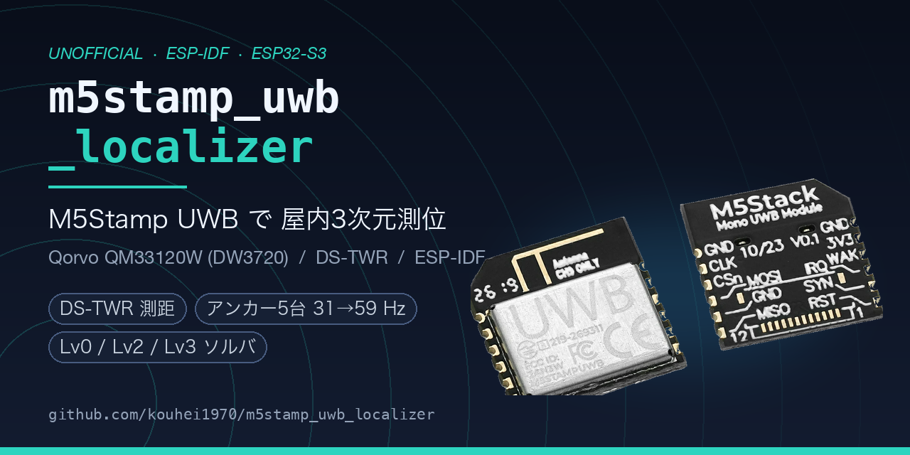

# m5stamp_uwb_localizer



**M5Stamp UWB Module (QM33120W)**（通称 **M5Stamp UWB**）を **ESP32-S3** から
**ESP-IDF** で使い、**屋内の 3 次元位置**を求めて JSON Lines で吐くスタックです。
タグ 1 台 + アンカー 4 台以上で動きます。

> ### ⚠️ 実機で確認できているのは 2 台での測距までです
> タグ 1 台 + アンカー 1 台の測距までは実機で動いています。アンカー 4 台以上での
> 3D 測位はまだです。→ [現状をもう少し詳しく](#現状をもう少し詳しく)
>
> **これは M5Stack 公式のリポジトリではありません。**
> 公式の Arduino ライブラリは [`m5stack/M5Stamp-UWB`](https://github.com/m5stack/M5Stamp-UWB) です。
> → [このリポジトリの位置づけ](#このリポジトリの位置づけ)

---

## 📖 どこから読むか

ドキュメントは現役 17 本（+ 経緯を記録した archive 11 本）あります。**全部読む必要はありません。**
下から自分に合う入口を選んでください。索引は **[`docs/README.md`](docs/README.md)**。

| あなたは | 入口 | その次 |
|---|---|---|
| 🔰 **UWB を知らない。原理から勉強したい** | **[`docs/UWB_PRIMER.md`](docs/UWB_PRIMER.md)**<br>なぜ電波で cm が測れるのか | [`UWB_ALGORITHMS.md`](docs/UWB_ALGORITHMS.md)（測位の数理） |
| 🔧 **買った。動かしたい** | **[`docs/GETTING_STARTED.md`](docs/GETTING_STARTED.md)**<br>BOM から測位までの完全手順 | [`EXPERIMENT_PLAN.md`](docs/EXPERIMENT_PLAN.md)（進める順序） |
| ⚡ **とにかく書き込んで試したい** | **[`docs/PREBUILT_BINARIES.md`](docs/PREBUILT_BINARIES.md)**<br>ESP-IDF を入れずに書き込む | [`GETTING_STARTED.md`](docs/GETTING_STARTED.md)（最初の関門） |
| 🛠 **中身を読みたい・改造したい** | **[`docs/PLAN.md`](docs/PLAN.md)**<br>全体設計と方針 | [`REIMPL_PLAN.md`](docs/archive/REIMPL_PLAN.md)（なぜこの実装か。経緯） |
**略語や単位（UUS / DTU）で混乱したら [`docs/GLOSSARY.md`](docs/GLOSSARY.md)。**

---

## 何ができるか

| 機能 | 状態 |
|---|---|
| **SS-TWR / DS-TWR による 2 点間の測距** | **実機確認済み**（2026-08-29〜31、タグ 1 + アンカー 1・約 1m。SS-TWR 99.95% / DS-TWR 99.5〜99.6%〈Wi-Fi 併用時 99.3〜99.4%〉） |
| **アンカー 4 台以上での 3D 測位**（台数は登録テーブルの長さで決まる。上限 8） | 実装済み（ホスト検証済み・**実機未検証**） |
| 測位ソルバ 3 段（Lv0 閉形式三辺測量 / **Lv2 Beck 厳密解 + Huber ロバスト化** / Lv3 EKF〈拡張カルマンフィルタ〉） | 実装済み |
| **外れ値アンカーの自動棄却**（Huber / χ² ゲート） | 実装済み |
| 欠測・タイムアウトへの耐性（有効測距 4 件以上あれば解く） | 実装済み |
| 同一平面配置の検出と 2D フォールバック | 実装済み |
| **JSON Lines 出力**（測距値・位置・GDOP〈アンカー配置の良し悪しによる精度低下係数〉・残差・棄却情報・周期時間） | 実装済み |
| アンテナ遅延の補正（値はアンカーごとに設定） | 実装済み（**校正手順は手動**） |
| **シリアルコンソールによる実行時設定**（アンカーのアドレス・座標を NVS〈ESP32 の不揮発設定ストレージ〉に保存。再ビルド不要） | Wi-Fi 設定（`wifi set/show`）は**実機確認済み**（2026-08-31）。**アンカー座標・アドレスの設定は実機未検証** |
| **IRQ 駆動**（アンカー側。既定で有効） | **実機確認済み**（2026-08-30、ポーリングと同等の成功率）・**既定で有効**（`UWB_ENABLE_IRQ` default y）。[`docs/IRQ_POLICY.md`](docs/IRQ_POLICY.md) |
| **TWR 遅延プリセットと版不一致の自動検出** | 実装済み（[`docs/TIMING_PRESETS.md`](docs/TIMING_PRESETS.md)） |
| **Wi-Fi ブラウザダッシュボード + 無線コンソール**（HTTP/WebSocket、TCP コンソール） | 実装済み（実機確認: UWB 測距への悪影響なし・ブラウザ実表示・**PC を繋がない給電のみ運用（充電器/モバイルバッテリ）**も確認済み〈2026-08-31〉。[`docs/NET_DASHBOARD.md`](docs/NET_DASHBOARD.md)） |
| ch9 PLL〈搬送波を作る位相同期回路〉再校正 / NLOS〈見通し外〉判定 | **未実装**（[§既知の制約](docs/GETTING_STARTED.md#limitations)） |

---

## すぐ試す

### A. ビルド済みバイナリを使う（ESP-IDF 不要）

GitHub Actions がビルドした**そのまま書き込めるバイナリ**があります。

```sh
# 例: 疎通確認ファーム（M5StampS3A 用）
curl -LO https://github.com/kouhei1970/m5stamp_uwb_localizer/releases/latest/download/probe-stamps3.zip
unzip probe-stamps3.zip
esptool.py --chip esp32s3 -p /dev/cu.usbmodemXXXX write_flash 0x0 merged-firmware.bin
```

ブラウザからでも書けます（<https://espressif.github.io/esptool-js/> でオフセット `0x0`）。
14 通りの構成を用意してあります → **[`docs/PREBUILT_BINARIES.md`](docs/PREBUILT_BINARIES.md)**

> **⚠ 実機確認済みのピン定義は M5StampS3A（`boards/stamps3.h`）のみ**です
> （SPI 4 本・RST・IRQ まで実機確認済み。WAKEUP と AtomS3 / StampFly 用の定義は未検証の暫定値）。
> 配線が [`docs/GETTING_STARTED.md` §3](docs/GETTING_STARTED.md#wiring) と違えば動きません。

配布 zip には Qorvo ライセンスの条件（Qorvo 製 IC 限定）が適用されます →
[`docs/PREBUILT_BINARIES.md`](docs/PREBUILT_BINARIES.md)

### B. 自分でビルドする（5 分）

**実機がなくてもここまでできます。**

> **ESP-IDF を入れずに試したい場合**は、GitHub Actions がビルドした
> **そのまま書き込めるバイナリ**が [Releases](https://github.com/kouhei1970/m5stamp_uwb_localizer/releases)
> と Actions の artifact にあります。→ [`docs/PREBUILT_BINARIES.md`](docs/PREBUILT_BINARIES.md)
> （ただし実機確認済みのピン定義は M5StampS3A 用のみ。配線が本書と違うと動きません）

```sh
# 1) ESP-IDF v5.5.2（未導入なら）
mkdir -p ~/esp && cd ~/esp
git clone -b v5.5.2 --recursive https://github.com/espressif/esp-idf.git
cd ~/esp/esp-idf && ./install.sh esp32s3

# 2) 環境変数（ターミナルを開くたびに必要）
. ~/esp/esp-idf/export.sh

# 3) このリポジトリ
git clone https://github.com/kouhei1970/m5stamp_uwb_localizer.git
cd m5stamp_uwb_localizer

# 4) 測位計算が正しく動くことを PC 上で確認（ESP-IDF 不要）
cd tests/host/pipeline && make test
#    → "=== 200 件中 0 件失敗 ===" が出れば OK
cd ../..

# 5) 疎通確認ファームをビルド
cd firmware/probe
idf.py set-target esp32s3
idf.py build
```

**実機がある場合**は、配線を済ませてから（**必ず
[§3.1 向きの確定](docs/GETTING_STARTED.md#orientation) を先に**）:

```sh
ls /dev/cu.usbmodem*                                  # macOS。Linux は /dev/ttyACM*
idf.py -p /dev/cu.usbmodemXXXX flash monitor
```

期待される出力:

```
I (xxx) uwb_probe: L1: raw DEV_ID = 0xDECA0314 (expect 0xDECA0314) -> PASS
I (xxx) uwb_probe: L2: dwt_probe + dwt_readdevid = 0xDECA0314 (expect 0xDECA0314) -> PASS
...（L3〜L11 の各検査が PASS / FAIL / SKIP を出力）
I (xxx) uwb_probe: === PROBE SUMMARY L1=PASS L2=PASS L3=PASS L4=PASS(RSTn ok) L5=PASS(irq=active) L6=PASS(0/1000 bad) L7=rec L8=PASS L9=rec L10=SKIP L11=rec(dgc=OTP) ===
```

**`0xDECA0314` が読めれば最初の関門は突破**です。
読めないときの切り分けは
[`docs/GETTING_STARTED.md` §4.3](docs/GETTING_STARTED.md#probe-troubleshoot)。

> **M5 AtomS3 で動かす場合**（手元にある場合の代替ホスト）は `idf.py menuconfig` →
> `UWB Probe Configuration` → `Target host board` → `M5 AtomS3` に切り替えてください
> （`firmware/probe` の既定は M5StampS3A）。

**→ ここから先の完全な手順は [`docs/GETTING_STARTED.md`](docs/GETTING_STARTED.md) へ。**
配線・5 台への書き込み・座標入力・測位・アンテナ遅延の校正まで通しで書いてあります。
測位まで動いたら、USB を挿さずに Wi-Fi 経由でブラウザから見ることもできます。
入口は [`docs/GETTING_STARTED.md` §8.7](docs/GETTING_STARTED.md#net-dashboard)、
完全版は [`docs/NET_DASHBOARD.md`](docs/NET_DASHBOARD.md) です。

---

## 現状をもう少し詳しく

**実機で確認できているのは 1 対 1 の測距までです。アンカー複数台での 3D 測位はまだ実機では動いていません。**

| | 状況 |
|---|---|
| ビルド | 全ファーム **警告 0・エラー 0**（ESP-IDF v5.5.2 / ESP32-S3） |
| 測位パイプライン | ホスト（PC）上の合成データで検証済み（**200 件のチェック全通過**。設定のシリアライズ/デシリアライズ、遅延プリセット、フレーム照合の検算を含む） |
| 測位ソルバ（uwb_loc） | 本リポジトリ独立のホストテストで検証済み（単体 **77 件** + 新旧比較回帰 **591,199 件**。上流 [uwb_localizer](https://github.com/kouhei1970/uwb_localizer) は凍結・独立しており、以後の開発は本リポジトリ側で行っている） |
| 線形代数（uwb_math）／自動測量（uwb_survey）／アンカー応答の状態遷移（responder_fsm） | ホストで検証済み（uwb_math **10,781 件** / uwb_survey **561 件** / responder_fsm **41 件**） |
| ソルバの計算時間 | ESP32-S3 実機用ベンチを実装済み（**実行は未**） |
| **実機での SPI 疎通（Device ID 読み出し）** | **確認済み**（2026-08-27。M5StampS3A + StampS3 BreakOut + FPC、1 台。60 秒 64 回すべて `0xDECA0314`。→ [`docs/GETTING_STARTED.md` §4.2.1](docs/GETTING_STARTED.md#probe-result)） |
| **実機での 1 対 1 測距（SS-TWR）** | **確認済み**（2026-08-29。850kbps/プリアンブル 256、タグ即時再試行 2 回。300 秒・2,180 サイクル中 2,179 成功＝**サイクル成功率 99.95%**、距離中央値 1.033m〈巻尺実測約 1.0m〉） |
| **実機での 1 対 1 測距（DS-TWR）** | **確認済み**（2026-08-30。不安定の原因〈タグ周期とアンカー受信窓の位相ロック、Final 遅延送信の締切不足〉を特定し、アンカーを受信常時 ON のステートマシン〈v2 アーキテクチャ、[`docs/ARCHITECTURE_V2.md`](docs/ARCHITECTURE_V2.md)〉へ移行して解決。本番既定構成〈850kbps/プリアンブル 256/IRQ 有効/再試行 2 回〉で**周期成功率 99.5〜99.6%**） |
| **実機での Wi-Fi ブラウザダッシュボード + PC を繋がない給電** | **確認済み**（2026-08-31。`http://uwb-tag.local/` でのブラウザ実表示、充電器/モバイルバッテリのみでの運用、Wi-Fi 併用時も測距の周期成功率 99.3〜99.4%〈悪化なし〉） |
| **アンカー 4 台以上での 3D 測位** | **未確認**（ホスト上の合成データでの検証のみ） |
| 自動測量（uwb_survey）の実機実行 | **未確認**（デバイス上の呼び出し経路が未実装） |
| アンテナ遅延の校正 | **未実施** |
| **RSTn の配線・16MHz SPI** | **確認済み**（2026-08-29。probe を L1〜L11 の受入検査へ拡張して 2 台とも実行。L4=RSTn 機能検査 PASS、L6=16MHz SPI 連続 1,000 回読み出しで不一致 0 件） |
| WAKEUP の配線 | **未確認**（拡張 probe の L10 は必要時のみ有効化する検査で、実行記録では SKIP） |
| `uwb_cfgstore` のアンカー座標・アドレス設定コンソールの実機読み書き | **未確認**（Wi-Fi 設定の NVS 保存は `uwb_net` 側で実機確認済み〈2026-08-31〉。別物なので混同しないこと） |
| アンカー 2 台目以降での UDP 集約 | **未確認** |

同じモジュールを公式 Arduino ライブラリ + 別 MCU（XIAO ESP32-C6）で動かした外部報告
（[GOROman 氏、gist](https://gist.github.com/GOROman/76c222768b042d35599d26192a25e829)）があり、
パッド配線と向きは本書の記述と一致しています。

- 製品自体が新しく、コミュニティの作例もほとんどありません。
- **配線の向きは、必ず自分の個体で確認してください。** 標準構成（FPC）では
  ケーブルの挿し方向、代替構成（半田パッド直付け）では pin 1 の位置です。
  → [`docs/GETTING_STARTED.md` §3.1](docs/GETTING_STARTED.md#orientation)
  （**間違えると電源逆接で壊れます**）。
- 未確認事項の一覧は [`docs/WIRING.md`](docs/WIRING.md) §5 と
  [`docs/GETTING_STARTED.md` §11](docs/GETTING_STARTED.md#limitations) にあります。

つまりこれは「測位まで動作実績のあるライブラリ」ではなく、**一次資料から積み上げた
実装と、その検証手順の一式**です。実機での検証はタグ 1 + アンカー 1 の測距まで進みました。
次の関門はアンカー複数台での 3D 測位です。

---

## 必要なもの

### ハードウェア（標準構成: タグ 1 + アンカー 5、据置機）

| 品目 | 数量 | 役割 |
|---|---:|---|
| [M5Stamp UWB Module with FPC (QM33120W)](https://docs.m5stack.com/en/stamp/Stamp_UWB_F) （SKU `S017-F`） | **6** | UWB モジュール。**0.5mm 12P FPC ケーブルが標準付属** |
| [M5StampS3A](https://docs.m5stack.com/en/core/M5StampS3A) | **6** | タグ（移動体）・アンカー（固定局）共通のホスト。**旧 M5StampS3（A 無し）と完全互換**（電源とアンテナが改良された現行版） |
| [StampS3 BreakOut](https://docs.m5stack.com/en/stamp/StampS3BreakOut) | **6** | M5StampS3A を 2.54mm ピッチへ変換する基板。**StampS3 本体（M5StampS3A）は同梱されません**、別途用意すること |
| 0.5mm 12P FPC→DIP 変換基板 | **6** | FPC ケーブルを BreakOut の 2.54mm ヘッダへ繋ぐための変換基板。**型番は未定** |
| USB-C ケーブル（データ通信対応） | 1〜 | 充電専用ケーブルでは書き込めない |
| USB 電源（アンカー給電用） | 5 | モバイルバッテリ・USB ハブ等 |

**モジュールとホストは FPC ケーブル + 変換基板で接続します。モジュール側の半田付けは不要**です
（`S017-F` の FPC コネクタ → 変換基板 → BreakOut の 2.54mm ヘッダ）。
無印 `S017` しか無い場合や変換基板が手元に無い場合は、1.27mm ピッチの
キャステレーションホールへ直付けする代替経路もあります → [`docs/WIRING.md`](docs/WIRING.md) §0.1。

> **アンカーのホストは [M5 AtomS3](https://docs.m5stack.com/en/core/AtomS3) でも代替できます。**
> 手元にある場合はそのまま使えます（AtomS3R（現行）/ 無印 AtomS3（在庫限り）のどちらでも可。
> IMU/地磁気を使わないため互換と推定。**実機未検証**）。上表は M5StampS3A に統一した
> 標準構成です。

### 工具・材料

**BreakOut への 2.54mm ピンヘッダの半田付け**（通常のはんだごて・はんだで可。
モジュール側の微細な半田付けが無くなったため、AWG30 相当の細線・1.6mm 以下の
こて先・フラックス・拡大鏡は**不要**になった）、**テスター（FPC の向きの確定に必須）**、
**巻尺（アンカー座標の実測用）**、USB-C ケーブル。

> 半田パッドへ直付けする代替経路（[`docs/WIRING.md`](docs/WIRING.md) §0.1 経路B）を選ぶ場合は、
> AWG30 相当の細線・1.6mm 以下のこて先・フラックス・拡大鏡が別途必要です
> （同文書 §4.1〜§4.3）。

> 詳細な BOM は [`docs/GETTING_STARTED.md` §1](docs/GETTING_STARTED.md#bom)。

### ソフトウェア

**ESP-IDF v5.5.2**

---

## ディレクトリ構成

```
m5stamp_uwb_localizer/
├── README.md                このファイル
├── LICENSE                  リポジトリ既定のライセンス（MIT）
├── THIRD_PARTY_LICENSES.md  ライセンス構成の詳細
│
├── docs/
│   ├── README.md            ★ ドキュメント索引（ここから探す）
│   ├── GETTING_STARTED.md   ★ 買ってから測位が出るまでの完全手順（Phase 1 の SPI 疎通受入確認を含む）
│   ├── NET_DASHBOARD.md     Wi-Fi ダッシュボード・無線コンソール（uwb_net）の使い方
│   ├── EXPERIMENT_PLAN.md   ★ 実機到着後の実験計画とフラグ有効化の順序
│   ├── UWB_PRIMER.md        ★ UWB 入門（なぜ電波で cm が測れるのか）
│   ├── UWB_ALGORITHMS.md    測位アルゴリズムの導出（上流からの移植・改訂版）
│   ├── GLOSSARY.md          用語集（略語の正式名称と意味。UUS / DTU / 実µs の単位リファレンスも含む）
│   ├── WIRING.md            配線の正本。3つの接続経路とピン対応・向きの確定
│   ├── PREBUILT_BINARIES.md ビルド済みバイナリの入手と書き込み（ESP-IDF 不要）
│   ├── ANCHOR_PLACEMENT.md  アンカー配置ルール（実測にもとづく）
│   ├── IRQ_POLICY.md        IRQ を使うかどうかの方針
│   ├── TIMING_PRESETS.md    TWR 遅延プリセットと版不一致検出
│   ├── SURVEY_SPEC.md       アンカー座標の自動測量の仕様
│   ├── STAMPFLY_INTEGRATION.md  StampFly 位置制御への統合検討
│   ├── ARCHITECTURE_V2.md   UWB 測距ファームウェアの v2 アーキテクチャ（アンカー受信常時 ON のステートマシン化）
│   ├── HANDOFF.md           次セッションへの申し送り
│   ├── PLAN.md              全体設計・フェーズ計画
│   ├── PERF_ANALYSIS.md     測位ソルバの計算コスト分析と ESP32-S3 固有の最適化調査
│   └── archive/             経緯文書（設計当時の調査・検討。現役の仕様ではない）
│       ├── DESIGN_HISTORY.md    廃案・訂正・方針変更の経緯の集約
│       ├── PROGRESS.md          開発進捗ログ（何がどこまで検証済みか）
│       ├── REIMPL_PLAN.md       TWR 層の課題一覧（R1〜R12）
│       ├── CRITICAL_REVIEW.md   移植元コードの問題点の詳細分析
│       ├── REVIEW_2026-08-21.md 実機投入前の最終レビュー
│       ├── MATH_AUDIT_2026-08-21.md  行列計算の残存箇所の監査とスカラー化の設計根拠
│       └── SURVEY_*.md          事前調査資料
│
├── assets/                  製品写真・公式ピンマップ・SNS カード
│
├── boards/                  ホストボードのピン定義（※ 暫定値。実配線で要検証）
│   ├── stamps3.h            M5StampS3A（タグ単体構成）
│   ├── atoms3.h             M5 AtomS3 / AtomS3R（アンカー。構成 A/B を Kconfig で切替）
│   └── stampfly.h           StampFly 搭載時のタグ（M5StampS3A 背面の 12P FPC 経由）
│
├── components/
│   ├── qm33120w_sdk/        Qorvo 提供の QM33120W チップドライバ SDK（ファイル名には旧称 DW3720 が残る）
│   ├── uwb_port/            ESP-IDF 向けプラットフォーム抽象層（SPI/GPIO/IRQ/時刻/排他）
│   ├── uwb_qm33120/         C++ ラッパ（初期化・PHY 設定・SS/DS-TWR・遅延プリセット）
│   ├── uwb_ranging/         アンカー登録テーブル / スケジューラ / 測位パイプライン
│   ├── uwb_cfgstore/        NVS 永続化 + シリアルコンソール
│   ├── uwb_survey/          アンカー座標の自動測量（MDS + Gauss-Newton + ゲージ固定）
│   ├── uwb_loc/             測位ソルバ（Lv0 / Lv2 / EKF）
│   ├── uwb_math/            uwb_loc・uwb_survey が使う小次元線形代数（ESP-IDF 非依存、C99）
│   ├── uwb_net/             Wi-Fi ブラウザダッシュボード + 無線コンソール（HTTP/WebSocket/TCP/UDP集約）
│   └── uwb_status_led/      内蔵 WS2812/SK6812 LED によるハートビート表示
│
├── firmware/
│   ├── probe/               ★ SPI 疎通確認（Device ID を読む）
│   ├── devtest/             フレーム送受信の疎通確認（sender / receiver）
│   ├── twr/                 ★ 1 対 1 の測距評価（ロール・方式を Kconfig で切替）
│   ├── anchor/              ★ 本番用アンカー（常時レスポンダ。アドレスを Kconfig で設定）
│   ├── tag/                 ★ 本番用タグ（測距 → 測位 → JSON Lines 出力）
│   └── soltest/             ソルバの実機ベンチ（UWB ハード不要）
│
├── tests/
│   ├── Makefile             host/*/Makefile を自動検出して一括実行（`make test strict float`）
│   └── host/
│       ├── loc/              測位ソルバのホスト検証（`make test`、77件 + 新旧比較回帰591,199件）
│       ├── math/              線形代数（uwb_math）のホスト検証（`make test`、10,781件）
│       ├── pipeline/          測位パイプラインのホスト検証（実機不要、`make test`、200件）
│       ├── responder_fsm/     アンカー応答の状態遷移（uwb::decide()）のホスト検証（`make test`、41件）
│       └── survey/            自動測量の計算のホスト検証（`make test`、561件）
│
├── tools/
│   ├── README.md            ベンチとスクリプトの置き場（テストは tests/ 側）
│   ├── bench_loc/           測位ソルバのマイクロベンチマーク（`make bench`）
│   ├── docs_check/          文書とコードの整合チェック（リンク切れ・削除済み文書への言及・Kconfig参照等。`python3 tools/docs_check/verify_docs.py`。CI から実行）
│   └── serial/              シリアルログ採取・集計スクリプト（capture / capture_reenum / twr_stats）
│
└── third_party/             上流リポジトリの参照クローン（gitignore 済み・ビルド対象外）
```

`docs/refs/`（ベンダ資料）と `third_party/` は `.gitignore` されています。
clone しただけの状態で全ファームがビルドできます。

### 依存関係

```
firmware/tag ──┬─ uwb_ranging ─┬─ uwb_loc          （ハード非依存。PC でもビルドできる）
               │               └─ uwb_qm33120 ── uwb_port ── qm33120w_sdk ── ESP-IDF
               └─ boards/*.h
```

ハードウェア依存は **`components/uwb_port/` 1 枚に閉じています**。
`uwb_ranging` の測位側と `uwb_loc` は ESP-IDF に一切依存せず、
`tests/host/pipeline` でそのまま PC 上でビルド・検証できます。

---

## 主なハードウェア仕様（M5Stamp UWB Module (QM33120W) 系）

| 項目 | 値 |
|---|---|
| チップ | Qorvo **QM33120W**（DW3000 系。旧 Decawave コードネーム DW3720。Device ID `0xDECA0314`） |
| ホスト I/F | **SPI 一択**（mode0 / MSB first、初期化 2MHz → 通常 16MHz、チップ上限 32MHz） |
| **電源** | **公式仕様 DC 3.3V。パッド 2 はチップ直結（動作 2.4〜3.6V、絶対最大定格 4.0V）。5V は不可（壊れます）** |
| 消費電流 | スリープ 75.9µA / アンカー動作 5.23mA / **タグ動作 58.0mA** @3.3V |
| チャネル | **ch9 固定**（中心周波数 7987.2MHz） |
| 接続 | **接続経路は3通り**（[`docs/WIRING.md`](docs/WIRING.md) §0.1）: ① 0.5mm 12P FPC（`S017-F` のみ）→ 変換基板で BreakOut へ　② 1.27mm キャステレーションホール 12 個（両方に対応）へ直付け　③ M5StampS3A 背面の 12P FPC（StampFly 搭載タグ用） |
| 外形 | 11.5 × 12.0 × 1.6mm（`S017`）/ × 2.8mm（`S017-F`） |

> **M5Stack の別製品「Unit UWB」(SKU U100) とは別物です。**
> あちらは UART + AT コマンド方式（DW1000 ベース）で、本リポジトリのコードは使えません。

詳細は [`docs/archive/SURVEY_m5stamp_uwb_module.md`](docs/archive/SURVEY_m5stamp_uwb_module.md)。

---

## このリポジトリの位置づけ

**M5Stack 公式ではありません。** 個人（[@kouhei1970](https://github.com/kouhei1970)）が
作っている非公式の実装です。

| | 公式 [`m5stack/M5Stamp-UWB`](https://github.com/m5stack/M5Stamp-UWB) | 本リポジトリ |
|---|---|---|
| フレームワーク | Arduino | **ESP-IDF** |
| 範囲 | 1 対 1 の測距まで | **測距（実機確認済み）+ 屋内3次元測位・自動測量（実装済み・実機未検証）** |
| 位置づけ | — | 公式ライブラリを**移植元の一つ**として参照 |

**StampFly（マルチコプター機体）には依存しません。** 想定利用者は
**このリポジトリを単体で試す人**で、StampFly を用意する必要は一切ありません。

> ただし**タグ側のハードウェア構成だけは、StampFly にそのまま載せられるよう
> 互換性を意図的に維持**しています。StampFly も同じ M5StampS3A をタグのホストに使い、
> 背面の 12P FPC（0.5mm。出荷時は未実装のため後付け半田が必要）経由で UWB モジュールに
> 繋ぐ構成です（旧 GROVE 2系統4本の構成は廃案）。方針の詳細は [`docs/PLAN.md` §1](docs/PLAN.md)。

---

## ライセンス

**このリポジトリは複数のライセンスが混在しています。**

| 対象 | ライセンス |
|---|---|
| 本リポジトリ独自のコード（`components/uwb_port/`, `components/uwb_ranging/`, `firmware/*` 等） | **MIT** — Copyright (c) 2026 Kouhei Ito |
| `components/qm33120w_sdk/`（Qorvo 提供 SDK の vendoring） | **LicenseRef-QORVO-2** |
| `components/uwb_loc/`（[uwb_localizer](https://github.com/kouhei1970/uwb_localizer) 由来） | **MIT** — Copyright (c) 2026 Kouhei Ito |
| `components/uwb_qm33120/`（[m5stack/M5Stamp-UWB](https://github.com/m5stack/M5Stamp-UWB) の Arduino ラッパを C++ へ移植） | **MIT** — Copyright (c) 2026 M5Stack Technology CO LTD |
| `assets/`（M5Stack 公式ドキュメントの製品写真・ピンマップ・回路図） | **MIT の対象外**。Copyright M5Stack Technology CO., LTD.、引用・参照目的で同梱（[`THIRD_PARTY_LICENSES.md`](THIRD_PARTY_LICENSES.md)） |

> ### ⚠️ `LicenseRef-QORVO-2` の重要な制約
>
> **一般的なパーミッシブライセンスではありません。**
> 条件 3 により、**Qorvo 製の集積回路（＝本モジュールが搭載する QM33120W（旧コードネーム DW3720）、
> またはそれを内蔵するモジュール）とともに使用する場合に限り**利用が許可されます。
> **他ベンダーのチップ向けに転用することはできません。**

全文と詳細は [`LICENSE`](LICENSE) と
[`THIRD_PARTY_LICENSES.md`](THIRD_PARTY_LICENSES.md) を参照してください。

---

## 進捗と計画

| | |
|---|---|
| **ドキュメント索引** | **[`docs/README.md`](docs/README.md)** |
| 現在地・次の一手 | [`docs/HANDOFF.md`](docs/HANDOFF.md) |
| 進捗ログ | [`docs/archive/PROGRESS.md`](docs/archive/PROGRESS.md) |
| 全体設計・フェーズ計画 | [`docs/PLAN.md`](docs/PLAN.md) |
| 既知の課題（経緯） | [`docs/archive/REIMPL_PLAN.md`](docs/archive/REIMPL_PLAN.md) / [`docs/archive/CRITICAL_REVIEW.md`](docs/archive/CRITICAL_REVIEW.md) |
| 最終レビュー（実機投入前） | [docs/archive/REVIEW_2026-08-21.md](docs/archive/REVIEW_2026-08-21.md) |
