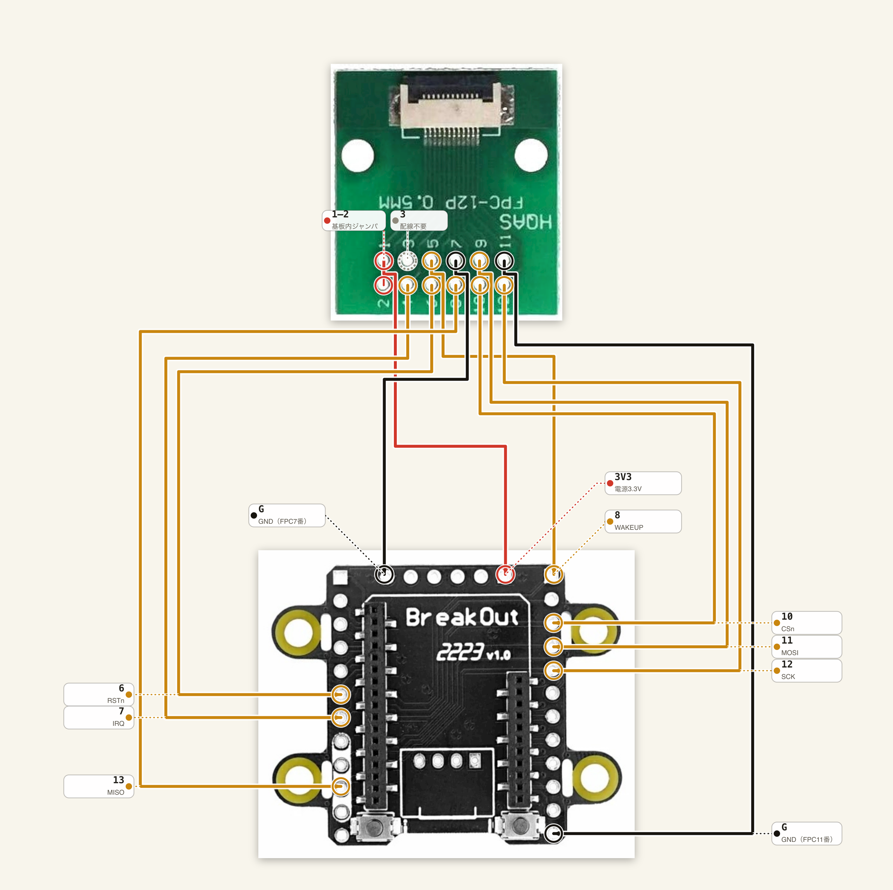

# はじめかた — 買ってから測位が出るまで

M5Stack **M5Stamp UWB Module**（通称 **M5Stamp UWB**）を 6 個買った人が、**タグ 1 台 + アンカー 5 台**の
UWB（Ultra-Wideband、超広帯域無線）測位を動かすまでの完全手順です。UWB の専門知識は前提にしません。

**所要時間の目安（未検証な見積もり）**: 環境構築 30分 / 配線 6台で 1〜2時間
（BreakOut へのヘッダ半田付け + ジャンパ配線。半田パッド直付けの経路Bなら 2〜4時間）/
疎通確認 30分 / 測距・測位 1〜2時間 / アンテナ遅延校正 1〜2時間。

> 略語が分からないときは [`docs/GLOSSARY.md`](GLOSSARY.md) を引いてください。

**章立て**

| 章 | 内容 | 実機の要否 |
|---|---|:-:|
| [1](#bom) | 必要なもの | |
| [2](#setup) | 環境構築（ESP-IDF・リポジトリ・PC 上のテスト） | 不要 |
| [3](#wiring) | 配線（FPC 接続が標準） | 要 |
| [4](#probe) | 疎通確認 `firmware/probe` ← **最初の関門** | 要 |
| [5](#twr) | 1 対 1 の測距 `firmware/twr` | 要 |
| [6](#anchors5) | アンカー 5 台の準備（アドレス設定） | 要 |
| [7](#survey) | 設置と座標入力 | 要 |
| [8](#run-tag) | 測位 `firmware/tag` | 要 |
| [9](#antenna-delay) | アンテナ遅延の校正 | 要 |
| [10](#troubleshooting) | トラブルシューティング | |
| [11](#limitations) | 既知の制約・未検証事項 | |

---

<a id="bom"></a>

## 1. 必要なもの

### 1.1 ハードウェア

**標準構成（経路A、[`WIRING.md` §1](WIRING.md#route)）は、M5StampS3A + StampS3 BreakOut を
6 台（タグ 1 + アンカー 5）組み、UWB モジュールは FPC ケーブルで挿すだけにします。
モジュール側の半田付けは不要です。**

| 品目 | 数量 | 備考 |
|---|---:|---|
| **M5Stamp UWB Module with FPC (QM33120W)**（SKU `S017-F`） | **6** | Qorvo QM33120W (DW3720) 搭載。**FPC コネクタ実装済み・0.5mm 12P FPC ケーブル付属が必須**（半田パッドを使わないため。無印 `S017` は FPC コネクタが無く挿せない） |
| **M5StampS3A** | **6** | タグ（移動体）1 台 + アンカー（固定局）5 台のホスト。**旧 M5StampS3（A 無し）と完全互換** |
| **StampS3 BreakOut** | **6** | M5StampS3A の 1.27mm ピンを 2.54mm へ変換する基板。**M5StampS3A 本体は同梱されない**（上の行と別に数える）。露出 IO 23 本、G0/EN にタクトスイッチ。出典: <https://docs.m5stack.com/en/stamp/StampS3BreakOut> |
| **0.5mm 12P FPC→DIP 変換基板** | **6** | UWB モジュール付属の FPC ケーブルを BreakOut の 2.54mm ヘッダへ渡す。**型番は本リポジトリでは未確定**（[11.2](#limitations)） |
| USB-C ケーブル（データ通信対応） | 1〜 | 充電専用ケーブルでは書き込めない |
| USB 電源（アンカー給電用） | 5 | モバイルバッテリ・USB ハブ等 |

> **無印 `S017` と `S017-F` の違いは FPC（Flexible Printed Circuit、フレキシブル基板）コネクタが実装済みかどうかだけ**で、
> 基板・寸法・電気仕様・半田パッドは同一です。ただし本書の標準経路（経路A）は
> **モジュール側の半田付けをしない**ことが前提なので、**`S017-F` が必須**になります。
> `S017-F` は背面に FPC コネクタが出っ張っていて厚みが 1.6mm → 2.8mm になりますが、
> 経路Aでは背面をベタ貼りしないので支障ありません。
> （出典: `docs/WIRING.md` §7.2, §1.6）

> **M5 AtomS3 は「手元にあるならアンカーに使える代替」として残っています。** 標準 BOM
> からは外しましたが、`boards/atoms3.h` のピン定義と `menuconfig` の切り替え（[6.1](#anchors5)）
> はそのまま使えます。AtomS3 を使う場合は半田パッド（経路B、[`WIRING.md` §3.3](WIRING.md)）
> での配線になります（AtomS3 向けの StampS3 BreakOut 相当品は本リポジトリでは確認していません）。

### 1.2 工具・材料

**経路A（標準）ではモジュール側の半田付けが不要**です。必要なのは BreakOut への
2.54mm ピンヘッダ半田付け、ジャンパ線、そして FPC の向きを確定するテスターだけです。
（1.27mm ピッチのキャステレーション用の細い線・細いこて先・ルーペは経路Bのみで必要。下記参照）

| 品目 | 推奨 | 理由 |
|---|---|---|
| **2.54mm ピンヘッダ**（オス） | 6 台分 | StampS3 BreakOut に半田付けする。**普通のこて先・普通の温度で足りる**（BreakOut の穴は通常の 2.54mm スルーホール） |
| はんだごて | 温度調整式、320〜340℃程度 | 2.54mm ピッチの通常の実装作業と同じ |
| ジャンパ線（オス-オス等） | **10cm 以内** | FPC→DIP 変換基板 ↔ BreakOut 間。長さと信号品質の関係は 3.5 |
| **テスター（導通・抵抗）** | | **FPC の向き確定に必須。無しで進めない**（→ [3.1](#orientation)） |
| ニッパー・ワイヤーストリッパー | | ジャンパ線の加工 |
| 10µF セラミックコンデンサ + 0.1µF | 6 組 | 変換基板の VCC_3V3・GND 直近に入れる（推奨。→ 3.6） |

> **経路B（半田パッド直付け）を選ぶ場合**は、代わりに次の道具が要ります。
> パッドは **1.27mm ピッチのキャステレーションホール（側面半円スルーホール）**で、
> **2.54mm のピンヘッダは立ちません。**
>
> | 品目 | 推奨 | 理由 |
> |---|---|---|
> | 電線 | **AWG30 ラッピングワイヤ**（芯線 0.25mm / 外径約 0.5mm）または **0.2〜0.26mm UEW（ポリウレタン線）** | 隣接パッド間の隙間は 0.67mm しかない。デュポン線（AWG24〜26）は直付け不可 |
> | こて先 | **1.6mm C 型以下** | 隣とブリッジしないため |
> | はんだごて | 温度調整式、320〜340℃（鉛フリーなら 350℃程度） | |
> | **フラックス** | ペーストまたはペン | **これが無いと成功率が大きく落ちる** |
> | 拡大鏡・ルーペ | 10倍程度 | ブリッジ確認に必須 |
> | **テスター（導通・抵抗）** | | **向きの確認に必須。無しで進めない** |
> | ピンセット | 先の細いもの | |
> | エポキシ接着剤 or UV レジン | | 線の根元の固定。**やらないとほぼ確実に断線する** |
> | 両面テープ・耐熱マット | | モジュールの固定 |

### 1.3 測定用

| 品目 | 用途 |
|---|---|
| **巻尺（5m 以上）またはレーザー距離計** | アンカー座標の実測。**これが測位精度の上限を決める** |
| 三脚・棚・突っ張り棒など | アンカーを高さを変えて固定する |
| 温度計 | アンテナ遅延校正時の温度記録（→ [9](#antenna-delay)） |

---

<a id="setup"></a>

## 2. 環境構築

実機がなくてもここまでは全部できます。

### 2.1 ESP-IDF v5.5.2

本リポジトリは **ESP-IDF v5.5.2** で検証しています。

```sh
mkdir -p ~/esp
cd ~/esp
git clone -b v5.5.2 --recursive https://github.com/espressif/esp-idf.git
cd ~/esp/esp-idf
./install.sh esp32s3
```

以降、**新しいターミナルを開くたびに**次を実行します（これを忘れると `idf.py` が見つかりません）。

```sh
. ~/esp/esp-idf/export.sh
```

確認:

```sh
idf.py --version      # → ESP-IDF v5.5.2
```

### 2.2 リポジトリの取得

```sh
git clone https://github.com/kouhei1970/m5stamp_uwb_localizer.git
cd m5stamp_uwb_localizer
```

> `third_party/` と `docs/refs/` は `.gitignore` されています（上流リポジトリの
> クローンとベンダ資料の置き場所で、ビルドには不要）。clone しただけの状態で
> 全ファームがビルドできます。

### 2.3 実機なしで動くテスト（PC 上）

配線を始める前に、測位計算そのものが正しく動くことを PC 上で確認できます。
**ESP-IDF は不要**です（C/C++ コンパイラだけで動きます）。

```sh
cd tests/host/pipeline
make test
```

期待される出力（最終行）:

```
=== 200 件中 0 件失敗 ===
```

アンカー 4 台・5 台、外れ値の棄却、欠測、同一平面配置の検出などを合成データで
検証しています。設定の永続化（[6.2](#anchors5-console) / [7.3](#survey)）についても、
**NVS（Non-Volatile Storage、ESP-IDF の不揮発設定ストレージ）に置くバイト列**の往復・境界値・壊れたデータの扱いをここで検算しています
（NVS そのものの読み書きは実機が要るので含まれません）。
**ここが通らないなら環境（コンパイラ）側の問題**です。

> `tests/host/loc/` にも測位ソルバ（`components/uwb_loc/`）単体のテストがあります
> （77件、`make test` / `make strict` / `make float`）。こちらは本リポジトリ内で
> 完結しており、上流リポジトリのクローンは不要です。買った人が実行する必要は
> ありません。

### 2.4 とりあえずビルドしてみる

```sh
cd firmware/probe
idf.py set-target esp32s3
idf.py build
```

警告 0・エラー 0 で `uwb_probe.bin` ができれば環境構築は完了です。

---

<a id="wiring"></a>

## 3. 配線（FPC 接続が標準）


**⚠ 半田パッドと FPC ケーブルでは信号の並びが違う。**
上の公式ピンマップで、**側面のラベルがパッド**、**下部の番号付きの帯が FPC ケーブル**を表す。
標準構成（経路A）は**FPC ケーブル**を使うので下部の帯側を見ること
（半田パッドを使う経路Bの場合は側面ラベル側）。

**この章がいちばん壊しやすいところです。焦らずに。**

詳細な寸法・出典は [`docs/WIRING.md`](WIRING.md) にあります。本章はそれを
手順の形にしたものです。**寸法・パッド番号の全表・回路図由来の数値は WIRING.md が正本**なので、
本章では要約とリンクに留めます（同じ表を複数文書に置くと、更新が片方だけに
入って食い違う恐れがあるため）。

### 接続経路は3つある。まず経路を決める

[`WIRING.md` §1](WIRING.md#route) に詳しい比較表があります。要約すると:

| | **経路A: FPC→DIP 変換基板（標準）** | 経路B: 半田パッド直付け（代替） | 経路C: StampS3A 背面 FPC |
|---|---|---|---|
| 対象 | **本書の標準構成（据置機）** | 変換基板が手元に無い／`S017`（FPC 非実装）しか無い場合 | StampFly 搭載タグ（**本書の対象外**） |
| モジュール | `S017-F` 必須 | `S017` / `S017-F` どちらでも | `S017` |
| モジュール側の半田付け | **不要** | **必要（1.27mm ピッチ、本章の最難関）** | 専用基板へ貼付 |
| ホスト | M5StampS3A + StampS3 BreakOut | 何でも | StampFly の M5StampS3A |
| 着脱 | 可 | 不可（付け外しは半田ごて） | 可 |

**本章（3.1 以降）は経路Aを前提に書きます。経路Bを選ぶ場合の手順は各節に
「経路Bを選ぶ場合」として残してあります（削除していません）。** 経路C（StampFly）は
本書（据置機のタグ・アンカー）の対象外です。詳細は [`WIRING.md`](WIRING.md) を参照してください。

> **⚠️ 配線前に必ず向きを確定すること。**
> 経路Aでは**FPC ケーブルの挿し方向**、経路Bでは**半田パッドの pin 1 の位置**が、
> それぞれ実物での確認が必要です。手順は [3.1](#orientation)。
> **間違えると電源逆接でモジュールが壊れます。**

### 3.0 モジュールのパッド配置

12 個のパッドが、対向する 2 辺に 6 個ずつ、**1.27mm ピッチ**で並んでいます。

```
     ← 12.0 mm →
   ／‾‾‾‾‾‾‾‾‾‾‾‾‾＼         ← pin1 側の角だけ 2.0×2.0mm の大きな面取り
  ／                ＼
 ┌──────────────────┐
 │ ■■■■■■■■■■■■■■■■ │  ← アンテナ禁止領域（端から 3.556mm、表裏とも）
 │ ■  ANT KEEPOUT  ■ │     ここに配線・金属・グランドを置かない
 │ ■■■■■■■■■■■■■■■■ │
 ├──────────────────┤
 ◖1  GND      GND 12◗
 ◖2  3V3      CLK 11◗       ◖ ◗ = キャステレーション φ0.5mm
 ◖3  WAKEUP   CSn 10◗            ピッチ 1.27mm
 ◖4  IRQ      CDI  9◗
 ◖5  GP7      GND  8◗
 ◖6  RSTn     CDO  7◗
 └──────────────────┘
```

公式回路図で確認済みのとおり、**信号名は共通だが番号の並びは違う**
（上の「接続経路は3つある」および [`WIRING.md` §7.1](WIRING.md) と同じ結論）。

**半田パッドで配線するなら「パッド」列、FPC ケーブルで配線するなら「FPC」列の番号を使う。**
**両者を混ぜると電源が信号線に入ってモジュールが壊れる。**

**→ パッド番号 ↔ FPC 番号の対応表は [`WIRING.md` §7.1](WIRING.md) にあります（唯一の正本）。**

同じ表を複数の文書に置くと、更新が片方だけに入って食い違う恐れがあるため、
番号の対応表は本書には置きません。覚えておくべき要点は3つ:

- **パッドは GND×3（1/8/12）・VCC_3V3×1（2）、FPC は GND×2（7/11）・VCC_3V3×2（1/2）**
  と本数からして違う
- 必須は 6 本（VCC_3V3 / GND / CLK / CDI / CDO / CSn）、推奨は +RSTn +IRQ の 8 本
- **DW_GP7 は配線不要**（読むコードが無い）

半田パッドの場合、**SPI（Serial Peripheral Interface）4 本 + GND 2 本がすべて右列（pin 7〜12）に
集まっている**ので、右列 6 本をリボン状にまとめて引き出すと戻り電流経路が短くなります（推奨）。
**Phase 1（`firmware/probe`）の最小配線は 6 本**（GND / VCC_3V3 / CLK / CDI / CDO / CSn）。
ドライバはポーリング方式なので IRQ は無くても動きます。
**`DW_RSTn`（pin 6）は配線を強く推奨**（`uwb_port_hard_reset()` が使えるようになる）。
実用上は、右列 6 本 + 左列の 3V3（pin 2）+ RSTn（pin 6）の**計 8 本**が最小構成です。

<a id="orientation"></a>

### 3.1 【最重要】向きを確定する

**ここを間違えると電源が信号線に入り、モジュールが壊れます。配線の前に必ずやってください。**

#### 経路A（FPC、標準）の場合

**3V3 を繋ぐ前に、必ずテスターで確認すること。** FPC ケーブルには**同面接点と異面接点**が
あり、変換基板側コネクタの接点位置と噛み合わないと、接触しないか**1 番と 12 番が
入れ替わって刺さります**。逆に刺さると FPC 1・2 番（VCC_3V3）が 11・12 番（GND・CLK）の
位置に来るため、**半田付けの向き間違いと同じ「電源が信号線に入る」事故**が起きます。
公式も **"Do not reverse-insert, otherwise it will damage the device."** と明記しています。

幸い FPC 側には**非対称性**があります（[`WIRING.md` §7.1](WIRING.md)）:
**1・2 番が VCC_3V3（隣接した同一ネット）、7・11 番が GND（4 本離れた同一ネット）。**
これをテスターで探せば向きは一意に決まります。

1. FPC ケーブルをモジュールと変換基板の両方に挿す。**ホスト側にはまだ何も繋がない。**
2. 変換基板の DIP ピン間で導通を測り、**隣り合う 2 本が導通する組**を探す（1 組しかない）。
   それが FPC 1・2 = **VCC_3V3**。
3. その組を 1・2 番として反対端へ数え、**7 番と 11 番が導通する**ことを確認する（GND）。
4. 2 と 3 が同時に成り立つ並びは 1 通りしかない。逆順で成立したらケーブルを裏返すか、
   挿し方を変える。
5. VCC 側と GND 側が **0Ω で張り付いていない**ことを確認する（モジュール内のコンデンサ
   24 個で、抵抗レンジでは低い値から徐々に上がる）。
6. **ここまで確認できてから、初めて 3V3 を繋ぐ。**

詳細な手順・根拠は [`WIRING.md` §2「向きを確定する」](WIRING.md) を参照してください。

#### 経路Bを選ぶ場合

**ここを間違えて pin 2（3V3）と pin 11（CLK）を取り違えると、電源が信号線に
入ってモジュールが壊れます。半田付けの前に必ずやってください。**

1. **面取りの大きい角を探す。** pin 1 側の角だけ 2.0mm × 2.0mm の 45° 面取りが
   あり、他の 3 隅は 0.2mm です。面取りのある端が**アンテナ側**です。
2. **基板のシルク印刷を見る。** ピン番号や信号名が印刷されていれば**それが最優先**です。
   （印刷があるかどうかは**未確認**）
3. **テスターで検証する（必ずやる）。**

| 試験 | 期待される結果 | これで何が分かるか |
|---|---|---|
| pin **1 / 8 / 12** の 3 本が互いに導通するか | **0Ω で導通する** | GND は 3 本しかなく、この 3 箇所に非対称に並んでいる。**左右反転も 180° 回転も、この 1 試験で弾ける** |
| pin **2** と GND 間の抵抗 | **0Ω に張り付かない**（モジュール内にコンデンサが 24 個あるので、抵抗レンジでは最初低く出て徐々に上がる） | 電源がベタ短絡していないこと |

**この 2 つが両方合って初めて向きが確定します。**
合わないときは向きの解釈が間違っているので、90°/180°/裏返しを試して
もう一度 GND の並びを探してください。

> なぜ確認が要るか: 公式 PINMAP 画像（`assets/S017_Stamp_UWB_pinmap.jpg`、本章冒頭に掲載）は
> 入手できているものの、
> 設計データからは**モジュールのどちらの面が部品面か**を確定できていません。
> キャステレーションは側面に出ているのでパッドの物理位置は表裏で変わりませんが、
> **左右の見え方が変わります**。（`docs/WIRING.md` §7.2, §1.7）
>
> **外部報告との整合**: 公式 Arduino ライブラリ + 別 MCU（Seeed XIAO ESP32-C6）で
> 動かした外部報告（GOROman 氏、
> <https://gist.github.com/GOROman/76c222768b042d35599d26192a25e829>）が、
> 「上面視・アンテナ側を上にして pin 1 が左上」という向きで配線し動作したと
> 記録している。上の図・表と一致する。**ただし本リポジトリでの実測ではないので、
> 上記のテスターによる導通確認は必ず実施すること。**

### 3.2 タグ・アンカー共通の配線（M5StampS3A × 6、経路A: FPC 番号）

**タグもアンカーも同じ配線です**（経路Aではホストが両方とも M5StampS3A + StampS3 BreakOut
のため統一されています）。

**下表は FPC 番号で書いています。半田パッド番号ではありません。** パッド↔FPC の
対応表は [`WIRING.md` §7.1](WIRING.md) を参照してください。**パッド番号をそのまま
流用すると電源が信号線に入って壊れます。**

| FPC | 信号 | M5StampS3A | 必須 | 備考 |
|----:|------|------------|:----:|---|
| 1, 2 | VCC_3V3 | **3V3** | ● | **公式仕様 3.3V。絶対最大定格 4.0V。5V は絶対に入れない**（[WIRING.md §5.1](WIRING.md)） |
| 3 | DW_GP7 | — | | 配線不要 |
| 4 | DW_IRQ | **G7** | ○ | 現状の実装はポーリングなので未配線でも動く |
| 5 | DW_WAKEUP | **G8** | ○ | 省電力を使わないなら省略可 |
| 6 | DW_RSTn | **G6** | ● | 配線を強く推奨（`uwb_port_hard_reset()` が使えるようになる） |
| 7, 11 | GND | **GND** | ● | FPC の GND 2 本は両方繋ぐ（戻り電流経路。片方だけにしない） |
| 8 | DW_CDO (MISO) | **G13** | ● | |
| 9 | DW_CDI (MOSI) | **G11** | ● | |
| 10 | DW_CSn | **G10** | ● | |
| 12 | DW_CLK (SCK) | **G12** | ● | |

**合計 10 本**（信号 8 本 + GND 2 本）。ホスト側のピン番号は `boards/stamps3.h` の
**暫定値**です。**実配線前に必ず現物と照合してください。**



*上表を実物写真に重ねた配線図（赤=3.3V、黒=GND、黄=信号線）。1〜2番は変換基板内で
ブリッジ、3番は配線不要。インタラクティブ版・最新版は
[こちら（Artifact）](https://claude.ai/code/artifact/8d72be3d-e3eb-4c30-ad1a-1160d19e13b4)。*

> **`5V` ピンには絶対に繋がないこと。** VCC_3V3 は QM33120W の電源レールに
> 直結しており、公式仕様 3.3V・絶対最大定格 4.0V（3.6V 超は仕様外）です。
> 5V を入れると壊れます。詳細は [`WIRING.md` §5.1](WIRING.md)。

> **IRQ（Interrupt ReQuest、割り込み要求）について**: アンカー側の IRQ 経路は
> **実装済み**で、有効にすると測位レートが 31 Hz → 59 Hz に上がります
> （効くのは**レスポンダ側＝アンカーの折り返し時間**です）。配線するなら上表の
> **G7 (DW_IRQ)**。経路Aはジャンパ線での接続なので、**後から IRQ 線を 1 本足すだけで
> 有効化を試せます**（経路Bの半田付けと違い、後戻りが利かないという制約はありません）。
> 既定では無効（極性が実機未検証のため）。→ [`docs/IRQ_POLICY.md`](IRQ_POLICY.md)、
> 有効化の手順は [`docs/EXPERIMENT_PLAN.md`](EXPERIMENT_PLAN.md) 実験7

#### 経路Bを選ぶ場合

半田パッドで配線する場合、`WIRING.md` に**タグ用（§3.1）とアンカー用（§3.2）が
別々の表**があります（§3.2 はアンカーに AtomS3 を使う場合の表で、空き GPIO が実質 6 本しか
ないため WAKEUP と GP7 は未配線になります）。パッド番号の使い方・向きの確認は
[3.1「経路Bを選ぶ場合」](#orientation) を参照してください。**この場合は半田付けが
恒久的な接続になるので、IRQ を配線するかどうかは最初に決めておくこと**
（AtomS3 では pin 4 → G2、`WIRING.md` §3.3）。

#### AtomS3 を代替に使う場合

AtomS3 を持っているなら、経路B（半田パッド、[`WIRING.md` §3.3](WIRING.md)）の配線で
アンカーとして使えます。ホスト側の menuconfig 切り替えは [6.1](#anchors5) を参照してください。

> **ホスト側のピン番号は暫定値です。** `boards/stamps3.h` / `boards/atoms3.h` の
> 冒頭にも同じ注意書きがあります。**基板のシルクと照合してから配線**してください。
> 実配線を変えた場合は、この 2 ファイルの値も必ず合わせて直します。

### 3.3 アンテナ禁止領域（測距距離に効く）

**面取りのある端（pin 1 / pin 12 側）から 3.556mm の帯には、表裏とも
配線・金属・グランド・電池・カーボンを置かないでください。**

- 公式フットプリントに**表裏両面の銅箔禁止領域**として定義されています。
- 配線の引き出しは **pin 6 / pin 7 側**（面取りと反対の端）へ逃がします。
- モジュールを板やケースに固定するときも、この帯の下に金属を入れないこと。
- **FPC ケーブルをモジュールの PCB アンテナの下に通さない。** 公式も
  "Do not route the FPC cable beneath the module's PCB antenna" と明記しています
  （[`WIRING.md` §5.2](WIRING.md)）。半田付けの飛び線と同じ理由で、測距距離に直接効きます。
- 疎通確認（Device ID の読み出し）には影響しませんが、**測距距離に直接効きます**。
  「測距距離が極端に短い」ときはここを疑ってください。

### 3.4 半田付けの手順

**経路A（標準）で半田付けするのは、モジュールではなく StampS3 BreakOut です。**
2.54mm ピッチの通常のスルーホールなので、キャステレーション用の特殊な技術は要りません。

1. BreakOut の使うピン（またはヘッダ全体）に **2.54mm ピンヘッダを半田付け**する。
   **普通のこて先・普通の温度で足ります**（1.2「経路Bを選ぶ場合」の道具は不要）。
2. 半田付け後、テスターで隣接ピン間にブリッジが無いことを確認する。
3. FPC→DIP 変換基板と BreakOut をジャンパ線で繋ぐ（3.2 の配線表）。
   ジャンパは **10cm 以内**、3.5 の信号品質の注意を守る。

#### 経路Bを選ぶ場合

1. モジュールを両面テープで板に固定する。**アンテナ側 3.5mm には金属を置かない。**
2. 使うパッドにだけ**フラックスを塗り、予備はんだを薄く盛る**。
   隣接パッドとの隙間は 0.67mm しかないので、**盛りすぎない**。
3. 線の先端 1mm を予備はんだし、切り欠きに当てて**こて先 1 秒**で付ける。
4. 全部付けたら:
   - **拡大鏡で隣接ブリッジを目視確認**
   - **テスターで隣接ピン間が導通していないことを確認**（特に **9-10, 10-11, 11-12**）
   - **もう一度 pin 1/8/12 の GND 導通と、pin 2 ↔ GND が 0Ω でないことを確認**
5. **エポキシまたは UV レジンで線の根元を固定する。**
   これをやらないと実験中にほぼ確実にパッドごと剥がれます。

### 3.5 配線長と信号品質

**経路Aは FPC ケーブル + 変換基板 + ジャンパ線を挟みます。** 「途中に何も挟むな」
という原則（経路B向けの下記参照）と一見矛盾しますが、次を守れば両立します
（[`WIRING.md` §2「信号品質」](WIRING.md) より）。

- **ジャンパは 10cm 以内。** できるだけ同じ長さに揃える。
- **FPC の GND 2 本（7・11）を両方繋ぐ。** 片方だけにしない（戻り電流経路）。
- CLK 線に GND を添わせる。
- **ブレッドボードは避け、短い直結（ジャンパ線を直挿し）にする。** ブレッドボードの
  接触抵抗・容量は 16MHz に効きます（FPC ケーブル・変換基板・ジャンパ自体は許容範囲内
  ですが、そこにさらにブレッドボードを足すのは避ける、という意味です）。
- 16MHz で不安定なら `boards/stamps3.h` の `spi_fast_hz` を
  **16MHz → 8MHz → 4MHz** と落として切り分けます（`spi_slow_hz` は変えない）。
- **注意**: 次の[§4 `firmware/probe`](#probe) は `dwt_probe()`/`dwt_readdevid()`
  までしか行わず `Qm33120::begin()` を呼ばないため、`spi_fast_hz` へは
  一度も切り替わらず常に `spi_slow_hz`（2MHz）のままです。`spi_fast_hz` を
  変えても `firmware/probe` の挙動は変わりません。16MHz での実挙動の
  切り分けは [§5 `firmware/twr`](#twr)（または `firmware/tag`/`firmware/anchor`）
  で行い、`begin()` 成功時のログ `spi: slow=... Hz fast=... Hz active=... Hz`
  の `active` が `spi_fast_hz` と一致しているか確認してください。

#### 経路Bを選ぶ場合

- **配線長は 10cm 以内**を目安に。SPI を 16MHz で走らせます。
- すべての線をできるだけ同じ長さに揃え、**GND 線を SPI 線と束ねる**。
- **途中にブレッドボードを挟まない。** 接触抵抗と容量が 16MHz に効きます。
- 16MHz で不安定なら、`boards/stamps3.h` / `boards/atoms3.h` の
  `spi_fast_hz` を **8000000 → 4000000** と落として切り分けます
  （`spi_slow_hz`（初期化時 2MHz）は変えない）。

<a id="extra-parts"></a>

### 3.6 推奨: 外付け部品

いずれも M5Stack の要求仕様ではなく、**保険としての推奨**です（**未検証**なので、
まずは付けずに疎通を試し、うまくいかないときの手札として憶えておいてください）。

#### 経路A（標準）の場合

| 部品 | 入れる場所 | 理由 |
|---|---|---|
| **10µF セラミック + 0.1µF** | **FPC→DIP 変換基板の VCC_3V3・GND 端子の直近**（BreakOut 側でも可） | モジュール自体には直付けできない（経路Aでは半田付け不要のため）。ジャンパ線には配線インダクタンスが乗るので、変換基板や BreakOut 側で受けるのが現実的 |

モジュール自体にはコンデンサが 24 個載っており、内部のデカップリングは
一通り入っています（`WIRING.md` §5.4(a)）。上記はそれでも足りないときの保険です。

#### 経路Bを選ぶ場合

| 部品 | 入れる場所 | 理由 |
|---|---|---|
| **10µF セラミック + 0.1µF** | pin 2 (3V3) と pin 1 (GND) の直近 | 飛び線には配線インダクタンスが乗る。モジュール内蔵のデカップリング（コンデンサ 24 個）だけでは足りない可能性 |

**疎通が全く取れないとき、まずこれを疑ってください。**

> **RSTn に外付けプルアップは付けないこと**: QM33120W データシートは RSTn について
> 「Must not be pulled high by the external source（外部から High へプルしてはならない）」
> と明記しており、High 側は
> **IC 自身の POR 回路が駆動**します。外付けプルアップは不要かつ仕様違反です。
> `components/uwb_port` の実装は `pin_rst` を Hi-Z（プルアップ／プルダウンとも無効）
> にしてリセット時だけ Low を出す設計で、これはデータシートに沿っています。
> **RSTn 未配線で「書き込み直後の再起動後だけ `begin()` が失敗する」場合は、
> 配線不足ではなく UWB チップ側のソフトリセット漏れが原因**です。詳しくは
> [4.3 の切り分け表](#probe-troubleshoot)。

---

<a id="probe"></a>

## 4. 疎通確認（`firmware/probe`）

**ここが最初の関門です。** SPI で Device ID **`0xDECA0314`** が読めれば、
以降はほぼソフトウェアの話になります。

<a id="probe-flash"></a>

### 4.1 書き込み

M5StampS3A / AtomS3 はどちらも ESP32-S3 のネイティブ USB でつながります。

```sh
. ~/esp/esp-idf/export.sh
cd firmware/probe

# ポート名を確認（macOS）
ls /dev/cu.usbmodem*
# Linux なら ls /dev/ttyACM*

idf.py set-target esp32s3
```

**M5StampS3A（既定）の場合:**

```sh
idf.py build
idf.py -p /dev/cu.usbmodemXXXX flash monitor
```

**M5 AtomS3 の場合**は、ボード選択を切り替えます。

```sh
idf.py menuconfig
# → UWB Probe Configuration → Target host board → M5 AtomS3
idf.py build
idf.py -p /dev/cu.usbmodemXXXX flash monitor
```

> **書き込みモードに入れないとき**: 通常は `idf.py flash` が自動でリセットして
> 書き込めますが、失敗する場合は手動でダウンロードモードに入れます。
>
> - **StampS3 BreakOut を使っている場合（標準構成）**: BreakOut 上の **G0 ボタンを
>   押したまま EN ボタンを押して離し、その後 G0 を離します**（ESP32 系でよく使われる
>   二ボタン方式）。G0・EN のタクトスイッチは BreakOut 側に載っているので、
>   USB の抜き挿しをせずに毎回確実にダウンロードモードへ入れます。
> - **BreakOut を使わず M5StampS3A 単体の場合**: 中央のボタン（G0）を押しながら
>   USB を挿します。
> - **AtomS3 の場合**: 側面のリセットボタンを 2 秒ほど長押しします。
>
> （**これらの操作は本リポジトリでは実機確認していません**。M5Stack の各製品ページを参照）

> `monitor` を抜けるには `Ctrl-]`。

### 4.2 期待される出力

```
I (xxx) uwb_probe: Phase 1 UWB probe acceptance test, board=M5StampS3A
I (xxx) uwb_probe: L1: raw DEV_ID = 0xDECA0314 (expect 0xDECA0314) -> PASS
I (xxx) uwb_probe: L2: dwt_probe + dwt_readdevid = 0xDECA0314 (expect 0xDECA0314) -> PASS
...（L3〜L11 の各検査が PASS / FAIL / SKIP を出力）
I (xxx) uwb_probe: === PROBE SUMMARY L1=PASS L2=PASS L3=PASS L4=PASS(RSTn ok) L5=PASS(irq=active) L6=PASS(0/1000 bad) L7=rec L8=PASS L9=rec L10=SKIP L11=rec(dgc=OTP) ===
I (xxx) uwb_probe: L1 (periodic): raw DEV_ID = 0xDECA0314
...
```

- **L1** = 生の SPI で DEV_ID レジスタを読む（配線が合っているか）
- **L2** = Qorvo SDK の `dwt_probe()` を通す（ドライバが初期化できるか）
- **L3〜L11** = 拡張検査。低速 SPI 書き戻し（L3）/ RSTn 機能検査（L4）/ `begin()` 完全初期化 + IRQ 自己診断（L5）/ 16MHz SPI 安定性・1,000 回連続読み出し（L6）/ 個体情報の記録（L7）/ TX スモーク（L8）/ 受信環境スキャン（L9）/ WAKEUP〈既定では SKIP、Kconfig で有効化〉（L10）/ DGC 記録（L11）。**2026-08-29 に 2 台とも L4（RSTn）・L5（IRQ）・L6（16MHz SPI、不一致 0 件）まで PASS を確認済み**（`docs/HANDOFF.md` の総括行）
- そのあと **1 秒周期で L1 を繰り返します**。値がずっと `0xDECA0314` で
  安定していることを 1 分ほど眺めてください。**たまに崩れるなら SPI 品質の問題**です。

**受入基準: L1・L2 とも PASS し、その後 1 秒周期で繰り返される L1 の値が
`0xDECA0314` のまま安定していること**（1 分程度は観察する）。

**6 台すべてでこれを確認してから先に進んでください。**

> M5StampS3A では**内蔵 LED が黄色く点滅**します。これは「起動して動作中」の表示で、
> **疎通の成否とは無関係**です（点滅は `uwb_port_init()` より前に始まり、専用タスクで
> 動くため、SPI 初期化に失敗しても点滅は続きます）。判定はログにしか出ません。

<a id="probe-result"></a>

### 4.2.1 実機での結果（2026-08-27）

**受入基準を満たした。本リポジトリで実機の Device ID が読めた最初の記録。**

| 項目 | 結果 |
|---|---|
| 構成 | **M5StampS3A + StampS3 BreakOut + FPC→DIP 変換基板 + `S017-F`**（= [3](#wiring) の**経路A。本書の標準構成**）。モジュールのパッドへの直付けはしていない |
| 台数 | **1 台**（タグ役 1 台のみ。残り 5 台は未着手） |
| L1 / L2 | **とも PASS**。`raw DEV_ID = 0xDECA0314` |
| 安定性 | 60 秒の周期読み出し **64 回すべて `0xDECA0314`**。`0x00000000` / `0xFFFFFFFF` は 0 件 |
| 機械的ストレス | 線を触る・軽く引っ張っても崩れない |
| ピン定義 | **`boards/stamps3.h` を一切変えずに通った**（SCK=G12 / MOSI=G11 / MISO=G13 / CS=G10） |
| SPI クロック | **2MHz (`spi_slow_hz`) のみ。** 本節冒頭の注意のとおり `firmware/probe` は `begin()` を呼ばないので **16MHz は依然として未検証** |

**この PASS が裏付ける範囲を広げて解釈しないこと。**

- **裏付けが取れた**: FPC 接続（経路A）そのもの。FPC ケーブルの挿し方向。
  FPC 番号↔信号の対応のうち SPI 4 本と電源・GND。
  `boards/stamps3.h` の **SCK=G12 / MOSI=G11 / MISO=G13 / CS=G10**
- **裏付けが取れていない**: **RSTn (G6)** は未配線でも POR 直後なら probe は通る。
  **WAKEUP (G8)** は未配線だと CS パルス経路にフォールバックする。
  **IRQ (G7)** は本ファームがポーリングのため一度も読まない。
  **16MHz SPI** は [5](#twr) の `begin()` ログの `active` 値で確認する項目

**到達までの経緯（原因は未確定）:** 最初は L1 / L2 とも FAIL で、`raw DEV_ID` が
`0x00000000` と `0xFFFFFFFF` の間をふらついていた。`components/uwb_port` は MISO に
プルを設定しないので、これは **MISO が浮いている**ことの直接証拠である。
3V3 は実測で来ていたため配線側を疑い、**変換基板の差し込みを挿し直した**ところ
PASS した。**半田付けはやり直していない。**「差し込みが 1 ピンずれていた可能性」が
挙がっているが、ずれた状態を直接観測していないので**原因は未確定**。機械的ストレスで
再現しないことから接触不良の線は薄く、差し込み位置の説明と整合する。

> **1 ピンずれは電源逆接になり得る配置です。**挿し位置に印を付ける、片側のピンを
> 抜いてキーにするなどの再発防止を勧めます。

<a id="probe-troubleshoot"></a>

### 4.3 読めないときの切り分け

| 症状 | 疑うところ | 対処 |
|---|---|---|
| `0x00000000` が返る | MISO (pin 7) 未接続 / CS (pin 10) が効いていない / 電源が来ていない | 3V3 パッドの電圧を実測。pin 7・10 の導通確認 |
| `0xFFFFFFFF` が返る | MISO が浮いている / モジュール未給電 | 同上。**予備はんだが切り欠きに乗らず被覆越しに触っているだけ**のケースが多い |
| 値が毎回バラつく | 配線長・GND の戻り経路 | GND を pin 8 と pin 12 の 2 本にする。**`spi_fast_hz` は `firmware/probe` には効かない**（上の 3.5「配線長と信号品質」末尾の注意参照。`begin()` を呼ばないため常に `spi_slow_hz`=2MHz で動く）ので、SPI クロックを疑うなら `spi_slow_hz` を落とすか `firmware/twr` の `active` ログで切り分ける |
| **触ると値が変わる** | パッド根元の剥がれ | 固定剤で補強してやり直す。詳しくは [`WIRING.md` §3.5](WIRING.md) |
| **隣の信号が連動する** | 半田ブリッジ | 拡大鏡で **9-10-11-12** を重点確認 |
| L1 は OK だが L2 が FAIL | `dwt_probe()` の wakeup シーケンス／SPI の再現性 | RSTn へのプルアップは付けない（DS で `Must not be pulled high` と禁止されている。詳細は [3.6](#extra-parts)）。配線長・GND 戻り経路を見直す |
| **DEV_ID は読めるのに `begin()` が `CONFIG_FAILED`**（`firmware/twr`/`tag`/`anchor` で発生。書き込み直後の再起動で起き、USB 抜き差しで直る） | RST 未配線のとき、UWB チップが前回の動作状態（受信中など）を引きずったまま MCU だけ再起動した | 本リポジトリは `begin()` の中でソフトリセットする実装なので起きないはず。起きたら `Config::soft_reset_on_begin` が `true` か、`pin_rst` を配線している場合はリセットパルスが出ているかを確認する。最終手段は電源断（外部報告と同じ症状・同じ対策） |
| **全く反応しない** | 電源・向き | **配線を外して [3.1](#orientation) の導通試験からやり直す**。3.3V を実測。FPC で接続している場合はコネクタの挿し込み／半田付けの浮きと、パッド番号・FPC 番号の取り違え（3.0 参照）も確認 |
| 電源を入れた瞬間に熱い | **電源逆接** | ただちに外す。モジュールが死んでいる可能性が高い |

### 4.4 通ったら記録する

- 実際に使ったピン番号（`boards/*.h` を実配線に合わせて更新する）
- 実際に使った配線長。`spi_fast_hz`（16MHz）が通ったかは `firmware/probe`
  では確認できない（4.3 の注意参照）。[§5 `firmware/twr`](#twr) の
  `begin()` ログの `active` 値で記録すること
- 3.3V 供給時の消費電流
  （データシート値: スリープ 75.9µA / アンカー 5.23mA / **タグ 58.0mA** @3.3V）
- 結果を [`archive/PROGRESS.md`](archive/PROGRESS.md) へ

---

<a id="twr"></a>

## 5. 1 対 1 の測距（`firmware/twr`）

測位に進む前に、**2 台だけで距離が出ること**を確認します。
使うのは評価用ファーム `firmware/twr` です（役割と方式を Kconfig で切り替えられる）。

### 5.1 用語

| 語 | 意味 |
|---|---|
| **TWR** | Two-Way Ranging。電波の往復時間から距離を出す方式 |
| **SS-TWR** | Single-Sided。Poll → Response の 1 往復。**距離はタグ側で計算**。速いが両者の水晶のずれ（クロックオフセット）の影響を受けやすい |
| **DS-TWR** | Double-Sided。さらに Final / Result のやりとりが加わる。**距離はアンカー側で計算**してタグへ返す。クロックずれに強いが 1 リンクあたりの時間が伸びる |
| **イニシエータ / レスポンダ** | 測距を始める側 / 応える側。タグ＝イニシエータ、アンカー＝レスポンダ |

**タグ側とアンカー側は必ず同じ方式（SS/DS）にしてください。** 違うと噛み合いません。

**タグ側とアンカー側は必ず同じ遅延プリセット（`UWB_TIMING_PROFILE`）で焼いてください。**
片側だけ変えると測距が成立しません。しかも症状は「距離が出ない」だけで、ログからは
どちらが悪いのか分かりません（不一致を検出したら警告は出ますが、測距自体は続行します）。
詳細は `docs/TIMING_PRESETS.md` を参照してください。

### 5.2 ビルドと書き込み

タグ役とアンカー役（どちらも M5StampS3A + StampS3 BreakOut + M5Stamp UWB Module）を
1 台ずつ用意します。ビルドディレクトリと `sdkconfig` を分けると、
2 つの設定を行き来せずに済みます。

```sh
. ~/esp/esp-idf/export.sh
cd firmware/twr

# --- タグ役: M5StampS3A / TAG / SS-TWR（すべて既定値） ---
mkdir -p build/tag_ss
idf.py -B build/tag_ss -D SDKCONFIG=build/tag_ss/sdkconfig build

# --- アンカー役: M5StampS3A / ANCHOR / SS-TWR ---
mkdir -p build/anc_ss
cat > build/anc_ss/role.defaults <<'EOF'
CONFIG_UWB_TWR_BOARD_STAMPS3=y
CONFIG_UWB_TWR_ROLE_ANCHOR=y
CONFIG_UWB_TWR_METHOD_SS=y
EOF
idf.py -B build/anc_ss -D SDKCONFIG=build/anc_ss/sdkconfig \
       -D SDKCONFIG_DEFAULTS="sdkconfig.defaults;build/anc_ss/role.defaults" build
```

書き込み（それぞれのボードを挿してポート名を確認してから）:

```sh
idf.py -B build/anc_ss -p /dev/cu.usbmodemAAAA flash monitor   # アンカー役
idf.py -B build/tag_ss -p /dev/cu.usbmodemBBBB flash monitor   # タグ役
```

> `build/` は `.gitignore` されているので、この方法なら作業用ファイルが git を汚しません。
> `idf.py -B <dir> ...` は 2 回目以降 `-D` を付けなくても設定を保持します（確認済み）。

### 5.3 期待される出力

**アンカー役**（20 回成功ごと）:

```
I (xxx) uwb_twr: SS_RESP_STAT ok=20 fail=0 last=OK seq=19 requester=0x0001 elapsed_ms=3
```

**タグ役**（10 回ごと）:

```
I (xxx) uwb_twr: SS_RANGE_STAT count=10 ok=10 fail=0 rate=100.0% last=OK seq=9
  distance_mm=1234 distance_m=1.234 mean_mm=1231.5 std_mm=8.2 n=10 elapsed_ms=3
```

<a id="twr-measure"></a>

### 5.4 ここで必ず実測すること

| 見るもの | どこ | 何のため |
|---|---|---|
| **`elapsed_ms`（1 リンクの所要時間）** | タグ側ログ | **更新レート設計の根拠**。アンカー 5 台なら 1 周 ≒ この 5 倍。5 台で 1 周 200ms なら 5Hz |
| `rate=` （成功率） | タグ側ログ | 90% を大きく下回るなら配線か配置の問題 |
| `mean_mm` / `std_mm` | タグ側ログ | 巻尺の実測値と比べる。**平均が数十cm〜1m ずれているのは正常**（アンテナ遅延未校正。→ [9](#antenna-delay)）。**`std_mm` が数cm 以内かどうか**を見る |

### 5.5 DS-TWR も試す

本番運用の既定は **DS-TWR** です。上のスクリプトの `_SS` を `_DS` に変えて
同じことをやり、**`elapsed_ms` が SS からどれだけ伸びるか**を測ってください。

```sh
mkdir -p build/tag_ds build/anc_ds
printf 'CONFIG_UWB_TWR_METHOD_DS=y\n' > build/tag_ds/role.defaults
idf.py -B build/tag_ds -D SDKCONFIG=build/tag_ds/sdkconfig \
       -D SDKCONFIG_DEFAULTS="sdkconfig.defaults;build/tag_ds/role.defaults" build

cat > build/anc_ds/role.defaults <<'EOF'
CONFIG_UWB_TWR_BOARD_STAMPS3=y
CONFIG_UWB_TWR_ROLE_ANCHOR=y
CONFIG_UWB_TWR_METHOD_DS=y
EOF
idf.py -B build/anc_ds -D SDKCONFIG=build/anc_ds/sdkconfig \
       -D SDKCONFIG_DEFAULTS="sdkconfig.defaults;build/anc_ds/role.defaults" build
```

DS-TWR では距離をアンカー側が計算するので、**アンカー側のログにも
`distance_m` / `mean_mm` / `std_mm` が出ます**。

---

<a id="anchors5"></a>

## 6. アンカー 5 台の準備

本番用アンカーファームは `firmware/anchor` です（常にレスポンダ。役割選択なし）。

**5 台それぞれに違うショートアドレス `0x0002`〜`0x0006` を持たせる必要がありますが、
ビルドは 1 回で済みます。** 同じファームを 5 台に焼いてから、1 台ずつ USB でつないで
シリアルコンソールの `addr set` → `save` でアドレスを書き分けます
（USB-Serial/JTAG 上の REPL。`idf.py monitor` で接続した端末がそのままコンソールになります）。
Kconfig の `UWB_ANCHOR_SHORT_ADDR` も引き続きありますが、これは
**「NVS が空のときに使う初期値」**という位置づけに変わりました。何も設定しなければ
従来どおりこの値で動きます（後方互換）。

### 6.1 既定値の確認

`firmware/anchor` の既定は**この構成（M5StampS3A + StampS3 BreakOut、経路A）にそのまま
合っています**。

| 項目 | 既定値 |
|---|---|
| ボード | **M5StampS3A**（+ StampS3 BreakOut） |
| 方式 | **DS-TWR** |
| ショートアドレス | `0x0002`（NVS が空のときの初期値） |
| PHY（データ速度／プリアンブル／タイミング／IRQ／PLL 粗調整） | **850 kbps／256／`PollingBoth`／IRQ 有効／PLL 粗調整は OTP 由来の値で固定**（`UWB_PHY_*`・`UWB_TIMING_PROFILE`・`UWB_ENABLE_IRQ`・`UWB_PHY_PLL_COARSE_MODE=OTP`、共通 Kconfig）。再試行は `UWB_TAG_RETRY_MAX=2` / `UWB_TAG_RETRY_DELAY_MS=2`。起動ログに強制の前後で `cal: pll_coarse=… otp_pll_cc=…` 行が出る。2026-08-30 に実機で決定した既定（`docs/HANDOFF.md` §0-D「6.8 Mbps の切り分けと本番既定の決定（§G）」「新既定の最終確認と PLL 粗調整（G-2）」） |

`firmware/tag` の既定も **M5StampS3A / DS-TWR / 850 kbps・プリアンブル256・`PollingBoth`・IRQ有効・PLL粗調整OTP固定** なので、揃っています。

**【重要】このリポジトリを新しく `pull` した直後は `sdkconfig` を作り直してください。**
`firmware/tag/sdkconfig` と `firmware/anchor/sdkconfig`（`idf.py build` が生成する、実際に
ビルドへ効くファイル）は Git 管理外（`.gitignore`）です。古い `sdkconfig` が残っていると
`Kconfig.projbuild` の既定値を変更しても反映されず、**古い PHY 設定のままビルドされます**。
該当ファイルを削除するか `idf.py fullclean` を実行してから `idf.py build` してください。

> **AtomS3 を代替に使う場合**は、ビルド前に `idf.py menuconfig` →
> `UWB Anchor Configuration` → `Target host board` を **`M5 AtomS3 (alternative)`**
> に切り替えてからビルドしてください（`CONFIG_UWB_ANCHOR_BOARD_ATOMS3`）。
> 配線は経路B（半田パッド、[`WIRING.md` §3.3](WIRING.md)）になります。
> AtomS3 には無印と AtomS3R の 2 系統があり、ピン配置をさらに
> `AtomS3 pin layout`（`CONFIG_UWB_BOARD_ATOMS3_PINOUT_A` / `_B`）で選べます
> （`docs/IRQ_POLICY.md`）。

<a id="anchors5-console"></a>

### 6.2 コンソールでアドレスを書き込む（推奨）

**ビルドは 1 回だけ**です。5 台とも同じ `uwb_anchor.bin` を書き込みます。

```sh
. ~/esp/esp-idf/export.sh
cd firmware/anchor
idf.py set-target esp32s3      # 初回のみ
idf.py build
```

**1 台ずつ USB に挿し、そのつどポート名を確認して**書き込みます。

```sh
ls /dev/cu.usbmodem*                                   # ポート名を確認（macOS）
# Linux なら ls /dev/ttyACM*
idf.py -p /dev/cu.usbmodemXXXX flash monitor
```

`monitor` がそのまま端末になるので、起動ログが流れたあとにプロンプト `uwb-anchor>`
が出たら、そこでコマンドを打ちます。**1 台目（アドレス `0x0002` にする個体）は
Kconfig の既定値と一致するので `addr set` は不要ですが、`save` は実行しておくことを
勧めます**（NVS に値が入り、起動ログが `(nvs)` になるので「設定済みの個体」だと
一目で分かります）。2 台目以降は `addr set` で書き換えます。

```
uwb-anchor> addr
short_addr = 0x0002  (Kconfig 既定値 = 0x0002, NVS = 未保存（save が必要）)
uwb-anchor> addr set 0x0003
short_addr = 0x0003 に変更しました（表示・info には即反映されますが、無線の応答には反映されません）。save で NVS へ保存したうえで reboot するまで、実際に測距に使われるアドレスは変わりません
uwb-anchor> save
NVS へ保存しました: short_addr = 0x0003（reboot すると次回起動時にこの値で無線が立ち上がります）
uwb-anchor> reboot
再起動します
```

> **v2 での変更**: `addr set` は表示（`addr`/`info`）にはすぐ反映されますが、
> 無線側は起動時に一度だけ組み立てられる設定を保持し続けるため、実際に
> 測距へ反映させるには **`save` の後に `reboot` が必須**です（旧ファームの
> 「次の応答から反映」という即時反映は v2 では成立しません。理由は
> `firmware/anchor/main/main.cpp` 冒頭コメント「v2 での変更点」参照）。

再起動後の起動ログでアドレスと設定の出どころ（`nvs`）を確認します。

```
I (xxx) uwb_anchor: uwb_anchor firmware (v2/Responder), board=M5StampS3A method=DS-TWR
  short_addr=0x0003 (nvs)
I (xxx) uwb_anchor: deviceId=0xDECA0314 (expect 0xDECA0314) chipName=... isInitialized=1
I (xxx) uwb_anchor: uwb_radio task started (core=1 prio=20 stack=8192), short_addr=0x0003
  method=DS-TWR idle_tick_ms=20 restart_on_foreign_poll=1
```

> **v2 での変更（2026-08-30、docs/ARCHITECTURE_V2.md §2.1/§2.5）**: 起動後は
> 1 秒ごと（`UWB_ANCHOR_STATS_INTERVAL_MS`、既定 1000ms）に
> `{"v":1,"type":"anchor_stats", ...}` という JSON 1 行が流れ続けます。
> 旧ファーム（`firmware/twr`）にあった `DS_RESP_STAT`/`SS_RESP_STAT` の
> テキストログ（20 回成功ごと）はこのファーム（`firmware/anchor`）には
> もう出ません。JSON 行は毎回 `polls`/`responses`/`finals`/`results`/
> `restarts`/`rx_errors`/`tx_failures`/`dist_mean_m` 等の累積カウンタを
> そのまま出す形になっています（詳細フィールドはソース
> `firmware/anchor/main/main.cpp` の `printAnchorStatsLine()` を参照）。
> 個々の DS-TWR 交換ごとの行（`{"v":1,"type":"range", ...}`）が欲しい場合は
> `menuconfig` → `UWB Anchor Configuration` →
> 「Print a "type":"range" JSON line for every completed DS-TWR exchange」
> （`CONFIG_UWB_ANCHOR_LOG_EVENTS`、既定 n）を y にしてください。

`info` コマンドでも Device ID と現在のアドレスをまとめて確認できます。

```
uwb-anchor> info
=== uwb_anchor ===
  board        : M5StampS3A
  method       : DS-TWR
  device id    : 0xDECA0314  chip: ...
  short_addr   : 0x0003  (起動時の設定元: nvs, Kconfig 既定値: 0x0002, NVS: 保存済み)
  tag addr     : 0x0001   pan id: 0xDECA
  nvs          : 使用可
  ranging      : ok=0 fail=0 rate=0.0%
  distance     : (まだサンプルがありません)
  free heap    : ... bytes
```

`Ctrl-]` で `monitor` を抜けて USB を抜き、次の個体に挿し替えて
`0x0004`・`0x0005`・`0x0006` について同じ手順を繰り返します。

**書き込んだアドレスをボードにテープで貼る**などして、必ず物理的に判別できるようにしてください
（後で座標と対応づけるときに必須）。

> **アドレスに `0xFFFF` は使わないこと**（ブロードキャストアドレス。`addr set` 側でも拒否されます）。
> タグは `0x0001` 固定です（`firmware/tag/main/main.cpp` の `TAG_SHORT_ADDR`。
> `addr set 0x0001` もコンソール側で拒否されます）。PAN ID（Personal Area Network ID）は両方 `0xDECA` 固定です。

> コンソールを無効化したい場合は `menuconfig` → `UWB Anchor Configuration` →
> 「シリアルコンソール (USB-Serial/JTAG) を有効にする」（`CONFIG_UWB_ANCHOR_CONSOLE`、既定 y）を外します。

### 6.3 代替手段: ビルド時に焼き込む

**コンソールが使えない場合や、大量に量産する場合**は、従来どおりアドレスごとに
ビルドディレクトリを分けて焼き込むこともできます。`idf.py menuconfig` を 5 回
やるのは煩雑なので、アドレスだけを差し替えた設定断片を作ってビルドディレクトリを
分けます。**この手順は動作確認済みです。**

```sh
. ~/esp/esp-idf/export.sh
cd firmware/anchor

for ADDR in 0002 0003 0004 0005 0006; do
  mkdir -p "build/a$ADDR"
  printf 'CONFIG_UWB_ANCHOR_SHORT_ADDR=0x%s\n' "$ADDR" > "build/a$ADDR/addr.defaults"
  idf.py -B "build/a$ADDR" \
         -D SDKCONFIG="build/a$ADDR/sdkconfig" \
         -D SDKCONFIG_DEFAULTS="sdkconfig.defaults;build/a$ADDR/addr.defaults" \
         build || break
done
```

確認:

```sh
grep -H UWB_ANCHOR_SHORT_ADDR build/a*/sdkconfig
# build/a0002/sdkconfig:CONFIG_UWB_ANCHOR_SHORT_ADDR=0x0002
# build/a0003/sdkconfig:CONFIG_UWB_ANCHOR_SHORT_ADDR=0x0003
# ...
```

**1 台ずつ USB に挿し、そのつどポート名を確認して**書き込みます。
**書き込んだアドレスをボードにテープで貼る**などして、必ず物理的に判別できるようにしてください
（後で座標と対応づけるときに必須）。

```sh
ls /dev/cu.usbmodem*                                   # ポート名を確認
idf.py -B build/a0002 -p /dev/cu.usbmodemXXXX flash monitor
```

起動ログでアドレスを確認します:

```
I (xxx) uwb_anchor: uwb_anchor firmware (v2/Responder), board=M5StampS3A method=DS-TWR
  short_addr=0x0002 (default)
I (xxx) uwb_anchor: deviceId=0xDECA0314 (expect 0xDECA0314) chipName=... isInitialized=1
I (xxx) uwb_anchor: uwb_radio task started (core=1 prio=20 stack=8192), short_addr=0x0002
  method=DS-TWR idle_tick_ms=20 restart_on_foreign_poll=1
```

これを `a0003` 〜 `a0006` について繰り返します。この方法で焼いた個体は
起動ログに `(default)`（Kconfig 由来）と出ます。あとからコンソールでアドレスを
変更すればそちらが優先され、次回起動時のログも `(nvs)` に変わります。

> **アドレスに `0xFFFF` は使わないこと**（ブロードキャストアドレス）。
> タグは `0x0001` 固定です（`firmware/tag/main/main.cpp` の `TAG_SHORT_ADDR`）。
> PAN ID は両方 `0xDECA` 固定です。

---

<a id="survey"></a>

## 7. アンカーの設置と座標入力

**測位の精度は、ここでの実測精度を絶対に超えられません。**

<a id="placement-rules"></a>

### 7.1 配置ルール（必ず守る）

[`docs/ANCHOR_PLACEMENT.md`](ANCHOR_PLACEMENT.md) に実測にもとづく根拠があります。要点:

| ルール | 理由 |
|---|---|
| **① アンカーを同一平面に置かない。最低 1 台（できれば複数）は高さを変える** | 同一平面だと 3D の高さが幾何的に決まらず、**アンカー平面に対して対称な鏡像解**が出る。どちらが返るかは初期値次第 |
| **② アンカー平面がワールド原点を通らないようにする** | 「床にアンカーを並べて床を z=0 にする」は**最悪の配置**（①②の両方に違反）で、実測上 Lv2 ソルバが**毎回失敗**する |
| ③ 部屋の四隅＋中央のように水平方向に広げる | GDOP（幾何精度劣化係数）が改善する |
| ④ タグとアンカーの間に人・金属・壁をなるべく入れない | UWB は見通し（LOS）で最も正確 |

**「床に 5 台並べる」は絶対にやらないでください。**

### 7.2 座標系を決める

1. 部屋の 1 つの角を基準に、**X 軸・Y 軸を壁沿い、Z 軸を上向き**にとる。
2. **床を z = 0 にしてよい**のは、アンカーが同一平面でない場合だけです
   （原点通過の警告は「同一平面」と判定されたときだけ出ます）。
   迷うなら**床を z = 0.1 のように少し持ち上げる**と安全側です。
3. 各アンカーの**アンテナ位置**（モジュールの面取り側）の座標を巻尺で測ります。
   ホストボードの位置ではなく**モジュールの位置**です。

### 7.3 座標を書き込む

**主な方法は、タグ本体のシリアルコンソールから `anchor set` で 1 件ずつ入力し、
`save` で NVS に保存することです。** ビルド・書き込みは不要で、**次の測位周期から
反映**されます。

タグを USB で PC につなぎ、`idf.py -p /dev/cu.usbmodemXXXX monitor` で接続します。
タグは毎周期 JSON を 2 行吐くので、**作業前に `output off` で出力を止めておくと
打ちやすくなります**。終わったら `output on` で戻します。

```
uwb-tag> output off
json output = off
uwb-tag> anchor set 0 0x0002 0.000 0.000 2.400
anchor[0] = 0x0002 (0.000, 0.000, 2.400) enabled=yes
次の測位周期から反映されます。残すには save を実行してください
uwb-tag> anchor set 1 0x0003 5.000 0.000 0.200
anchor[1] = 0x0003 (5.000, 0.000, 0.200) enabled=yes
次の測位周期から反映されます。残すには save を実行してください
uwb-tag> anchor set 2 0x0004 5.000 5.000 2.400
anchor[2] = 0x0004 (5.000, 5.000, 2.400) enabled=yes
次の測位周期から反映されます。残すには save を実行してください
uwb-tag> anchor set 3 0x0005 0.000 5.000 0.200
anchor[3] = 0x0005 (0.000, 5.000, 0.200) enabled=yes
次の測位周期から反映されます。残すには save を実行してください
uwb-tag> anchor set 4 0x0006 2.500 2.500 2.400
anchor[4] = 0x0006 (2.500, 2.500, 2.400) enabled=yes
次の測位周期から反映されます。残すには save を実行してください
uwb-tag> anchor list
idx  addr       x[m]      y[m]      z[m]   delay[m]  enabled
  0  0x0002     0.000     0.000     2.400     0.0000  yes
  1  0x0003     5.000     0.000     0.200     0.0000  yes
  2  0x0004     5.000     5.000     2.400     0.0000  yes
  3  0x0005     0.000     5.000     0.200     0.0000  yes
  4  0x0006     2.500     2.500     2.400     0.0000  yes
件数 5 / 上限 8（うち enabled 5）  NVS: 未保存（save が必要）
uwb-tag> save
NVS へ保存しました: アンカー 5 件
uwb-tag> output on
json output = on
```

`idx`（第 1 引数）は登録テーブルの添字（0 始まり）です。**現在の件数以上の idx を
指定すると、そこまで件数が自動的に広がります**（間のスロットは未設定＝
`enabled=false` で埋まります）。`anchor set` で座標を入れたスロットは
**`enabled` が自動で `true`** になり、`antenna_delay_m` は既存の値を保ったまま
変わりません（[9.2](#antenna-delay) で別途設定します）。

| 引数 | 意味 |
|---|---|
| 第 1 引数 (idx) | 登録テーブルの添字（0 始まり） |
| 第 2 引数 | ショートアドレス。**[6](#anchors5) で焼いた値と一致させる**。`0x0000`〜`0xFFFE`、タグ自身の `0x0001` は不可 |
| 第 3〜5 引数 | ワールド座標 `x y z` [m]。**巻尺の実測値**。±10000m 以内の有限値のみ |

**設置後に数 cm 直したいときも、同じコマンドをその場で打ち直して `save` する
だけです。** 再ビルド・再書き込みは不要で、次の測位周期から反映されます。
これが今回の一番の改善点です。

台数を減らしたい場合は `anchor count <n>`（1〜8）で件数そのものを変えられます。
増えた分のスロットは未設定（`enabled=false`）になるので `anchor set` で埋めてください。

---

#### 代替手段: 既定値をソースに焼き込む

コンソールを使わない場合は、`firmware/tag/main/main.cpp` の `kAnchors[]`
（NVS が空のときに使われる既定値）を実測値に置き換えて再ビルドします。

```cpp
static const uwb::AnchorEntry kAnchors[] = {
    {0x0002, {0.0f, 0.0f, 2.4f}, 0.0f, true},
    {0x0003, {5.0f, 0.0f, 0.2f}, 0.0f, true},
    {0x0004, {5.0f, 5.0f, 2.4f}, 0.0f, true},
    {0x0005, {0.0f, 5.0f, 0.2f}, 0.0f, true},
    {0x0006, {2.5f, 2.5f, 2.4f}, 0.0f, true},
};
```

| 位置 | 意味 |
|---|---|
| 第 1 引数 | ショートアドレス。**[6](#anchors5) で焼いた値と一致させる** |
| 第 2 引数 | ワールド座標 `{x, y, z}` [m]。**巻尺の実測値** |
| 第 3 引数 | `antenna_delay_m` [m]。**まず 0.0f のまま**。[9](#antenna-delay) で埋める |
| 第 4 引数 | `enabled`。`false` にすると測距・測位から除外される（切り分けに便利） |

> **既定値は 5m × 5m の部屋の例です。そのまま使わないでください。**
> この例は配置ルールを満たすように作ってあります（高さ 2.4m が 3 台、0.2m が 2 台
> → 同一平面でない。最低高さ 0.2m → 平面が原点を通らない）。
> 実測値に置き換えるときも、**高さを 2 段以上に散らす**構造は保ってください。

台数を減らす／増やす場合は配列の要素を増減するだけです（上限は `UWB_LOC_MAX_ANCHORS`、既定 8）。
**3D 測位には有効測距が最低 4 件必要**です。5 台以上あって初めて
「1 台を外れ値として弾いても解ける」状態になります。

---

<a id="run-tag"></a>

## 8. 測位を動かす（`firmware/tag`）

### 8.1 書き込み

```sh
. ~/esp/esp-idf/export.sh
cd firmware/tag
idf.py set-target esp32s3      # 初回のみ
idf.py build
idf.py -p /dev/cu.usbmodemXXXX flash monitor
```

既定は **M5StampS3A / DS-TWR / 850 kbps・プリアンブル256・`PollingBoth`・IRQ有効・
PLL粗調整OTP固定 / EKF（Extended Kalman Filter、拡張カルマンフィルタ）無効 /
2D 自動フォールバック有効**です（PHY の既定は 2026-08-30 に実機で決定。
`docs/HANDOFF.md` §0-D 参照）。起動ログに、PLL 粗調整コードを OTP の値へ強制する
前後 2 回、`cal: pll_coarse=… pll_cfg=… pll_cal=… pll_status=… pll_lock=…
otp_pll_cc=… xtal_reg=…` 行が出る。

**アンカー 5 台に先に電源を入れてから**タグを起動してください。

### 8.2 起動時に必ず見るログ

```
I (xxx) uwb_tag: Phase 4 Step 2 uwb_tag firmware, board=M5StampS3A method=DS-TWR anchors=5 (nvs)
I (xxx) uwb_tag: deviceId=0xDECA0314 ... isInitialized=1
I (xxx) uwb_tag: begin() + PHY config OK, starting ranging loop
```

末尾の `(nvs)` / `(default)` が設定の出どころです。[7.3](#survey) のコンソールで
`save` 済みなら `nvs`、NVS が空・未初期化なら `kAnchors[]` の既定値を使った
`default` になります。アンカー側の起動ログでも `short_addr=0x0003 (nvs)` のように
同じ形式で出ます（[6.2](#anchors5-console)）。

**次の警告が出たら配置がまずい**ので [7.1](#placement-rules) に戻ってください。

```
I (xxx) uwb_tag: 測位モード: 2d（有効アンカーが同一平面上にあるため2D測位（高さ固定）へフォールバック、有効アンカー4台）
W (xxx) uwb_tag: 登録済みアンカーが同一平面上にあります。2D測位（z_fixed=1.200m）へ自動的に切り替えました
W (xxx) uwb_tag: アンカー平面が原点を通っています（この配置では3D測位のLv2がok=0になりがちです）
```

> 2行目・3行目が出た場合、**高さは解かれず 1.2m 固定になっています**。
> 3D 測位はしていません。`UWB_TAG_FIXED_Z_MM` で既定の固定値を変えられますが、
> **本来は配置を直すべき**です。生の失敗をそのまま見たいときは、タグのコンソールで
> `mode 3d` を実行して3D測位を強制します（同一平面のままだと ambiguous=true が
> 立ち続けるので、それを確認しながら配置を直してください）。

### 8.3 JSON Lines 出力の読み方

タグは診断ログ（`I (xxx) uwb_tag: ...`）とは別に、**行頭が `{` の JSON を
1 行ずつ標準出力へ**書きます。4 種類あります。

#### `"type":"anchors"` — 起動時に 1 回

```json
{"v":1,"type":"anchors","anchors":[{"id":"A0002","p":[0.0000,0.0000,2.4000],"antenna_delay_m":0.0000,"enabled":true}, ...]}
```

**`kAnchors[]` が意図通り書き込まれたかの確認に使います。**

#### `"type":"meas"` — 毎周期。測距値そのもの

```json
{"v":1,"type":"meas","t":12.345,"tag":"tag0","meas":[{"a":"A0002","d":3.1416},{"a":"A0003","d":4.2000}]}
```

| フィールド | 意味 |
|---|---|
| `t` | 起動からの経過秒 |
| `a` | アンカー ID（`A` + ショートアドレス 4 桁 hex） |
| `d` | 測距値 [m]（**アンテナ遅延の補正前の生値**） |

**失敗したアンカーはこの配列に含まれません。** 要素数が減っていたら欠測しています。

#### `"type":"fix"` — 毎周期。測位結果と診断情報

```json
{"v":1,"type":"fix","t":12.345,"tag":"tag0","cycle_ms":210,"primary_level":"Lv2",
 "ok":true,"ambiguous":false,"solvable":true,"p":[1.7000,1.1000,0.9000],
 "gdop":1.8321,"residual_rms":0.0412,"sigma":0.0755,"n_used":5,"n_total":5,
 "excluded":"0x00000000","solve_us_lv0":120,"solve_us_lv2":980,
 "lv0":{...},"anchors":[{"a":"A0002","ok":true,"d":3.1416,"elapsed_ms":42}, ...]}
```

トップレベルの値は **Lv2（本番ソルバ）**の結果です。

| フィールド | 意味 | 見かた |
|---|---|---|
| **`ok`** | 位置が解けたか | **`false` なら `p` は無意味**。無視すること |
| **`ambiguous`** | 高さが信用できないか | **`true` なら z を使ってはいけない**（鏡像解の可能性）。`ok` と**両方必ず見る** |
| `solvable` | 有効測距が閾値（3D なら 4 件）以上あってソルバを呼んだか | `false` は「測位不能」。測距が足りていない |
| `p` | 推定位置 `[x, y, z]` [m] | |
| **`cycle_ms`** | **アンカー全台を 1 周ポーリングするのに要した時間 [ms]** | **更新レートではない。** 周期間の待ち合わせ（`cycleIntervalMs`）も JSON 出力時間も含まない純粋な測距時間。実効レートを知りたいなら連続する `t` の差を取ること |
| `gdop` | 幾何精度劣化係数 | 小さいほど良い。GNSS 一般の目安は 3 以下（**本プロジェクトでの実測基準は未確立**）。大きいならアンカー配置が偏っている |
| `residual_rms` | 残差の RMS [m] | 測距値とモデルの食い違い。**大きいなら座標入力ミスかアンテナ遅延未校正**（無校正時のばらつきは 3σ ≈ 30cm 級。しきい値は実機で決めること） |
| `sigma` | 位置誤差の代表値 [m] | |
| `n_used` / `n_total` | 実際に使った測距数 / 全体 | |
| **`redundancy`** | 冗長度（= `n_used − (次元+1)`） | **`0` なら外れ値棄却が原理的に効いていない。** 1台でも外せば解けなくなるので、`ok:true` でも数 m ずれている可能性がある。アンカーを増やすか、欠測の原因を潰すこと |
| **`excluded`** | 外れ値として弾いたアンカーのビットマスク | **特定のアンカーがいつも立つなら、そのアンカーの座標入力ミス・NLOS（壁越し）・アンテナ遅延ずれを疑う**。bit n = `kAnchors[n]` |
| `solve_us_lv0` / `_lv2` | 各ソルバの計算時間 [µs] | |
| `lv0` | 比較用の簡易ソルバ（閉形式三辺測量）の結果 | Lv2 と大きく食い違うなら配線・座標系を疑う |
| `anchors[]` | アンカーごとの成否・距離・**その 1 リンクの所要時間** | `ok:false` が続くアンカーを特定できる |

`anchors[]` の各要素:

| フィールド | 意味 |
|---|---|
| `a` | アンカー ID |
| `ok` | そのリンクの測距が成立したか |
| `d` | 測距値 [m] |
| `elapsed_ms` | その 1 リンクに要した時間 [ms] |
| `t` | そのリンクを測った時刻 [s]（**1周の中でも台ごとに最大数十 ms ずれる**。移動体では位置の解に効く） |

#### `"type":"stats"` — 約 1 秒ごと。アンカーごとの成功率

```json
{"v":1,"type":"stats","t":13.002,"tag":"tag0","cycle_ms":210,"anchors":[{"a":"A0002","att":31,"succ":30,"rate":0.9677,"retries":3,"rescued":2}, ...]}
```

| フィールド | 意味 | 見かた |
|---|---|---|
| `att` / `succ` | 測距の試行回数（サイクル単位。1周でこのアンカーを試みたら1） / 成功回数 | |
| **`rate`** | 成功率 | **特定のアンカーだけ低いなら、そのアンカーの設置（NLOS・向き・距離）を疑う。** 全台低いならタイミングプリセットの不一致や SPI を疑う |
| `retries` | 最初の試行が失敗した後に行った無線再試行の総回数 | 頻発するなら `CONFIG_UWB_TAG_RETRY_MAX` / `CONFIG_UWB_TAG_RETRY_DELAY_MS` の見直しを検討 |
| `rescued` | 最初の試行は失敗したが再試行で成功したサイクル数（`succ` の内数） | `att` に対する比率が高いなら、素の（再試行なしの）成功率が低いということ |

**アンカーテーブルを差し替える（`anchor set` → `save`）と統計はリセットされます。**
間隔は `menuconfig` → `UWB Tag Configuration` → `CONFIG_UWB_TAG_STATS_INTERVAL_MS`。

失敗したアンカーへの即時再試行は `menuconfig` → `UWB Tag Configuration` →
`CONFIG_UWB_TAG_RETRY_MAX`（既定2回） / `CONFIG_UWB_TAG_RETRY_DELAY_MS`
（既定2ms、DS-TWR・SS-TWR共通）で設定する。

【2026-08-30 v2】v2 のアンカー（`uwb::Responder`、受信常時 ON。`docs/ARCHITECTURE_V2.md`）は
Response 送信直後から受信を開き、Final 待ち中に来た再試行の Poll にも応じるため、
DS-TWR でも既定 2ms で周期成功率 99.5% まで上がる（10msでも99.6%だが周期時間が
延びるだけで差は誤差の範囲。実測根拠は `docs/HANDOFF.md` §0-D）。旧アンカー
（`firmware/twr` の `respondDSRange()`。Poll待ちに200msの窓がある旧構造）と組む
場合はこの限りでない: DS-TWRで**10ms未満にすると**、アンカーが自身のFinal待ち窓の
中で再試行のPollを聞き逃し、2回目の試行の失敗率が跳ね上がる（実測根拠は
`docs/HANDOFF.md` §0-C「再試行の待ち時間」）。

> Lv3（EKF、移動体向けの平滑化）は既定で無効です。有効にすると `solve_us_lv3` と
> `"lv3":{...}` が増えます（`menuconfig` → `UWB Tag Configuration` → 毎周期 Lv3 EKF も呼ぶ）。

### 8.4 ログをファイルに残す

```sh
idf.py -p /dev/cu.usbmodemXXXX monitor | tee run.log
# 別ターミナルで、あるいは終了後に:
grep -a '^{' run.log > run.jsonl
```

`run.jsonl` は 1 行 1 JSON なので、`jq` や Python でそのまま扱えます。

```sh
# 位置と品質だけ抜き出す
jq -r 'select(.type=="fix") | [.t, .ok, .ambiguous, .p[0], .p[1], .p[2], .gdop, .residual_rms, .cycle_ms] | @tsv' run.jsonl
```

> `"anchors"` / `"meas"` 行は上流 [uwb_localizer](https://github.com/kouhei1970/uwb_localizer) の
> `JsonLinesHal` がそのまま読める形式です。`"fix"` は本プロジェクト独自の追加で、
> `JsonLinesHal` は未知の `type` を黙って読み捨てるので共存できます。

<a id="first-checks"></a>

### 8.5 動かして最初に確認すること

1. **タグを固定して数十秒回す。** `p` のばらつきを記録する（実機での期待値は未確立。まずは基準値を作る）。
2. **巻尺で測った真の位置と比べる。** ずれの**平均**が数十 cm あるのは正常です
   （アンテナ遅延未校正）。**ばらつきではなく偏りなら [9](#antenna-delay) で消えます。**
3. **タグを 1m 動かして、`p` が 1m 動くか。** 動かないなら座標系の取り違えです。
4. **`cycle_ms` を記録する。** これが更新レートの実力値です。

<a id="ranging-service"></a>

### 8.6 タグをホストから使う（RangingService）

ここまでの `firmware/tag` は「測距・測位した結果をシリアルへ JSON で流すだけの
完成品ファーム」でした。将来 StampFly（本プロジェクトが想定するドローン機体）
に載せて飛行制御と同居させる場合は、JSON を作ってシリアルへ書き出す代わりに、
**測距・測位を行うプログラムの部品（タスク）から直接、位置の推定値を読み出す**
形にしたくなります。それを行うのが `components/uwb_ranging` の
`uwb::RangingService`（[`uwb_ranging_service.hpp`](../components/uwb_ranging/include/uwb_ranging_service.hpp)）です。

`firmware/tag` 自体も v2 からこの `RangingService` を使っています。**電波
（UWBチップ）を触るのは `RangingService` が起こす専用のタスク（`uwb_ranging_svc`）
1本だけ**で、測距・測位の結果は次の2通りの受け渡し口から取り出せます
（「タスク」は FreeRTOS の並行実行単位、「キュー」は先入れ先出しの受け渡し箱、
「ミューテックス」は複数のタスクが同じデータを同時に触らないための排他ロック
——これらの用語は以下でも使います）。

| 受け渡し口 | 用途 | 特徴 |
|---|---|---|
| `getLatest(CycleResult&)` | 制御ループから「今の最新値」をいつでも取り出す | ブロックしない。1件ぶんのメールボックス（郵便受け）で、`seq`（周期番号。1から単調増加）を前回値と比べれば新しい値が来たか分かる |
| `latestQueue()` | 「次の更新を待ってから使う」制御ループ向け | 長さ1のキュー。新しい結果が来るたびに前の値を上書きする（`xQueueOverwrite`）。`xQueueReceive()` で待てる |
| `resultQueue()` | ログ・記録用 | 長さ4のキュー。取りこぼしたら古い方から捨てて詰め直す（drop-oldest）。`firmware/tag` の `uwb_log` タスクはこちらを使う |

いずれも `CycleResult`（1周期ぶんの測距・測位結果。位置・各アンカーの測距値・
計算時間などを1つの構造体にまとめたもの。ポインタを持たないので単純にコピー
して使える）を運びます。

将来 StampFly のホストタスク（推定器・飛行制御ループ）から使う最小例（10行）:

```cpp
// service は起動済みの uwb::RangingService への参照（別途 start() 済み）。
// lastSeq は呼び出し側が static/メンバ変数として保持しておく初期値0の変数。
uwb::CycleResult r;
if (service.getLatest(r) && r.seq != lastSeq) {  // seq の変化で新しい周期か判定
    lastSeq = r.seq;
    if (r.lv2.ok && !r.lv2.ambiguous) {           // 測位成立 かつ 高さが信用できる
        // r.lv2.p[0..2] [m] を推定器（EKF等）や制御ループへ入力する
        estimator.fuseUwbPosition(r.lv2.p, r.tUs);
    }
}
```

アンカー登録テーブル（`uwb::AnchorTable`）を実行時に書き換える場合（本プロジェクトの
コンソールの `anchor set` 等）は、必ず `service.tableMutex()` を取ってから
`AnchorTable::update()`/`set()` を呼び、離してから `service.resetStats()` を
呼んでください（`RangingService` は測距・測位の1周期の間ずっとこのミューテックスを
保持するため、表を書き換えるコマンドは実行中の1周期ぶん待たされることがあります。
設定作業はホットパスではないので許容しています。詳しくはヘッダのコメント、
および `firmware/tag/main/tag_console.cpp` の実装を参照）。

**関連する Kconfig**（`idf.py menuconfig` → `UWB Tag Configuration`）:

| オプション | 既定 | 内容 |
|---|---|---|
| `CONFIG_UWB_TAG_SERVICE_TASK_CORE` | 1 | `uwb_ranging_svc` タスク（電波を触る唯一のタスク）を割り当てるコア |
| `CONFIG_UWB_TAG_SERVICE_TASK_PRIO` | 18 | 同タスクの優先度 |
| `CONFIG_UWB_TAG_SERVICE_TASK_STACK` | 8192 | 同タスクのスタックサイズ [bytes]（**未測定**。実機の `uxTaskGetStackHighWaterMark()` ログで確認すること） |
| `CONFIG_UWB_TAG_LOG_TASK_STACK` | 6144 | JSON Lines 出力を担う `uwb_log` タスクのスタックサイズ [bytes]（同上、**未測定**） |

`firmware/tag` は起動から5秒後に、上の2タスクぶんのスタック残量
（`uxTaskGetStackHighWaterMark()`）を診断ログへ1回出します。2KB を切っていたら
上のスタックサイズを上げてください。

<a id="net-dashboard"></a>

### 8.7 Wi-Fi でブラウザから見る（`uwb_net`）

ここまででタグ（[8.1](#run-tag)）とアンカー（[6](#anchors5)）の両方が USB で
動いていれば、**Wi-Fi 経由でブラウザから測距・測位の状態を見られる**ようになります。
USB を挿したまま設定し、その後はモバイルバッテリ給電 + 無線だけで運用できます。

**【重要】このリポジトリを新しく `pull` した直後は、`uwb_net` 追加に伴う
フラッシュサイズ・パーティション変更（8 MiB フラッシュ・factory パーティション
1 MiB → 3 MiB）を反映させるため、[6.2](#anchors5-console) と同じ理由で
`firmware/tag/sdkconfig` と `firmware/anchor/sdkconfig` を必ず作り直してください。**

```sh
rm -f firmware/tag/sdkconfig firmware/anchor/sdkconfig
```

あとは通常どおりビルド・書き込みし（初回ビルドは mDNS 用のマネージド・
コンポーネント取得にインターネット接続が必要です）、コンソールから Wi-Fi を設定します。

```sh
cd firmware/tag && idf.py build && idf.py -p /dev/cu.usbmodemXXXX flash monitor
```

```
uwb-tag> wifi set <ルーターのSSID> <パスワード>
```

起動ログ（または再起動後）の次の行に、開くべき URL がそのまま出ます。

```
I (xxx) uwb_net_wifi: net: mode=sta ssid=... ip=192.168.2.50 url=http://192.168.2.50/ mdns=http://uwb-tag.local/
```

この URL（または mDNS が使える環境なら `http://uwb-tag.local/`）をブラウザで開くと、
タグと（UDP 集約された）全アンカーの数値・グラフ・平面図・無線コンソールが
1 画面で見られます。トポロジの選び方（ルーター経由 vs タグを親機にする）・
`wifi` コマンドの全リファレンス・ダッシュボードの各パネルの意味・データの
間引き（`meas`/`fix` はネットワーク経路のみ最大20Hzに間引かれる。USB
シリアルの記録がフルレートの一次資料）・既知の制約は
**[`docs/NET_DASHBOARD.md`](NET_DASHBOARD.md) に完全な説明があります。**

測距が始まった後は USB を抜いて構いません。充電器やモバイルバッテリからの給電
だけ（PC 接続なし）でも起動して Wi-Fi に繋がり、ブラウザから見られることを
実機で確認済みです（2026-08-31）。給電のみ運用時のトラブルシュートは
[`docs/NET_DASHBOARD.md`](NET_DASHBOARD.md) を参照してください。

---

<a id="antenna-delay"></a>

## 9. アンテナ遅延の校正

### 9.1 なぜ必要か

UWB の測距は電波の飛行時間を測ります。アンテナやチップ内部を信号が通る時間
（＝**アンテナ遅延**）が測距値に丸ごと乗るので、これを引かないと**距離が一定量だけ長く出ます**。

| 事実 | 数値 |
|---|---|
| 遅延 **1ns のずれ** → 距離の誤差 | **30cm** |
| デバイス時間単位 1 dtu | 15.65ps ＝ **4.7mm** |
| ファームの初期値（TX + RX の合計） | 16385 × 2 = **512.85ns**（≒ APS014 の典型初期値 513ns） |
| 校正前の実績（Qorvo APS014、EVB1000 2000台） | 3σ ≈ **30cm** |
| 校正後 | 3σ ≈ **4.5cm** |
| 温度依存 | **2.15 mm/°C** |

**初期値は「一般的な typical 値」であって、M5Stamp UWB Module のアンテナ・RF 経路に
合わせたものではありません。無校正では ±1m 級の定常バイアスが乗り得ます。**

**重要**: これは**定常バイアス**（いつも同じ方向に同じだけずれる）なので、
校正すれば消えます。逆に言えば、[8.5](#first-checks) で
「ばらつきは小さいが位置が一定量ずれている」なら、それはこれです。

> **TWR（Two-Way Ranging、双方向測距）では TX と RX の遅延の「合計」だけが効きます**（APS014 Table 1）。
> APS014 = Qorvo のアプリケーションノート。アンテナ遅延校正の手順書。
> 内訳の分割を気にする必要はありません（分割が要るのは TDoA 無線同期の場合だけ）。

### 9.2 このリポジトリでの補正のしかた

`firmware/tag/main/main.cpp` の `kAnchors[]` の**第 3 引数 `antenna_delay_m` [m]**
に、そのリンクの余分な距離を入れます。測位計算では

```
補正後の距離 = 測距値 − antenna_delay_m
```

として使われます（`components/uwb_loc/src/uwb_model.c`）。
つまり **「実際より 0.35m 長く出る」なら `0.35f` を入れます。**

**シリアルコンソールからでも設定できます。** `firmware/tag` 起動後に
`anchor delay <idx> <meters>` → `save` を打てば、再ビルドせずに次の測位周期から
反映されます（[7.3](#survey) と同じ操作方法）。`kAnchors[]` を直接編集する方法は、
コンソールを使わない場合の代替手段として引き続き使えます。

> **注意**: `antenna_delay_m` は**アンカーごと**の値であり、
> 実際には「タグ ↔ そのアンカー」というリンク単位の合計遅延を吸収します。
> タグを別の個体に替えたら再校正が必要です。

### 9.3 手順（簡易版・推奨）

**現実的にはこれで十分**です。1 台ずつ、既知距離で測ります。

1. **タグ 1 台とアンカー 1 台を、既知の距離だけ離して置く。**
   - **推奨距離: 5.0m**（Qorvo APS011 Table 3）。狭ければ 3m でも可。
   - **両方とも床から 1m 以上上げ**、間に人や物を入れない（見通し）。
   - **アンテナ禁止領域（面取り側 3.5mm）に金属が無いこと**を再確認。
   - 距離は**モジュールのアンテナ間**をレーザー距離計か巻尺で測る。
2. **`firmware/twr`（[5](#twr) と同じ）で 1000 回以上測って平均を取る。**
   タグ側ログの `mean_mm` をそのまま使えます（Welford の累積平均なので待つだけ）。
   運用と同じ方式（DS-TWR）で測ること。
3. **`遅延[m] = mean_mm/1000 − 真の距離[m]`** を計算する。
4. 5 台ぶん繰り返し、それぞれの値を `kAnchors[]` の第 3 引数へ入れるか、
   コンソールから `anchor delay <idx> <meters>` → `save` で設定する。
5. **温度を記録する**（2.15mm/°C で効きます）。
6. `kAnchors[]` を編集した場合は `firmware/tag` を再ビルドして書き込む。
   コンソールで設定した場合は `save` すればそのまま反映されている。
   いずれの場合も [8.5](#first-checks) をやり直す。**位置の偏りが消えているはず**です。

### 9.4 手順（APS014 の本式・参考）

基準機がまったく無い状態から追い込むなら、APS014 §2.2 の方法があります。

- 3 台以上を**互いにできるだけ等距離**に置き、全ペアで TWR して距離行列（EDM）を作る。
- 全機のアンテナ遅延を 0 にした状態で測り、各ペアの実距離を正確に測っておく。
- 遅延の初期値を **513ns**、摂動幅 0.2ns として候補を乱数生成 → 推定 ToF（Time of Flight、電波の飛行時間）行列と
  実測 ToF 行列の差のノルムが最小の候補を残す → 20 反復ごとに摂動幅を半減、を繰り返す。
- 各測定は **200〜1000 回の平均**を使う。

原文: `docs/refs/APS014.txt`（`docs/refs/` は `.gitignore` 済み。
[Qorvo の APS014 "Antenna Delay Calibration"](https://www.qorvo.com/) を各自入手してください）

> **本リポジトリにはこの探索を自動化するツールはありません。** 9.3 の簡易版を推奨します。

### 9.5 チップの工場校正値（未確認）

DW3720 の OTP アドレス `0x0B` は "Antenna Delay – RFLoop" とされており、
**工場校正値が書かれている可能性があります**。実機が手に入ったら
`dwt_otpread(0x0B, &v, 1)` で読んでみる価値があります（**未確認**、
`docs/archive/REIMPL_PLAN.md` R11）。

---

<a id="troubleshooting"></a>

## 10. トラブルシューティング

### 10.1 症状別・切り分け表

| 症状 | 最初に疑う | 次に疑う |
|---|---|---|
| **Device ID が読めない** | 配線の向き・浮き（[4.3](#probe-troubleshoot)） | 配線長・GND の戻り経路。パスコン追加（[3.6](#extra-parts)） |
| Device ID は読めるが `dwt_probe` が失敗 | WAKEUP シーケンス / 電源のリップル | パスコン追加（[3.6](#extra-parts)） |
| **Device ID は読めるが `begin()` が `CONFIG_FAILED`**（書き込み直後の再起動で発生） | RST 未配線で UWB チップが前回状態を引きずる（外部報告） | `Config::soft_reset_on_begin` が有効か確認。最終手段は電源断（[4.3](#probe-troubleshoot)） |
| **測距が 1 回も成功しない** | タグ側とアンカー側の**方式（SS/DS）が違う** | ショートアドレス・PAN ID の不一致。アンカーが起動していない |
| 測距の成功率が低い（< 90%） | アンテナ禁止領域の金属 / 見通しの障害物 | 距離が遠すぎる。SPI クロックを落として再試験 |
| **測距値のばらつき（`std_mm`）が大きい** | NLOS（壁・人体越し） | アンテナの向き・偏波。反射の多い環境 |
| **測距値の平均が一定量ずれている** | **アンテナ遅延未校正**（[9](#antenna-delay)） | 距離の実測ミス |
| **特定のアンカーだけ `ok:false` が続く** | そのアンカーの配線・電源 | そのアンカーだけ遠い／壁越し |
| **特定のアンカーがいつも `excluded` に立つ** | そのアンカーの**座標入力ミス** | アンテナ遅延がそのリンクだけ大きくずれている |
| **`ok:false` が毎回返る** | 有効測距が 4 件未満（`solvable:false` を確認） | 同一平面かつ原点通過の配置（起動ログの警告を確認） |
| **`ambiguous:true` が続く** | **アンカーが同一平面**（[7.1](#placement-rules)） | 高さの差が小さすぎる |
| **位置の z だけおかしい** | 同上。鏡像解を返している | `dim=2` フォールバックが働いている（起動ログを確認） |
| `gdop` が大きい（> 5） | アンカーが一直線／一箇所に固まっている | タグがアンカーの外側にいる |
| `residual_rms` が大きい（> 0.3m） | 座標入力ミス | アンテナ遅延未校正。NLOS |
| **`cycle_ms` が長すぎる** | アンカー台数 × 1 リンク時間。欠測アンカーのタイムアウト待ち | `anchors[]` の `elapsed_ms` で遅い個体を特定 |
| **JSON 行が出ない / ログだけ出る** | `grep '^{'` の対象がログの色コード付き行になっている | `monitor` ではなく生のシリアル読み出しで確認 |
| 書き込めない | ケーブルが充電専用 | ダウンロードモードに手動で入る（[4.1](#probe-flash)） |

### 10.2 切り分けの基本方針

1. **常に 1 台ずつ、1 変数ずつ。** アンカーは `kAnchors[]` の `enabled` を
   `false` にすれば測距対象から外せます。
2. **`firmware/probe` に戻る。** 測位で悩んだら、まず Device ID が安定して読めるかまで戻る。
3. **`firmware/twr` で 1 対 1 に戻る。** 5 台で悩むより 2 台で確実に測れる状態を作る。
4. **`lv0` と Lv2（トップレベル）を比べる。** 大きく食い違うなら座標系か配線の問題。
5. **`spi_fast_hz` を 4MHz に落として再現するか見る。** 変わるなら配線品質の問題。
   （この段階では `firmware/twr`/`tag`/`anchor` は `begin()` を通るので
   `spi_fast_hz` が実際に効く。`begin()` ログの `active` 値で今何Hzで
   動いているか確認できる。`firmware/probe` に戻って切り分ける場合は
   4.3 の注意のとおり `spi_fast_hz` は効かないので注意。）

---

<a id="limitations"></a>

## 11. 既知の制約・未検証事項

### 11.1 いちばん大きいこと

**1 対 1 測距（SS-TWR・DS-TWR）とブラウザダッシュボードでの表示までは実機で動作確認済みです**
（M5StampS3A ×2、タグ 1 台 + アンカー 1 台の構成。2026-08-27〜31、詳細は
[`docs/HANDOFF.md`](HANDOFF.md)）。**一方、アンカー 4 台以上での 3D 測位・自動測量・
複数アンカーの集約はまだ実機で動かしていません**（ホスト側の検証のみ）。

| 検証済み | 未検証 |
|---|---|
| 全ファームのビルド（警告 0・エラー 0） | 3D 測位（アンカー 4 台以上。ホストテストのみ） |
| **実機での Device ID 読み出し**（2026-08-27） | 自動測量（`survey`）の実機実行（呼び出し経路が未実装） |
| **実機でのフレーム送受信 devtest**（2026-08-29） | アンテナ遅延校正（[9](#antenna-delay)） |
| **実機での SS-TWR 測距**（2026-08-29、850kbps・即時再試行2回・約1m・300秒2,180サイクルでサイクル成功率99.95%） | WAKEUP 配線（[11.2](#limitations)。RSTn・16MHz SPI は 2026-08-29 の拡張 probe で確認済み） |
| **実機での DS-TWR 測距**（2026-08-30、アンカー受信常時ONのv2アーキテクチャ、本番既定構成850kbps・IRQ有効・再試行2回で周期成功率99.5〜99.6%） | `uwb_cfgstore` のアンカー座標・アドレス設定コンソールの実機読み書き（[11.5](#limitations)） |
| 測位パイプラインと設定シリアライズのホスト検証（合成データ 200 件） | アンカー 2 台目以降の UDP 集約 |
| 測位ソルバ（uwb_loc）のホストテスト | 5 アンカー構成での更新レート実測（1 アンカーの周期時間は実測済み） |
| ESP32-S3 上でのソルバ計算時間ベンチ | |
| **Wi-Fi 設定コンソール・ブラウザダッシュボード実表示・PC なし給電運用・Wi-Fi 併用時 DS-TWR 99.3〜99.4%**（いずれも2026-08-31） | |

### 11.2 ハードウェア側の未確認事項

`docs/WIRING.md` §8 に完全なリストがあります。特に重要なもの:

| 項目 | 状況 |
|---|---|
| **FPC 接続（経路A）が通るか** | **確認済み**（2026-08-27、1 台。[4.2.1](#probe-result)）。FPC の挿し方向と SPI 4 本の対応は実機で裏付けが取れた |
| **半田パッドの向き（pin 1 の位置）** | **未確認（本リポジトリでは）。** 経路B は今回検証していない。外部報告（公式 Arduino ライブラリ + 別 MCU）とは整合している（[3.1](#orientation)）が、経路B を使うなら [3.1](#orientation) の導通試験を必ず自分の個体で実施すること |
| 基板シルクにピン番号の印刷があるか | 未確認 |
| **DW_RSTn の High 側の駆動** | データシート上は IC 内蔵の POR 回路が駆動する設計（外部プルアップ禁止、[3.6](#extra-parts)）。本リポジトリの実装（Hi-Z + リセット時のみ Low）はこれに沿っている。回路図が未入手のため実機波形は未確認 |
| VCC_3V3 直近のバイパスコンデンサ | 未確認 |
| `boards/*.h` のホスト側ピン番号 | **`boards/stamps3.h` の SPI 4 本（SCK=G12 / MOSI=G11 / MISO=G13 / CS=G10）は実機で確認済み**（2026-08-27。値を変えずに PASS）。**RST=G6 は 2026-08-29 の拡張 probe（L4: RSTn 機能検査）で、IRQ=G7 は同 probe（L5: IRQ 自己診断）と 2026-08-30 の測距試験で実機確認済み**（[11.3](#limitations)、`docs/HANDOFF.md`）。**WAKEUP=G8 のみ未確認**。`boards/atoms3.h` は全ピン未確認 |
| **RSTn / WAKEUP が実際に効いているか** | **RSTn は確認済み**（2026-08-29。拡張 probe の L4 が RSTn をパルスし、書き込んだレジスタ値が既定へ戻ることを 2 台とも確認）。**WAKEUP は未確認**（L10 は既定で SKIP）。**IRQ は 2026-08-30 に実機で動作確認済み**（[11.3](#limitations)、`docs/HANDOFF.md` §0-D）で、既定を有効へ変更済み |
| 16MHz SPI が実際に通るか | **確認済み**（2026-08-29。拡張 probe の L6 が `begin()` 成功後の 16MHz で DEV_ID を 1,000 回連続読み出しし、2 台とも不一致 0 件。probe は L5 で `begin()` を呼ぶ検査へ拡張済み） |
| **FPC→DIP 変換基板の型番** | **未定。** 経路A（[3](#wiring)）で使う 0.5mm 12P FPC→DIP 変換基板の具体的な型番・購入先は本リポジトリでは確定していない |
| **`S017-F` にキャステレーションパッドがあるか** | 公式の製品比較表では「`S017` と `S017-F` の差は FPC コネクタ実装の有無とケーブル同梱の有無だけ」で半田パッドは両方にあるとされている（`WIRING.md` §7.2）が、**実機での確認はまだ** |
| **StampS3 BreakOut の 3V3・GND ヘッダ位置** | 未確認。公式ページの図から把握しているが、実物のシルクとの照合は未実施 |

### 11.3 ソフトウェア側の既知の制約

| 項目 | 内容 |
|---|---|
| **IRQ は既定で有効（2026-08-30 に実機で確認済み）** | アンカー側の IRQ 経路は実装済み（`UWB_ENABLE_IRQ`、[`docs/IRQ_POLICY.md`](IRQ_POLICY.md)）。従来はここに「極性が実機未検証なので既定は無効」と書いてあったが、2026-08-30 の v2 アーキテクチャ実機検証（`docs/HANDOFF.md` §0-D）で IRQ 経路とポーリング経路が同等の成功率で動くことを確認できたため、**既定を有効へ変更した**（未配線・極性不一致の場合は自動でポーリングへフォールバックする）。本番既定 PHY（850 kbps・プリアンブル 256・`PollingBoth`、`docs/HANDOFF.md` §0-D「6.8 Mbps の切り分けと本番既定の決定（§G）」）での 1 台あたりの所要時間は DS ≈9 ms・SS ≈6 ms（旧記載の「3,077µs・31→59 Hz」は 6.8 Mbps 前提の数字で、現在の既定 PHY には当てはまらない）。手順は [`docs/EXPERIMENT_PLAN.md`](EXPERIMENT_PLAN.md) 実験7・8 |
| **ch9 の PLL 再校正が未実装** | M5Stamp UWB Module は ch9 固定です。ユーザマニュアル §10.4 によれば **ch9 では温度が 20°C 変化したら PLL の再校正が必要**です（ch5 では不要）。アンカーは連続受信でダイ温度が周囲 +20〜30°C まで上がるため**確実に該当します**。長時間運用で受信性能が落ちる可能性があります（R10） |
| **診断情報（NLOS 判定）を取っていない** | SDK には受信電力（RSL）と第一波電力（FP_RSL）を出す関数が揃っていますが未使用です。`RSL − FP_RSL > 6dB` は Qorvo 標準の見通し外（壁越し）指標で、これを `uwb_loc` の重み付けに渡せば NLOS 環境の精度が直接改善するはずですが未実装（R12） |
| **アンテナ遅延が未校正** | 初期値は APS014 の典型値であって M5Stamp UWB Module 用ではありません（[9](#antenna-delay)） |
| **アンカー座標・アドレスの設定方法** | NVS 永続化とシリアルコンソール（`addr set` / `anchor set` 等）を実装済み。コンソールを使わない場合は Kconfig / `kAnchors[]` のコンパイル時定数も引き続き使える。**ただし実機での NVS 読み書き・コンソール動作そのものは未検証**（下記 11.5 参照） |
| **タグのショートアドレスが固定** | `0x0001` 固定（ソース上の定数）。タグ複数台には未対応 |
| 温度・電圧補償の API 未使用 | `dwt_xtal_temperature_compensation()` 等が未呼び出し |
| **`firmware/twr` のアンカーアドレスはソース固定** | `0x0002` 固定です（Kconfig で変えられるのは `firmware/anchor` のほう）。1 対 1 テストでは `0x0002` を焼いた個体を使ってください |

詳細は [`docs/archive/REIMPL_PLAN.md`](archive/REIMPL_PLAN.md)（R1〜R12）と
[`docs/archive/CRITICAL_REVIEW.md`](archive/CRITICAL_REVIEW.md) にあります。

### 11.4 測位そのものの制約

| 項目 | 内容 |
|---|---|
| 3D 測位には**有効測距 4 件以上**が必要 | 4 台ちょうどだと 1 台弾いた時点で解けないので、**外れ値棄却を効かせるには 5 台以上**が要ります |
| 同一平面配置では 3D の高さが決まらない | [7.1](#placement-rules) |
| 「アンカー平面が原点を通る」判定のしきい値（0.05m） | 実測 2 点からの外挿で、**正確な境界は未特定** |
| 更新レート | DS-TWR を 5 アンカー**逐次**で回すので、1 周 = 1 リンク時間 × 5。実測が必要（[5.4](#twr-measure)） |

### 11.5 設定の永続化（NVS + コンソール）の未検証事項

`components/uwb_cfgstore/`（アンカー座標・アドレスの設定、[6.2](#anchors5-console),
[7.3](#survey)）**そのものはまだ実機で検証できていません。** ホスト側では「NVS に置く
バイト列」の往復・境界値・破損データの検算のみ実施しています。フラッシュへの実際の
読み書きそのものは確認できていません。**Wi-Fi 設定の NVS（`uwb_net` 側、[8.7](#net-dashboard)）
は 2026-08-31 に実機で読み書き・再起動後の保持を確認済みですが、これは別の NVS 領域であり
`uwb_cfgstore` の検証にはなりません。**

| 項目 | 状況 |
|---|---|
| **NVS への実際の読み書き（`uwb_cfgstore`、アンカー座標・アドレス）** | 未確認。ホストでは NVS に置くバイト列の往復・境界値・破損データの検算のみ実施。フラッシュ操作そのものは未確認。Wi-Fi 設定 NVS（`uwb_net`）は別領域で実機確認済み |
| **USB-Serial/JTAG 上の REPL** | **確認済み**（2026-08-27〜31、`idf.py monitor` 経由で全ファームの検証に使用）。2026-08-31 には、USB ホスト不在時に read フックが busy loop に陥り Wi-Fi 起動タスクを飢餓させる不具合を実機で発見・修正した（`598525c`）。linenoise の端末制御・JSON 出力とコンソール入力の混在は問題なく使えている |
| **コンソールから設定を変えたときの測距・測位の継続性** | `addr set` / `anchor set`（`uwb_cfgstore`）は未確認。一方、アンカーテーブルのロックを取る読み取り系コマンド（`info` / `anchor list`、USB・TCP・WebSocket 経由）は、実行中に測距を短時間（通常1〜3ms、上限20ms）足止めするだけで継続性を壊さないことを2026-08-31 に実機確認済み（`docs/HANDOFF.md` §0-D 項目8） |
| **一次コンソールを UART から USB-Serial/JTAG へ変更した影響** | **確認済み**。`CONFIG_ESP_CONSOLE_USB_SERIAL_JTAG=y` は `firmware/tag` / `firmware/anchor` の既定であり、2026-08-27 以降の全実機セッションの起動ログ確認・書き込み手順がこの設定で行われている |

---

## 関連ドキュメント

| ファイル | 内容 |
|---|---|
| [`WIRING.md`](WIRING.md) | 半田パッドの寸法・配線・アンテナ禁止領域。**配線前に必読** |
| [`ANCHOR_PLACEMENT.md`](ANCHOR_PLACEMENT.md) | アンカー配置ルールの実測根拠 |
| [`GETTING_STARTED.md`](GETTING_STARTED.md) | Phase 1（SPI 疎通）の受入確認手順。本書 [4](#probe) の元資料 |
| [`archive/SURVEY_m5stamp_uwb_module.md`](archive/SURVEY_m5stamp_uwb_module.md) | モジュールのハードウェア仕様調査 |
| [`archive/REIMPL_PLAN.md`](archive/REIMPL_PLAN.md) | TWR 層の課題一覧（R1〜R12） |
| [`archive/CRITICAL_REVIEW.md`](archive/CRITICAL_REVIEW.md) | 移植元コードの問題点の詳細分析 |
| [`PLAN.md`](PLAN.md) | 全体設計・フェーズ計画 |
| [`archive/PROGRESS.md`](archive/PROGRESS.md) | 開発進捗ログ（何がどこまで検証済みか） |

---

## 実機で確認できたら記録してほしいこと

このプロジェクトは実機データを持っていません。以下が取れたら大きな前進です。

- [ ] **半田パッドの向き**（pin 1 の位置、シルク印刷の有無）→ `docs/WIRING.md` §8
- [ ] 動作した `spi_fast_hz` と配線長（`firmware/probe` は `begin()` を呼ばず
      検証できないので、`firmware/twr`/`tag`/`anchor` の `begin()` ログの
      `active` 値で確認すること）
- [ ] **1 リンクの所要時間**（SS / DS それぞれ）
- [ ] **`cycle_ms`**（アンカー 5 台での 1 周時間）
- [ ] アンカーごとの測距成功率
- [ ] **校正後のアンテナ遅延値**（5 台ぶん）と測定時の温度
- [ ] 校正前後の位置精度
- [ ] 3.3V 供給時の実消費電流（アイドル / 測距中）
- [ ] `dwt_otpread(0x0B, ...)` の値（工場校正値の有無）
