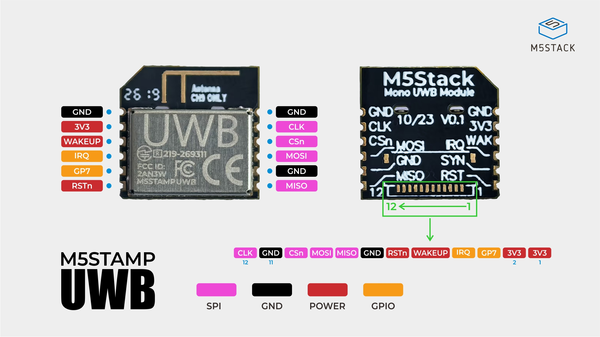

# はじめかた — 買ってから測位が出るまで

M5Stack **M5Stamp UWB Module with FPC** を 6 個買った人が、**タグ 1 台 + アンカー 5 台**の
UWB 測位を動かすまでの完全手順です。UWB の専門知識は前提にしません。

> ### 先に読んでほしいこと（正直な現状）
>
> - **このリポジトリのコードは実機で一度も動作確認していません。**
>   ビルドは全ファーム警告 0 で通り、測位計算はホスト（PC）上の合成データで
>   検証済みですが、**実機では Device ID すらまだ読めていません**（実機が未着のため）。
> - M5Stamp UWB Module with FPC は新しい製品で、コミュニティの作例もほとんどありません。
> - **半田付けパッドの向き（ピン 1 がどちらか）は実物で確認が必要です。**
>   ここを間違えると電源逆接でモジュールが壊れます（→ [3.1](#orientation)）。
> - つまり本書は「検証済みの手順書」ではなく、**設計資料から起こした最良の推定**です。
>   実物と違う点が出たら、そこがこのプロジェクトの最初のバグ報告になります。

**所要時間の目安**: 環境構築 30分 / 半田付け 6台で 2〜4時間 / 疎通確認 30分 /
測距・測位 1〜2時間 / アンテナ遅延校正 1〜2時間。

**章立て**

| 章 | 内容 | 実機 |
|---|---|:-:|
| [1](#bom) | 必要なもの | |
| [2](#setup) | 環境構築（ESP-IDF・リポジトリ・PC 上のテスト） | 不要 |
| [3](#wiring) | 配線（半田付け） | 要 |
| [4](#probe) | 疎通確認 `firmware/probe` ← **最初の関門** | 要 |
| [5](#twr) | 1 対 1 の測距 `firmware/twr` | 要 |
| [6](#anchors5) | アンカー 5 台の準備（アドレス設定） | 要 |
| [7](#survey) | 設置と座標入力 | 要 |
| [8](#run-tag) | 測位 `firmware/tag` | 要 |
| [9](#antenna-delay) | アンテナ遅延の校正 | 要 |
| [10](#troubleshooting) | トラブルシューティング | |
| [11](#limitations) | 既知の制約・未検証事項 | |

---

<a id="bom"></a>

## 1. 必要なもの

### 1.1 ハードウェア

| 品目 | 数量 | 備考 |
|---|---:|---|
| **M5Stamp UWB Module with FPC**（SKU `S017-F`） | **6** | Qorvo QM33120W (DW3720) 搭載。無印 `S017` でも可 |
| **M5Stamp S3** | **1** | タグ（移動体）のホスト |
| **M5 AtomS3** | **5** | アンカー（固定局）のホスト |
| USB-C ケーブル（データ通信対応） | 1〜 | 充電専用ケーブルでは書き込めない |
| USB 電源（アンカー給電用） | 5 | モバイルバッテリ・USB ハブ等 |

> **無印 `S017` と `S017-F` の違いは FPC コネクタが実装済みかどうかだけ**で、
> 基板・寸法・電気仕様・半田パッドは同一です。本書は**半田パッドを使う**ので
> どちらでも構いません。ただし `S017-F` は背面に FPC コネクタが出っ張っていて
> 厚みが 1.6mm → 2.8mm になるため、**背面をベタ貼りできません**。
> （出典: `docs/SOLDER_PADS.md` §0, §1.6）

### 1.2 工具・材料（半田付け）

**パッドは 1.27mm ピッチのキャステレーションホール（側面半円スルーホール）です。
2.54mm のピンヘッダは立ちません。細い線と細いこて先が要ります。**

| 品目 | 推奨 | 理由 |
|---|---|---|
| 電線 | **AWG30 ラッピングワイヤ**（芯線 0.25mm / 外径約 0.5mm）または **0.2〜0.26mm UEW（ポリウレタン線）** | 隣接パッド間の隙間は 0.67mm しかない。デュポン線（AWG24〜26）は直付け不可 |
| こて先 | **1.6mm C 型以下** | 隣とブリッジしないため |
| はんだごて | 温度調整式、320〜340℃（鉛フリーなら 350℃程度） | |
| **フラックス** | ペーストまたはペン | **これが無いと成功率が大きく落ちる** |
| 拡大鏡・ルーペ | 10倍程度 | ブリッジ確認に必須 |
| **テスター（導通・抵抗）** | | **向きの確認に必須。無しで進めない** |
| ピンセット | 先の細いもの | |
| エポキシ接着剤 or UV レジン | | 線の根元の固定。**やらないとほぼ確実に断線する** |
| 両面テープ・耐熱マット | | モジュールの固定 |
| 10µF セラミックコンデンサ + 0.1µF | 6 組 | 電源パッド直近に入れる（推奨。→ [3.7](#extra-parts)） |
| 10kΩ 抵抗 | 6 | RSTn のプルアップ（保険。→ [3.7](#extra-parts)） |

### 1.3 測定用

| 品目 | 用途 |
|---|---|
| **巻尺（5m 以上）またはレーザー距離計** | アンカー座標の実測。**これが測位精度の上限を決める** |
| 三脚・棚・突っ張り棒など | アンカーを高さを変えて固定する |
| 温度計 | アンテナ遅延校正時の温度記録（→ [9](#antenna-delay)） |

---

<a id="setup"></a>

## 2. 環境構築

実機がなくてもここまでは全部できます。

### 2.1 ESP-IDF v5.5.2

本リポジトリは **ESP-IDF v5.5.2** で検証しています。

```sh
mkdir -p ~/esp
cd ~/esp
git clone -b v5.5.2 --recursive https://github.com/espressif/esp-idf.git
cd ~/esp/esp-idf
./install.sh esp32s3
```

以降、**新しいターミナルを開くたびに**次を実行します（これを忘れると `idf.py` が見つかりません）。

```sh
. ~/esp/esp-idf/export.sh
```

確認:

```sh
idf.py --version      # → ESP-IDF v5.5.2
```

### 2.2 リポジトリの取得

```sh
git clone <このリポジトリの URL> m5stack_uwb
cd m5stack_uwb
```

> `third_party/` と `docs/refs/` は `.gitignore` されています（上流リポジトリの
> クローンとベンダ資料の置き場所で、ビルドには不要）。clone しただけの状態で
> 全ファームがビルドできます。

### 2.3 実機なしで動くテスト（PC 上）

配線を始める前に、測位計算そのものが正しく動くことを PC 上で確認できます。
**ESP-IDF は不要**です（C/C++ コンパイラだけで動きます）。

```sh
cd tools/test_pipeline
make test
```

期待される出力（最終行）:

```
=== 132 件中 0 件失敗 ===
```

アンカー 4 台・5 台、外れ値の棄却、欠測、同一平面配置の検出などを合成データで
検証しています。設定の永続化（[6.2](#anchors5-console) / [7.3](#survey)）についても、
**NVS に置くバイト列**の往復・境界値・壊れたデータの扱いをここで検算しています
（NVS そのものの読み書きは実機が要るので含まれません）。
**ここが通らないなら環境（コンパイラ）側の問題**です。

> `tools/test_uwb_loc/` にもテストがありますが、こちらはテストコード本体を
> `third_party/uwb_localizer/`（gitignore 済み）から参照するため、
> 上流リポジトリを別途クローンしないと動きません。買った人が実行する必要はありません。

### 2.4 とりあえずビルドしてみる

```sh
cd firmware/probe
idf.py set-target esp32s3
idf.py build
```

警告 0・エラー 0 で `uwb_probe.bin` ができれば環境構築は完了です。

---

<a id="wiring"></a>

## 3. 配線（半田付け）



**⚠ 半田パッドと FPC ケーブルでは信号の並びが違う。**
上の公式ピンマップで、**側面のラベルがパッド**、**下部の番号付きの帯が FPC ケーブル**を表す。
本手順は**パッド**に半田付けするので、側面ラベル側を見ること。


**この章がいちばん壊しやすいところです。焦らずに。**

詳細な寸法・出典は [`docs/SOLDER_PADS.md`](SOLDER_PADS.md) にあります。本章はそれを
手順の形にしたものです。

### 3.0 モジュールのパッド配置

12 個のパッドが、対向する 2 辺に 6 個ずつ、**1.27mm ピッチ**で並んでいます。

```
     ← 12.0 mm →
   ／‾‾‾‾‾‾‾‾‾‾‾‾‾＼         ← pin1 側の角だけ 2.0×2.0mm の大きな面取り
  ／                ＼
 ┌──────────────────┐
 │ ■■■■■■■■■■■■■■■■ │  ← アンテナ禁止領域（端から 3.556mm、表裏とも）
 │ ■  ANT KEEPOUT  ■ │     ここに配線・金属・グランドを置かない
 │ ■■■■■■■■■■■■■■■■ │
 ├──────────────────┤
 ◖1  GND      GND 12◗
 ◖2  3V3      CLK 11◗       ◖ ◗ = キャステレーション φ0.5mm
 ◖3  WAKEUP   CSn 10◗            ピッチ 1.27mm
 ◖4  IRQ      CDI  9◗
 ◖5  GP7      GND  8◗
 ◖6  RSTn     CDO  7◗
 └──────────────────┘
```

| パッド | 信号 | 意味 |
|---:|---|---|
| 1 | GND | グランド |
| **2** | **VCC_3V3** | **電源 3.3V 単一。5V は絶対に入れない** |
| 3 | DW_WAKEUP | ウェイクアップ制御（省電力を使わないなら未配線可） |
| 4 | DW_IRQ | 割り込み出力（現状の実装はポーリングなので未配線でも動く） |
| 5 | DW_GP7 | 予備。**配線不要** |
| 6 | DW_RSTn | リセット（負論理）。**配線推奨** |
| 7 | DW_CDO | SPI **MISO** |
| 8 | GND | グランド |
| 9 | DW_CDI | SPI **MOSI** |
| 10 | DW_CSn | SPI **CS** |
| 11 | DW_CLK | SPI **SCK** |
| 12 | GND | グランド |

**SPI 4 本 + GND 2 本がすべて右列（pin 7〜12）に集まっている**ので、
右列 6 本をリボン状にまとめて引き出すと戻り電流経路が短くなります（推奨）。

<a id="orientation"></a>

### 3.1 【最重要】向きを確定する

**ここを間違えて pin 2（3V3）と pin 11（CLK）を取り違えると、電源が信号線に
入ってモジュールが壊れます。半田付けの前に必ずやってください。**

1. **面取りの大きい角を探す。** pin 1 側の角だけ 2.0mm × 2.0mm の 45° 面取りが
   あり、他の 3 隅は 0.2mm です。面取りのある端が**アンテナ側**です。
2. **基板のシルク印刷を見る。** ピン番号や信号名が印刷されていれば**それが最優先**です。
   （印刷があるかどうかは**未確認**）
3. **テスターで検証する（必ずやる）。**

| 試験 | 期待される結果 | これで何が分かるか |
|---|---|---|
| pin **1 / 8 / 12** の 3 本が互いに導通するか | **0Ω で導通する** | GND は 3 本しかなく、この 3 箇所に非対称に並んでいる。**左右反転も 180° 回転も、この 1 試験で弾ける** |
| pin **2** と GND 間の抵抗 | **0Ω に張り付かない**（モジュール内にコンデンサが 24 個あるので、抵抗レンジでは最初低く出て徐々に上がる） | 電源がベタ短絡していないこと |

**この 2 つが両方合って初めて向きが確定します。**
合わないときは向きの解釈が間違っているので、90°/180°/裏返しを試して
もう一度 GND の並びを探してください。

> なぜ確認が要るか: 公式の PINMAP 画像が入手できておらず（配信サーバに接続不可）、
> 設計データからは**モジュールのどちらの面が部品面か**を確定できていません。
> キャステレーションは側面に出ているのでパッドの物理位置は表裏で変わりませんが、
> **左右の見え方が変わります**。（`docs/SOLDER_PADS.md` §1.4, §1.7）

### 3.2 タグ用の配線（M5Stamp S3 × 1台）

Stamp S3 は GPIO に余裕があるので**フル配線**します。

| UWB パッド | 信号 | Stamp S3 | 必須 |
|---:|---|---|:-:|
| 2 | VCC_3V3 | **3V3** | ● |
| 11 | DW_CLK | **G12** | ● |
| 9 | DW_CDI (MOSI) | **G11** | ● |
| 7 | DW_CDO (MISO) | **G13** | ● |
| 10 | DW_CSn | **G10** | ● |
| 6 | DW_RSTn | **G6** | ● |
| 4 | DW_IRQ | **G7** | ○ |
| 3 | DW_WAKEUP | **G8** | ○ |
| 5 | DW_GP7 | — | 配線不要 |
| 8, 12 | GND | **GND** | ● |

**合計 10 本**（信号 8 本 + GND 2 本）。

> **`5V` ピンには絶対に繋がないこと。** モジュールは 3.3V 単一供給で、
> 5V を入れると壊れます（`docs/SURVEY_m5stamp_uwb_module.md`）。

### 3.3 アンカー用の配線（M5 AtomS3 × 5台）

AtomS3 は空き GPIO が実質 6 本しかないので、WAKEUP と GP7 は未配線です。

| UWB パッド | 信号 | AtomS3 | 必須 | 備考 |
|---:|---|---|:-:|---|
| 2 | VCC_3V3 | **3V3** | ● | **Grove の 5V から取らない** |
| 11 | DW_CLK | **G7** | ● | 底面 6 ピンヘッダ |
| 9 | DW_CDI (MOSI) | **G6** | ● | 底面 6 ピンヘッダ |
| 7 | DW_CDO (MISO) | **G5** | ● | 底面 6 ピンヘッダ |
| 10 | DW_CSn | **G8** | ● | 底面 6 ピンヘッダ |
| 6 | DW_RSTn | **G1** | ● | Grove SDA を転用（**Grove I2C は使えなくなる**） |
| 4 | DW_IRQ | **G2** | ○ | Grove SCL を転用 |
| 3, 5 | WAKEUP, GP7 | — | | 未配線 |
| 8, 12 | GND | **GND** | ● | |

**合計 9 本**（信号 7 本 + GND 2 本）。

> **IRQ（pin 4 → G2）は配線しておくことを強く推奨します。**
> 現在の実装は IRQ を使わないポーリング方式ですが、将来 IRQ 駆動化する際に
> 効くのは**レスポンダ側（＝アンカー＝AtomS3）の折り返し時間**です。
> ここが配線されていないと後戻りできません。（`firmware/anchor/PROGRESS.md`）

> **ホスト側のピン番号は暫定値です。** `boards/stamps3.h` / `boards/atoms3.h` の
> 冒頭にも同じ注意書きがあります。**基板のシルクと照合してから半田付け**してください。
> 実配線を変えた場合は、この 2 ファイルの値も必ず合わせて直します。

### 3.4 アンテナ禁止領域（測距距離に効く）

**面取りのある端（pin 1 / pin 12 側）から 3.556mm の帯には、表裏とも
配線・金属・グランド・電池・カーボンを置かないでください。**

- 公式フットプリントに**表裏両面の銅箔禁止領域**として定義されています。
- 配線の引き出しは **pin 6 / pin 7 側**（面取りと反対の端）へ逃がします。
- モジュールを板やケースに固定するときも、この帯の下に金属を入れないこと。
- 疎通確認（Device ID の読み出し）には影響しませんが、**測距距離に直接効きます**。
  「測距距離が極端に短い」ときはここを疑ってください。

### 3.5 半田付けの手順

1. モジュールを両面テープで板に固定する。**アンテナ側 3.5mm には金属を置かない。**
2. 使うパッドにだけ**フラックスを塗り、予備はんだを薄く盛る**。
   隣接パッドとの隙間は 0.67mm しかないので、**盛りすぎない**。
3. 線の先端 1mm を予備はんだし、切り欠きに当てて**こて先 1 秒**で付ける。
4. 全部付けたら:
   - **拡大鏡で隣接ブリッジを目視確認**
   - **テスターで隣接ピン間が導通していないことを確認**（特に **9-10, 10-11, 11-12**）
   - **もう一度 pin 1/8/12 の GND 導通と、pin 2 ↔ GND が 0Ω でないことを確認**
5. **エポキシまたは UV レジンで線の根元を固定する。**
   これをやらないと実験中にほぼ確実にパッドごと剥がれます。

### 3.6 配線長と信号品質

- **配線長は 10cm 以内**を目安に。SPI を 16MHz で走らせます。
- すべての線をできるだけ同じ長さに揃え、**GND 線を SPI 線と束ねる**。
- **途中にブレッドボードを挟まない。** 接触抵抗と容量が 16MHz に効きます。
- 16MHz で不安定なら、`boards/stamps3.h` / `boards/atoms3.h` の
  `spi_fast_hz` を **8000000 → 4000000** と落として切り分けます
  （`spi_slow_hz`（初期化時 2MHz）は変えない）。

<a id="extra-parts"></a>

### 3.7 推奨: 外付け部品

いずれも M5Stack の要求仕様ではなく、**飛び線で配線することに対する保険**です。

| 部品 | 入れる場所 | 理由 |
|---|---|---|
| **10µF セラミック + 0.1µF** | pin 2 (3V3) と pin 1 (GND) の直近 | 飛び線には配線インダクタンスが乗る。モジュール内蔵のデカップリング（コンデンサ 24 個）だけでは足りない可能性 |
| **10kΩ プルアップ** | pin 6 (RSTn) ↔ pin 2 (3V3) 間 | **ドライバは RSTn を能動的に High へ駆動しません**（初期化時ハイインピーダンス、リセット時だけ Low）。**モジュール側のプルアップが前提**ですが、その有無は回路図が入手できておらず**未確認**です。RSTn が浮くとリセットが解除されない可能性があります |

**疎通が全く取れないとき、まずこの 2 つを疑ってください。**

---

<a id="probe"></a>

## 4. 疎通確認（`firmware/probe`）

**ここが最初の関門です。** SPI で Device ID **`0xDECA0314`** が読めれば、
以降はほぼソフトウェアの話になります。

<a id="probe-flash"></a>

### 4.1 書き込み

Stamp S3 / AtomS3 はどちらも ESP32-S3 のネイティブ USB でつながります。

```sh
. ~/esp/esp-idf/export.sh
cd firmware/probe

# ポート名を確認（macOS）
ls /dev/cu.usbmodem*
# Linux なら ls /dev/ttyACM*

idf.py set-target esp32s3
```

**M5Stamp S3（既定）の場合:**

```sh
idf.py build
idf.py -p /dev/cu.usbmodemXXXX flash monitor
```

**M5 AtomS3 の場合**は、ボード選択を切り替えます。

```sh
idf.py menuconfig
# → UWB Probe Configuration → Target host board → M5 AtomS3
idf.py build
idf.py -p /dev/cu.usbmodemXXXX flash monitor
```

> **書き込みモードに入れないとき**: 通常は `idf.py flash` が自動でリセットして
> 書き込めますが、失敗する場合は手動でダウンロードモードに入れます。
> M5Stamp S3 は中央のボタンを押しながら USB を挿す、
> AtomS3 は側面のリセットボタンを 2 秒ほど長押しします。
> （**この操作は本リポジトリでは実機確認していません**。M5Stack の各製品ページを参照）

> `monitor` を抜けるには `Ctrl-]`。

### 4.2 期待される出力

```
I (xxx) uwb_probe: Phase 1 UWB probe acceptance test, board=Stamp S3
I (xxx) uwb_probe: L1: raw DEV_ID = 0xDECA0314 (expect 0xDECA0314) -> OK
I (xxx) uwb_probe: L2: dwt_probe + dwt_readdevid = 0xDECA0314 (expect 0xDECA0314) -> OK
I (xxx) uwb_probe: === L1: PASS / L2: PASS ===
I (xxx) uwb_probe: L1 (periodic): raw DEV_ID = 0xDECA0314
...
```

- **L1** = 生の SPI で DEV_ID レジスタを読む（配線が合っているか）
- **L2** = Qorvo SDK の `dwt_probe()` を通す（ドライバが初期化できるか）
- そのあと **1 秒周期で L1 を繰り返します**。値がずっと `0xDECA0314` で
  安定していることを 1 分ほど眺めてください。**たまに崩れるなら SPI 品質の問題**です。

**6 台すべてでこれを確認してから先に進んでください。**

<a id="probe-troubleshoot"></a>

### 4.3 読めないときの切り分け

| 症状 | 疑うところ | 対処 |
|---|---|---|
| `0x00000000` が返る | MISO (pin 7) 未接続 / CS (pin 10) が効いていない / 電源が来ていない | 3V3 パッドの電圧を実測。pin 7・10 の導通確認 |
| `0xFFFFFFFF` が返る | MISO が浮いている / モジュール未給電 | 同上。**予備はんだが切り欠きに乗らず被覆越しに触っているだけ**のケースが多い |
| 値が毎回バラつく | 配線長・SPI クロック・GND の戻り経路 | GND を pin 8 と pin 12 の 2 本にする → それでも駄目なら `spi_fast_hz` を 8MHz / 4MHz に落とす |
| **触ると値が変わる** | パッド根元の剥がれ | 固定剤で補強してやり直す |
| **隣の信号が連動する** | 半田ブリッジ | 拡大鏡で **9-10-11-12** を重点確認 |
| L1 は OK だが L2 が FAIL | `dwt_probe()` 周り。WAKEUP シーケンス | RSTn のプルアップを追加してみる（[3.7](#extra-parts)） |
| **全く反応しない** | 電源・向き | **配線を外して [3.1](#orientation) の導通試験からやり直す**。3.3V を実測 |
| 電源を入れた瞬間に熱い | **電源逆接** | ただちに外す。モジュールが死んでいる可能性が高い |

### 4.4 通ったら記録する

- 実際に使ったピン番号（`boards/*.h` を実配線に合わせて更新する）
- 動作した `spi_fast_hz`（16MHz が通ったか）と、そのときの配線長
- 3.3V 供給時の消費電流
  （データシート値: スリープ 75.9µA / アンカー 5.23mA / **タグ 58.0mA** @3.3V）

---

<a id="twr"></a>

## 5. 1 対 1 の測距（`firmware/twr`）

測位に進む前に、**2 台だけで距離が出ること**を確認します。
使うのは評価用ファーム `firmware/twr` です（役割と方式を Kconfig で切り替えられる）。

### 5.1 用語

| 語 | 意味 |
|---|---|
| **TWR** | Two-Way Ranging。電波の往復時間から距離を出す方式 |
| **SS-TWR** | Single-Sided。Poll → Response の 1 往復。**距離はタグ側で計算**。速いが両者の水晶のずれ（クロックオフセット）の影響を受けやすい |
| **DS-TWR** | Double-Sided。さらに Final / Result のやりとりが加わる。**距離はアンカー側で計算**してタグへ返す。クロックずれに強いが 1 リンクあたりの時間が伸びる |
| **イニシエータ / レスポンダ** | 測距を始める側 / 応える側。タグ＝イニシエータ、アンカー＝レスポンダ |

**タグ側とアンカー側は必ず同じ方式（SS/DS）にしてください。** 違うと噛み合いません。

### 5.2 ビルドと書き込み

タグ役（Stamp S3 + M5Stamp UWB Module with FPC）とアンカー役（AtomS3 + M5Stamp UWB Module with FPC）を
1 台ずつ用意します。ビルドディレクトリと `sdkconfig` を分けると、
2 つの設定を行き来せずに済みます。

```sh
. ~/esp/esp-idf/export.sh
cd firmware/twr

# --- タグ役: Stamp S3 / TAG / SS-TWR（すべて既定値） ---
mkdir -p build/tag_ss
idf.py -B build/tag_ss -D SDKCONFIG=build/tag_ss/sdkconfig build

# --- アンカー役: AtomS3 / ANCHOR / SS-TWR ---
mkdir -p build/anc_ss
cat > build/anc_ss/role.defaults <<'EOF'
CONFIG_UWB_TWR_BOARD_ATOMS3=y
CONFIG_UWB_TWR_ROLE_ANCHOR=y
CONFIG_UWB_TWR_METHOD_SS=y
EOF
idf.py -B build/anc_ss -D SDKCONFIG=build/anc_ss/sdkconfig \
       -D SDKCONFIG_DEFAULTS="sdkconfig.defaults;build/anc_ss/role.defaults" build
```

書き込み（それぞれのボードを挿してポート名を確認してから）:

```sh
idf.py -B build/anc_ss -p /dev/cu.usbmodemAAAA flash monitor   # アンカー役
idf.py -B build/tag_ss -p /dev/cu.usbmodemBBBB flash monitor   # タグ役
```

> `build/` は `.gitignore` されているので、この方法なら作業用ファイルが git を汚しません。
> `idf.py -B <dir> ...` は 2 回目以降 `-D` を付けなくても設定を保持します（確認済み）。

### 5.3 期待される出力

**アンカー役**（20 回成功ごと）:

```
I (xxx) uwb_twr: SS_RESP_STAT ok=20 fail=0 last=OK seq=19 requester=0x0001 elapsed_ms=3
```

**タグ役**（10 回ごと）:

```
I (xxx) uwb_twr: SS_RANGE_STAT count=10 ok=10 fail=0 rate=100.0% last=OK seq=9
  distance_mm=1234 distance_m=1.234 mean_mm=1231.5 std_mm=8.2 n=10 elapsed_ms=3
```

<a id="twr-measure"></a>

### 5.4 ここで必ず実測すること

| 見るもの | どこ | 何のため |
|---|---|---|
| **`elapsed_ms`（1 リンクの所要時間）** | タグ側ログ | **更新レート設計の根拠**。アンカー 5 台なら 1 周 ≒ この 5 倍。5 台で 1 周 200ms なら 5Hz |
| `rate=` （成功率） | タグ側ログ | 90% を大きく下回るなら配線か配置の問題 |
| `mean_mm` / `std_mm` | タグ側ログ | 巻尺の実測値と比べる。**平均が数十cm〜1m ずれているのは正常**（アンテナ遅延未校正。→ [9](#antenna-delay)）。**`std_mm` が数cm 以内かどうか**を見る |

### 5.5 DS-TWR も試す

本番運用の既定は **DS-TWR** です。上のスクリプトの `_SS` を `_DS` に変えて
同じことをやり、**`elapsed_ms` が SS からどれだけ伸びるか**を測ってください。

```sh
mkdir -p build/tag_ds build/anc_ds
printf 'CONFIG_UWB_TWR_METHOD_DS=y\n' > build/tag_ds/role.defaults
idf.py -B build/tag_ds -D SDKCONFIG=build/tag_ds/sdkconfig \
       -D SDKCONFIG_DEFAULTS="sdkconfig.defaults;build/tag_ds/role.defaults" build

cat > build/anc_ds/role.defaults <<'EOF'
CONFIG_UWB_TWR_BOARD_ATOMS3=y
CONFIG_UWB_TWR_ROLE_ANCHOR=y
CONFIG_UWB_TWR_METHOD_DS=y
EOF
idf.py -B build/anc_ds -D SDKCONFIG=build/anc_ds/sdkconfig \
       -D SDKCONFIG_DEFAULTS="sdkconfig.defaults;build/anc_ds/role.defaults" build
```

DS-TWR では距離をアンカー側が計算するので、**アンカー側のログにも
`distance_m` / `mean_mm` / `std_mm` が出ます**。

---

<a id="anchors5"></a>

## 6. アンカー 5 台の準備

本番用アンカーファームは `firmware/anchor` です（常にレスポンダ。役割選択なし）。

**5 台それぞれに違うショートアドレス `0x0002`〜`0x0006` を持たせる必要がありますが、
ビルドは 1 回で済みます。** 同じファームを 5 台に焼いてから、1 台ずつ USB でつないで
シリアルコンソールの `addr set` → `save` でアドレスを書き分けます
（USB-Serial/JTAG 上の REPL。`idf.py monitor` で接続した端末がそのままコンソールになります）。
Kconfig の `UWB_ANCHOR_SHORT_ADDR` も引き続きありますが、これは
**「NVS が空のときに使う初期値」**という位置づけに変わりました。何も設定しなければ
従来どおりこの値で動きます（後方互換）。

### 6.1 既定値の確認

`firmware/anchor` の既定は**この構成にそのまま合っています**。

| 項目 | 既定値 |
|---|---|
| ボード | **M5 AtomS3** |
| 方式 | **DS-TWR** |
| ショートアドレス | `0x0002`（NVS が空のときの初期値） |

`firmware/tag` の既定も **Stamp S3 / DS-TWR** なので、方式は揃っています。

<a id="anchors5-console"></a>

### 6.2 コンソールでアドレスを書き込む（推奨）

**ビルドは 1 回だけ**です。5 台とも同じ `uwb_anchor.bin` を書き込みます。

```sh
. ~/esp/esp-idf/export.sh
cd firmware/anchor
idf.py set-target esp32s3      # 初回のみ
idf.py build
```

**1 台ずつ USB に挿し、そのつどポート名を確認して**書き込みます。

```sh
ls /dev/cu.usbmodem*                                   # ポート名を確認（macOS）
# Linux なら ls /dev/ttyACM*
idf.py -p /dev/cu.usbmodemXXXX flash monitor
```

`monitor` がそのまま端末になるので、起動ログが流れたあとにプロンプト `uwb-anchor>`
が出たら、そこでコマンドを打ちます。**1 台目（アドレス `0x0002` にする個体）は
Kconfig の既定値と一致するので `addr set` は不要ですが、`save` は実行しておくことを
勧めます**（NVS に値が入り、起動ログが `(nvs)` になるので「設定済みの個体」だと
一目で分かります）。2 台目以降は `addr set` で書き換えます。

```
uwb-anchor> addr
short_addr = 0x0002  (Kconfig 既定値 = 0x0002, NVS = 未保存（save が必要）)
uwb-anchor> addr set 0x0003
short_addr = 0x0003 に変更しました（次の応答から反映）。電源を切っても残すには save を実行してください
uwb-anchor> save
NVS へ保存しました: short_addr = 0x0003
uwb-anchor> reboot
再起動します
```

再起動後の起動ログでアドレスと設定の出どころ（`nvs`）を確認します。

```
I (xxx) uwb_anchor: Phase 4 Step 2 uwb_qm33120 production anchor firmware,
  board=AtomS3 method=DS-TWR short_addr=0x0003 (nvs)
I (xxx) uwb_anchor: deviceId=0xDECA0314 (expect 0xDECA0314) chipName=... isInitialized=1
I (xxx) uwb_anchor: begin() + PHY config OK, starting ANCHOR/DS-TWR loop (short_addr=0x0003)
```

`info` コマンドでも Device ID と現在のアドレスをまとめて確認できます。

```
uwb-anchor> info
=== uwb_anchor ===
  board        : AtomS3
  method       : DS-TWR
  device id    : 0xDECA0314  chip: ...
  short_addr   : 0x0003  (起動時の設定元: nvs, Kconfig 既定値: 0x0002, NVS: 保存済み)
  tag addr     : 0x0001   pan id: 0xDECA
  nvs          : 使用可
  ranging      : ok=0 fail=0 rate=0.0%
  distance     : (まだサンプルがありません)
  free heap    : ... bytes
```

`Ctrl-]` で `monitor` を抜けて USB を抜き、次の個体に挿し替えて
`0x0004`・`0x0005`・`0x0006` について同じ手順を繰り返します。

**書き込んだアドレスをボードにテープで貼る**などして、必ず物理的に判別できるようにしてください
（後で座標と対応づけるときに必須）。

> **アドレスに `0xFFFF` は使わないこと**（ブロードキャストアドレス。`addr set` 側でも拒否されます）。
> タグは `0x0001` 固定です（`firmware/tag/main/main.cpp` の `TAG_SHORT_ADDR`。
> `addr set 0x0001` もコンソール側で拒否されます）。PAN ID は両方 `0xDECA` 固定です。

> コンソールを無効化したい場合は `menuconfig` → `UWB Anchor Configuration` →
> 「シリアルコンソール (USB-Serial/JTAG) を有効にする」（`CONFIG_UWB_ANCHOR_CONSOLE`、既定 y）を外します。

### 6.3 代替手段: ビルド時に焼き込む

**コンソールが使えない場合や、大量に量産する場合**は、従来どおりアドレスごとに
ビルドディレクトリを分けて焼き込むこともできます。`idf.py menuconfig` を 5 回
やるのは煩雑なので、アドレスだけを差し替えた設定断片を作ってビルドディレクトリを
分けます。**この手順は動作確認済みです。**

```sh
. ~/esp/esp-idf/export.sh
cd firmware/anchor

for ADDR in 0002 0003 0004 0005 0006; do
  mkdir -p "build/a$ADDR"
  printf 'CONFIG_UWB_ANCHOR_SHORT_ADDR=0x%s\n' "$ADDR" > "build/a$ADDR/addr.defaults"
  idf.py -B "build/a$ADDR" \
         -D SDKCONFIG="build/a$ADDR/sdkconfig" \
         -D SDKCONFIG_DEFAULTS="sdkconfig.defaults;build/a$ADDR/addr.defaults" \
         build || break
done
```

確認:

```sh
grep -H UWB_ANCHOR_SHORT_ADDR build/a*/sdkconfig
# build/a0002/sdkconfig:CONFIG_UWB_ANCHOR_SHORT_ADDR=0x0002
# build/a0003/sdkconfig:CONFIG_UWB_ANCHOR_SHORT_ADDR=0x0003
# ...
```

**1 台ずつ USB に挿し、そのつどポート名を確認して**書き込みます。
**書き込んだアドレスをボードにテープで貼る**などして、必ず物理的に判別できるようにしてください
（後で座標と対応づけるときに必須）。

```sh
ls /dev/cu.usbmodem*                                   # ポート名を確認
idf.py -B build/a0002 -p /dev/cu.usbmodemXXXX flash monitor
```

起動ログでアドレスを確認します:

```
I (xxx) uwb_anchor: Phase 4 Step 2 uwb_qm33120 production anchor firmware,
  board=AtomS3 method=DS-TWR short_addr=0x0002 (default)
I (xxx) uwb_anchor: deviceId=0xDECA0314 (expect 0xDECA0314) chipName=... isInitialized=1
I (xxx) uwb_anchor: begin() + PHY config OK, starting ANCHOR/DS-TWR loop (short_addr=0x0002)
```

これを `a0003` 〜 `a0006` について繰り返します。この方法で焼いた個体は
起動ログに `(default)`（Kconfig 由来）と出ます。あとからコンソールでアドレスを
変更すればそちらが優先され、次回起動時のログも `(nvs)` に変わります。

> **アドレスに `0xFFFF` は使わないこと**（ブロードキャストアドレス）。
> タグは `0x0001` 固定です（`firmware/tag/main/main.cpp` の `TAG_SHORT_ADDR`）。
> PAN ID は両方 `0xDECA` 固定です。

---

<a id="survey"></a>

## 7. アンカーの設置と座標入力

**測位の精度は、ここでの実測精度を絶対に超えられません。**

<a id="placement-rules"></a>

### 7.1 配置ルール（必ず守る）

[`docs/ANCHOR_PLACEMENT.md`](ANCHOR_PLACEMENT.md) に実測にもとづく根拠があります。要点:

| ルール | 理由 |
|---|---|
| **① アンカーを同一平面に置かない。最低 1 台（できれば複数）は高さを変える** | 同一平面だと 3D の高さが幾何的に決まらず、**アンカー平面に対して対称な鏡像解**が出る。どちらが返るかは初期値次第 |
| **② アンカー平面がワールド原点を通らないようにする** | 「床にアンカーを並べて床を z=0 にする」は**最悪の配置**（①②の両方に違反）で、実測上 Lv2 ソルバが**毎回失敗**する |
| ③ 部屋の四隅＋中央のように水平方向に広げる | GDOP（幾何精度劣化係数）が改善する |
| ④ タグとアンカーの間に人・金属・壁をなるべく入れない | UWB は見通し（LOS）で最も正確 |

**「床に 5 台並べる」は絶対にやらないでください。**

### 7.2 座標系を決める

1. 部屋の 1 つの角を基準に、**X 軸・Y 軸を壁沿い、Z 軸を上向き**にとる。
2. **床を z = 0 にしてよい**のは、アンカーが同一平面でない場合だけです
   （原点通過の警告は「同一平面」と判定されたときだけ出ます）。
   迷うなら**床を z = 0.1 のように少し持ち上げる**と安全側です。
3. 各アンカーの**アンテナ位置**（モジュールの面取り側）の座標を巻尺で測ります。
   ホストボードの位置ではなく**モジュールの位置**です。

### 7.3 座標を書き込む

**主な方法は、タグ本体のシリアルコンソールから `anchor set` で 1 件ずつ入力し、
`save` で NVS に保存することです。** ビルド・書き込みは不要で、**次の測位周期から
反映**されます。

タグを USB で PC につなぎ、`idf.py -p /dev/cu.usbmodemXXXX monitor` で接続します。
タグは毎周期 JSON を 2 行吐くので、**作業前に `output off` で出力を止めておくと
打ちやすくなります**。終わったら `output on` で戻します。

```
uwb-tag> output off
json output = off
uwb-tag> anchor set 0 0x0002 0.000 0.000 2.400
anchor[0] = 0x0002 (0.000, 0.000, 2.400) enabled=yes
次の測位周期から反映されます。残すには save を実行してください
uwb-tag> anchor set 1 0x0003 5.000 0.000 0.200
anchor[1] = 0x0003 (5.000, 0.000, 0.200) enabled=yes
次の測位周期から反映されます。残すには save を実行してください
uwb-tag> anchor set 2 0x0004 5.000 5.000 2.400
anchor[2] = 0x0004 (5.000, 5.000, 2.400) enabled=yes
次の測位周期から反映されます。残すには save を実行してください
uwb-tag> anchor set 3 0x0005 0.000 5.000 0.200
anchor[3] = 0x0005 (0.000, 5.000, 0.200) enabled=yes
次の測位周期から反映されます。残すには save を実行してください
uwb-tag> anchor set 4 0x0006 2.500 2.500 2.400
anchor[4] = 0x0006 (2.500, 2.500, 2.400) enabled=yes
次の測位周期から反映されます。残すには save を実行してください
uwb-tag> anchor list
idx  addr       x[m]      y[m]      z[m]   delay[m]  enabled
  0  0x0002     0.000     0.000     2.400     0.0000  yes
  1  0x0003     5.000     0.000     0.200     0.0000  yes
  2  0x0004     5.000     5.000     2.400     0.0000  yes
  3  0x0005     0.000     5.000     0.200     0.0000  yes
  4  0x0006     2.500     2.500     2.400     0.0000  yes
件数 5 / 上限 8（うち enabled 5）  NVS: 未保存（save が必要）
uwb-tag> save
NVS へ保存しました: アンカー 5 件
uwb-tag> output on
json output = on
```

`idx`（第 1 引数）は登録テーブルの添字（0 始まり）です。**現在の件数以上の idx を
指定すると、そこまで件数が自動的に広がります**（間のスロットは未設定＝
`enabled=false` で埋まります）。`anchor set` で座標を入れたスロットは
**`enabled` が自動で `true`** になり、`antenna_delay_m` は既存の値を保ったまま
変わりません（[9.2](#antenna-delay) で別途設定します）。

| 引数 | 意味 |
|---|---|
| 第 1 引数 (idx) | 登録テーブルの添字（0 始まり） |
| 第 2 引数 | ショートアドレス。**[6](#anchors5) で焼いた値と一致させる**。`0x0000`〜`0xFFFE`、タグ自身の `0x0001` は不可 |
| 第 3〜5 引数 | ワールド座標 `x y z` [m]。**巻尺の実測値**。±10000m 以内の有限値のみ |

**設置後に数 cm 直したいときも、同じコマンドをその場で打ち直して `save` する
だけです。** 再ビルド・再書き込みは不要で、次の測位周期から反映されます。
これが今回の一番の改善点です。

台数を減らしたい場合は `anchor count <n>`（1〜8）で件数そのものを変えられます。
増えた分のスロットは未設定（`enabled=false`）になるので `anchor set` で埋めてください。

---

#### 代替手段: 既定値をソースに焼き込む

コンソールを使わない場合は、`firmware/tag/main/main.cpp` の `kAnchors[]`
（NVS が空のときに使われる既定値）を実測値に置き換えて再ビルドします。

```cpp
static const uwb::AnchorEntry kAnchors[] = {
    {0x0002, {0.0f, 0.0f, 2.4f}, 0.0f, true},
    {0x0003, {5.0f, 0.0f, 0.2f}, 0.0f, true},
    {0x0004, {5.0f, 5.0f, 2.4f}, 0.0f, true},
    {0x0005, {0.0f, 5.0f, 0.2f}, 0.0f, true},
    {0x0006, {2.5f, 2.5f, 2.4f}, 0.0f, true},
};
```

| 位置 | 意味 |
|---|---|
| 第 1 引数 | ショートアドレス。**[6](#anchors5) で焼いた値と一致させる** |
| 第 2 引数 | ワールド座標 `{x, y, z}` [m]。**巻尺の実測値** |
| 第 3 引数 | `antenna_delay_m` [m]。**まず 0.0f のまま**。[9](#antenna-delay) で埋める |
| 第 4 引数 | `enabled`。`false` にすると測距・測位から除外される（切り分けに便利） |

> **既定値は 5m × 5m の部屋の例です。そのまま使わないでください。**
> この例は配置ルールを満たすように作ってあります（高さ 2.4m が 3 台、0.2m が 2 台
> → 同一平面でない。最低高さ 0.2m → 平面が原点を通らない）。
> 実測値に置き換えるときも、**高さを 2 段以上に散らす**構造は保ってください。

台数を減らす／増やす場合は配列の要素を増減するだけです（上限は `UWB_LOC_MAX_ANCHORS`、既定 8）。
**3D 測位には有効測距が最低 4 件必要**です。5 台以上あって初めて
「1 台を外れ値として弾いても解ける」状態になります。

---

<a id="run-tag"></a>

## 8. 測位を動かす（`firmware/tag`）

### 8.1 書き込み

```sh
. ~/esp/esp-idf/export.sh
cd firmware/tag
idf.py set-target esp32s3      # 初回のみ
idf.py build
idf.py -p /dev/cu.usbmodemXXXX flash monitor
```

既定は **Stamp S3 / DS-TWR / EKF 無効 / 2D 自動フォールバック有効**です。

**アンカー 5 台に先に電源を入れてから**タグを起動してください。

### 8.2 起動時に必ず見るログ

```
I (xxx) uwb_tag: Phase 4 Step 2 uwb_tag firmware, board=Stamp S3 method=DS-TWR anchors=5 (nvs)
I (xxx) uwb_tag: deviceId=0xDECA0314 ... isInitialized=1
I (xxx) uwb_tag: begin() + PHY config OK, starting ranging loop
```

末尾の `(nvs)` / `(default)` が設定の出どころです。[7.3](#survey) のコンソールで
`save` 済みなら `nvs`、NVS が空・未初期化なら `kAnchors[]` の既定値を使った
`default` になります。アンカー側の起動ログでも `short_addr=0x0003 (nvs)` のように
同じ形式で出ます（[6.2](#anchors5-console)）。

**次の警告が出たら配置がまずい**ので [7.1](#placement-rules) に戻ってください。

```
W (xxx) uwb_tag: 登録済みアンカーが同一平面上にあります。3D測位のambiguousフラグを必ず確認してください
W (xxx) uwb_tag: アンカー平面が原点を通っています。ワールド原点をずらしてください
W (xxx) uwb_tag: dim=2 (z_fixed=1.200m) へフォールバックしました
```

> 最後の行が出た場合、**高さは解かれず 1.2m 固定になっています**。
> 3D 測位はしていません。`UWB_TAG_FIXED_Z_MM` で固定値を変えられますが、
> **本来は配置を直すべき**です。生の失敗をそのまま見たいときは
> `menuconfig` → `UWB Tag Configuration` → 自動フォールバックを無効にします。

### 8.3 JSON Lines 出力の読み方

タグは診断ログ（`I (xxx) uwb_tag: ...`）とは別に、**行頭が `{` の JSON を
1 行ずつ標準出力へ**書きます。3 種類あります。

#### `"type":"anchors"` — 起動時に 1 回

```json
{"v":1,"type":"anchors","anchors":[{"id":"A0002","p":[0.0000,0.0000,2.4000],"antenna_delay_m":0.0000,"enabled":true}, ...]}
```

**`kAnchors[]` が意図通り書き込まれたかの確認に使います。**

#### `"type":"meas"` — 毎周期。測距値そのもの

```json
{"v":1,"type":"meas","t":12.345,"tag":"tag0","meas":[{"a":"A0002","d":3.1416},{"a":"A0003","d":4.2000}]}
```

| フィールド | 意味 |
|---|---|
| `t` | 起動からの経過秒 |
| `a` | アンカー ID（`A` + ショートアドレス 4 桁 hex） |
| `d` | 測距値 [m]（**アンテナ遅延の補正前の生値**） |

**失敗したアンカーはこの配列に含まれません。** 要素数が減っていたら欠測しています。

#### `"type":"fix"` — 毎周期。測位結果と診断情報

```json
{"v":1,"type":"fix","t":12.345,"tag":"tag0","cycle_ms":210,"primary_level":"Lv2",
 "ok":true,"ambiguous":false,"solvable":true,"p":[1.7000,1.1000,0.9000],
 "gdop":1.8321,"residual_rms":0.0412,"sigma":0.0755,"n_used":5,"n_total":5,
 "excluded":"0x00000000","solve_us_lv0":120,"solve_us_lv2":980,
 "lv0":{...},"anchors":[{"a":"A0002","ok":true,"d":3.1416,"elapsed_ms":42}, ...]}
```

トップレベルの値は **Lv2（本番ソルバ）**の結果です。

| フィールド | 意味 | 見かた |
|---|---|---|
| **`ok`** | 位置が解けたか | **`false` なら `p` は無意味**。無視すること |
| **`ambiguous`** | 高さが信用できないか | **`true` なら z を使ってはいけない**（鏡像解の可能性）。`ok` と**両方必ず見る** |
| `solvable` | 有効測距が閾値（3D なら 4 件）以上あってソルバを呼んだか | `false` は「測位不能」。測距が足りていない |
| `p` | 推定位置 `[x, y, z]` [m] | |
| **`cycle_ms`** | **アンカー全台を 1 周するのにかかった時間 [ms]** | **更新レートそのもの**。210ms なら約 4.8Hz |
| `gdop` | 幾何精度劣化係数 | 小さいほど良い。GNSS 一般の目安は 3 以下（**本プロジェクトでの実測基準は未確立**）。大きいならアンカー配置が偏っている |
| `residual_rms` | 残差の RMS [m] | 測距値とモデルの食い違い。**大きいなら座標入力ミスかアンテナ遅延未校正**（無校正時のばらつきは 3σ ≈ 30cm 級。しきい値は実機で決めること） |
| `sigma` | 位置誤差の代表値 [m] | |
| `n_used` / `n_total` | 実際に使った測距数 / 全体 | |
| **`excluded`** | 外れ値として弾いたアンカーのビットマスク | **特定のアンカーがいつも立つなら、そのアンカーの座標入力ミス・NLOS（壁越し）・アンテナ遅延ずれを疑う**。bit n = `kAnchors[n]` |
| `solve_us_lv0` / `_lv2` | 各ソルバの計算時間 [µs] | |
| `lv0` | 比較用の簡易ソルバ（閉形式三辺測量）の結果 | Lv2 と大きく食い違うなら配線・座標系を疑う |
| `anchors[]` | アンカーごとの成否・距離・**その 1 リンクの所要時間** | `ok:false` が続くアンカーを特定できる |

> Lv3（EKF、移動体向けの平滑化）は既定で無効です。有効にすると `solve_us_lv3` と
> `"lv3":{...}` が増えます（`menuconfig` → `UWB Tag Configuration` → 毎周期 Lv3 EKF も呼ぶ）。

### 8.4 ログをファイルに残す

```sh
idf.py -p /dev/cu.usbmodemXXXX monitor | tee run.log
# 別ターミナルで、あるいは終了後に:
grep -a '^{' run.log > run.jsonl
```

`run.jsonl` は 1 行 1 JSON なので、`jq` や Python でそのまま扱えます。

```sh
# 位置と品質だけ抜き出す
jq -r 'select(.type=="fix") | [.t, .ok, .ambiguous, .p[0], .p[1], .p[2], .gdop, .residual_rms, .cycle_ms] | @tsv' run.jsonl
```

> `"anchors"` / `"meas"` 行は上流 [uwb_localizer](https://github.com/kouhei1970/uwb_localizer) の
> `JsonLinesHal` がそのまま読める形式です。`"fix"` は本プロジェクト独自の追加で、
> `JsonLinesHal` は未知の `type` を黙って読み捨てるので共存できます。

<a id="first-checks"></a>

### 8.5 動かして最初に確認すること

1. **タグを固定して数十秒回す。** `p` のばらつきを記録する（実機での期待値は未確立。まずは基準値を作る）。
2. **巻尺で測った真の位置と比べる。** ずれの**平均**が数十 cm あるのは正常です
   （アンテナ遅延未校正）。**ばらつきではなく偏りなら [9](#antenna-delay) で消えます。**
3. **タグを 1m 動かして、`p` が 1m 動くか。** 動かないなら座標系の取り違えです。
4. **`cycle_ms` を記録する。** これが更新レートの実力値です。

---

<a id="antenna-delay"></a>

## 9. アンテナ遅延の校正

### 9.1 なぜ必要か

UWB の測距は電波の飛行時間を測ります。アンテナやチップ内部を信号が通る時間
（＝**アンテナ遅延**）が測距値に丸ごと乗るので、これを引かないと**距離が一定量だけ長く出ます**。

| 事実 | 数値 |
|---|---|
| 遅延 **1ns のずれ** → 距離の誤差 | **30cm** |
| デバイス時間単位 1 dtu | 15.65ps ＝ **4.7mm** |
| ファームの初期値（TX + RX の合計） | 16385 × 2 = **512.85ns**（≒ APS014 の典型初期値 513ns） |
| 校正前の実績（Qorvo APS014、EVB1000 2000台） | 3σ ≈ **30cm** |
| 校正後 | 3σ ≈ **4.5cm** |
| 温度依存 | **2.15 mm/°C** |

**初期値は「一般的な typical 値」であって、M5Stamp UWB Module with FPC のアンテナ・RF 経路に
合わせたものではありません。無校正では ±1m 級の定常バイアスが乗り得ます。**

**重要**: これは**定常バイアス**（いつも同じ方向に同じだけずれる）なので、
校正すれば消えます。逆に言えば、[8.5](#first-checks) で
「ばらつきは小さいが位置が一定量ずれている」なら、それはこれです。

> **TWR では TX と RX の遅延の「合計」だけが効きます**（APS014 Table 1）。
> 内訳の分割を気にする必要はありません（分割が要るのは TDoA 無線同期の場合だけ）。

### 9.2 このリポジトリでの補正のしかた

`firmware/tag/main/main.cpp` の `kAnchors[]` の**第 3 引数 `antenna_delay_m` [m]**
に、そのリンクの余分な距離を入れます。測位計算では

```
補正後の距離 = 測距値 − antenna_delay_m
```

として使われます（`components/uwb_loc/src/uwb_model.c`）。
つまり **「実際より 0.35m 長く出る」なら `0.35f` を入れます。**

**シリアルコンソールからでも設定できます。** `firmware/tag` 起動後に
`anchor delay <idx> <meters>` → `save` を打てば、再ビルドせずに次の測位周期から
反映されます（[7.3](#survey) と同じ操作方法）。`kAnchors[]` を直接編集する方法は、
コンソールを使わない場合の代替手段として引き続き使えます。

> **注意**: `antenna_delay_m` は**アンカーごと**の値であり、
> 実際には「タグ ↔ そのアンカー」というリンク単位の合計遅延を吸収します。
> タグを別の個体に替えたら再校正が必要です。

### 9.3 手順（簡易版・推奨）

**現実的にはこれで十分**です。1 台ずつ、既知距離で測ります。

1. **タグ 1 台とアンカー 1 台を、既知の距離だけ離して置く。**
   - **推奨距離: 5.0m**（Qorvo APS011 Table 3）。狭ければ 3m でも可。
   - **両方とも床から 1m 以上上げ**、間に人や物を入れない（見通し）。
   - **アンテナ禁止領域（面取り側 3.5mm）に金属が無いこと**を再確認。
   - 距離は**モジュールのアンテナ間**をレーザー距離計か巻尺で測る。
2. **`firmware/twr`（[5](#twr) と同じ）で 1000 回以上測って平均を取る。**
   タグ側ログの `mean_mm` をそのまま使えます（Welford の累積平均なので待つだけ）。
   運用と同じ方式（DS-TWR）で測ること。
3. **`遅延[m] = mean_mm/1000 − 真の距離[m]`** を計算する。
4. 5 台ぶん繰り返し、それぞれの値を `kAnchors[]` の第 3 引数へ入れるか、
   コンソールから `anchor delay <idx> <meters>` → `save` で設定する。
5. **温度を記録する**（2.15mm/°C で効きます）。
6. `kAnchors[]` を編集した場合は `firmware/tag` を再ビルドして書き込む。
   コンソールで設定した場合は `save` すればそのまま反映されている。
   いずれの場合も [8.5](#first-checks) をやり直す。**位置の偏りが消えているはず**です。

### 9.4 手順（APS014 の本式・参考）

基準機がまったく無い状態から追い込むなら、APS014 §2.2 の方法があります。

- 3 台以上を**互いにできるだけ等距離**に置き、全ペアで TWR して距離行列（EDM）を作る。
- 全機のアンテナ遅延を 0 にした状態で測り、各ペアの実距離を正確に測っておく。
- 遅延の初期値を **513ns**、摂動幅 0.2ns として候補を乱数生成 → 推定 ToF 行列と
  実測 ToF 行列の差のノルムが最小の候補を残す → 20 反復ごとに摂動幅を半減、を繰り返す。
- 各測定は **200〜1000 回の平均**を使う。

原文: `docs/refs/APS014.txt`（`docs/refs/` は `.gitignore` 済み。
[Qorvo の APS014 "Antenna Delay Calibration"](https://www.qorvo.com/) を各自入手してください）

> **本リポジトリにはこの探索を自動化するツールはありません。** 9.3 の簡易版を推奨します。

### 9.5 チップの工場校正値（未確認）

DW3720 の OTP アドレス `0x0B` は "Antenna Delay – RFLoop" とされており、
**工場校正値が書かれている可能性があります**。実機が手に入ったら
`dwt_otpread(0x0B, &v, 1)` で読んでみる価値があります（**未確認**、
`docs/REIMPL_PLAN.md` R11）。

---

<a id="troubleshooting"></a>

## 10. トラブルシューティング

### 10.1 症状別・切り分け表

| 症状 | 最初に疑う | 次に疑う |
|---|---|---|
| **Device ID が読めない** | 配線の向き・浮き（[4.3](#probe-troubleshoot)） | RSTn のプルアップ（[3.7](#extra-parts)） |
| Device ID は読めるが `dwt_probe` が失敗 | WAKEUP シーケンス / 電源のリップル | パスコン追加（[3.7](#extra-parts)） |
| **測距が 1 回も成功しない** | タグ側とアンカー側の**方式（SS/DS）が違う** | ショートアドレス・PAN ID の不一致。アンカーが起動していない |
| 測距の成功率が低い（< 90%） | アンテナ禁止領域の金属 / 見通しの障害物 | 距離が遠すぎる。SPI クロックを落として再試験 |
| **測距値のばらつき（`std_mm`）が大きい** | NLOS（壁・人体越し） | アンテナの向き・偏波。反射の多い環境 |
| **測距値の平均が一定量ずれている** | **アンテナ遅延未校正**（[9](#antenna-delay)） | 距離の実測ミス |
| **特定のアンカーだけ `ok:false` が続く** | そのアンカーの配線・電源 | そのアンカーだけ遠い／壁越し |
| **特定のアンカーがいつも `excluded` に立つ** | そのアンカーの**座標入力ミス** | アンテナ遅延がそのリンクだけ大きくずれている |
| **`ok:false` が毎回返る** | 有効測距が 4 件未満（`solvable:false` を確認） | 同一平面かつ原点通過の配置（起動ログの警告を確認） |
| **`ambiguous:true` が続く** | **アンカーが同一平面**（[7.1](#placement-rules)） | 高さの差が小さすぎる |
| **位置の z だけおかしい** | 同上。鏡像解を返している | `dim=2` フォールバックが働いている（起動ログを確認） |
| `gdop` が大きい（> 5） | アンカーが一直線／一箇所に固まっている | タグがアンカーの外側にいる |
| `residual_rms` が大きい（> 0.3m） | 座標入力ミス | アンテナ遅延未校正。NLOS |
| **`cycle_ms` が長すぎる** | アンカー台数 × 1 リンク時間。欠測アンカーのタイムアウト待ち | `anchors[]` の `elapsed_ms` で遅い個体を特定 |
| **JSON 行が出ない / ログだけ出る** | `grep '^{'` の対象がログの色コード付き行になっている | `monitor` ではなく生のシリアル読み出しで確認 |
| 書き込めない | ケーブルが充電専用 | ダウンロードモードに手動で入る（[4.1](#probe-flash)） |

### 10.2 切り分けの基本方針

1. **常に 1 台ずつ、1 変数ずつ。** アンカーは `kAnchors[]` の `enabled` を
   `false` にすれば測距対象から外せます。
2. **`firmware/probe` に戻る。** 測位で悩んだら、まず Device ID が安定して読めるかまで戻る。
3. **`firmware/twr` で 1 対 1 に戻る。** 5 台で悩むより 2 台で確実に測れる状態を作る。
4. **`lv0` と Lv2（トップレベル）を比べる。** 大きく食い違うなら座標系か配線の問題。
5. **`spi_fast_hz` を 4MHz に落として再現するか見る。** 変わるなら配線品質の問題。

---

<a id="limitations"></a>

## 11. 既知の制約・未検証事項

### 11.1 いちばん大きいこと

**このリポジトリのコードは実機で一度も動作確認されていません。**

| 検証済み | 未検証 |
|---|---|
| 全ファームのビルド（警告 0・エラー 0） | **実機での Device ID 読み出し** |
| 測位パイプラインと設定シリアライズのホスト検証（合成データ 132 件） | 実機での測距 |
| 測位ソルバ（uwb_loc）のホストテスト | 実機での測位 |
| ESP32-S3 上でのソルバ計算時間ベンチ | 更新レートの実測値 |

### 11.2 ハードウェア側の未確認事項

`docs/SOLDER_PADS.md` §5 に完全なリストがあります。特に重要なもの:

| 項目 | 状況 |
|---|---|
| **半田パッドの向き（pin 1 の位置）** | **未確認。** 公式 PINMAP 画像が入手できていない。[3.1](#orientation) の導通試験で必ず検証すること |
| 基板シルクにピン番号の印刷があるか | 未確認 |
| **DW_RSTn のモジュール内プルアップの有無** | **未確認**（回路図が入手できていない）。現在の実装はプルアップがある前提 |
| VCC_3V3 直近のバイパスコンデンサ | 未確認 |
| `boards/*.h` のホスト側ピン番号 | **暫定値。** 現物のシルクと照合すること |
| 16MHz SPI が実際に通るか | 未確認 |

### 11.3 ソフトウェア側の既知の制約

| 項目 | 内容 |
|---|---|
| **IRQ 未使用（ポーリング動作）** | IRQ ピンは配線しているのに `dwt_setinterrupt` / `dwt_isr` を使っていません。全状態機械が 1ms 粒度のポーリングです。このため**折り返し遅延値が Qorvo 公式の約 4.7 倍**（M5Stack 由来の 3,077µs vs 公式 SS-TWR 650µs）になっており、**1 リンクあたりの時間＝更新レートの上限を押し上げています**。IRQ 駆動化（R6）と遅延値の追い込み（R5）は実機での検証が前提のため未実施 |
| **ch9 の PLL 再校正が未実装** | M5Stamp UWB Module with FPC は ch9 固定です。ユーザマニュアル §10.4 によれば **ch9 では温度が 20°C 変化したら PLL の再校正が必要**です（ch5 では不要）。アンカーは連続受信でダイ温度が周囲 +20〜30°C まで上がるため**確実に該当します**。長時間運用で受信性能が落ちる可能性があります（R10） |
| **診断情報（NLOS 判定）を取っていない** | SDK には受信電力（RSL）と第一波電力（FP_RSL）を出す関数が揃っていますが未使用です。`RSL − FP_RSL > 6dB` は Qorvo 標準の見通し外（壁越し）指標で、これを `uwb_loc` の重み付けに渡せば NLOS 環境の精度が直接改善するはずですが未実装（R12） |
| **アンテナ遅延が未校正** | 初期値は APS014 の典型値であって M5Stamp UWB Module with FPC 用ではありません（[9](#antenna-delay)） |
| **アンカー座標・アドレスの設定方法** | NVS 永続化とシリアルコンソール（`addr set` / `anchor set` 等）を実装済み。コンソールを使わない場合は Kconfig / `kAnchors[]` のコンパイル時定数も引き続き使える。**ただし実機での NVS 読み書き・コンソール動作そのものは未検証**（下記 11.5 参照） |
| **タグのショートアドレスが固定** | `0x0001` 固定（ソース上の定数）。タグ複数台には未対応 |
| 温度・電圧補償の API 未使用 | `dwt_xtal_temperature_compensation()` 等が未呼び出し |
| **`firmware/twr` のアンカーアドレスはソース固定** | `0x0002` 固定です（Kconfig で変えられるのは `firmware/anchor` のほう）。1 対 1 テストでは `0x0002` を焼いた個体を使ってください |

詳細は [`docs/REIMPL_PLAN.md`](REIMPL_PLAN.md)（R1〜R12）と
[`docs/CRITICAL_REVIEW.md`](CRITICAL_REVIEW.md) にあります。

### 11.4 測位そのものの制約

| 項目 | 内容 |
|---|---|
| 3D 測位には**有効測距 4 件以上**が必要 | 4 台ちょうどだと 1 台弾いた時点で解けないので、**外れ値棄却を効かせるには 5 台以上**が要ります |
| 同一平面配置では 3D の高さが決まらない | [7.1](#placement-rules) |
| 「アンカー平面が原点を通る」判定のしきい値（0.05m） | 実測 2 点からの外挿で、**正確な境界は未特定** |
| 更新レート | DS-TWR を 5 アンカー**逐次**で回すので、1 周 = 1 リンク時間 × 5。実測が必要（[5.4](#twr-measure)） |

### 11.5 設定の永続化（NVS + コンソール）の未検証事項

`components/uwb_cfgstore/`（[6.2](#anchors5-console), [7.3](#survey)）は
**実機が無いため一切検証できていません。** ホスト側では「NVS に置くバイト列」の
往復・境界値・破損データの検算のみ実施しています。フラッシュへの実際の
読み書きそのものは確認できていません。

| 項目 | 状況 |
|---|---|
| **NVS への実際の読み書き** | 未確認。ホストでは NVS に置くバイト列の往復・境界値・破損データの検算のみ実施。フラッシュ操作そのものは未確認 |
| **USB-Serial/JTAG 上の REPL** | 未確認。linenoise の端末制御、`idf.py monitor` との相性、JSON 出力とコンソール入力が混在したときの使い勝手は実機で試していない |
| **コンソールから設定を変えたときの測距・測位の継続性** | 未確認。`addr set` / `anchor set` 等で書き換えた瞬間に測距・測位が途切れないか未検証 |
| **一次コンソールを UART から USB-Serial/JTAG へ変更した影響** | 未確認。`CONFIG_ESP_CONSOLE_USB_SERIAL_JTAG=y` への切り替えが起動ログ・書き込み手順に与える影響は未検証 |

---

## 関連ドキュメント

| ファイル | 内容 |
|---|---|
| [`SOLDER_PADS.md`](SOLDER_PADS.md) | 半田パッドの寸法・配線・アンテナ禁止領域。**配線前に必読** |
| [`ANCHOR_PLACEMENT.md`](ANCHOR_PLACEMENT.md) | アンカー配置ルールの実測根拠 |
| [`BRINGUP.md`](BRINGUP.md) | Phase 1（SPI 疎通）の受入確認手順。本書 [4](#probe) の元資料 |
| [`SURVEY_m5stamp_uwb_module.md`](SURVEY_m5stamp_uwb_module.md) | モジュールのハードウェア仕様調査 |
| [`REIMPL_PLAN.md`](REIMPL_PLAN.md) | TWR 層の課題一覧（R1〜R12） |
| [`CRITICAL_REVIEW.md`](CRITICAL_REVIEW.md) | 移植元コードの問題点の詳細分析 |
| [`PLAN.md`](PLAN.md) | 全体設計・フェーズ計画 |
| [`../PROGRESS.md`](../PROGRESS.md) | 開発進捗ログ（何がどこまで検証済みか） |

---

## 実機で確認できたら記録してほしいこと

このプロジェクトは実機データを持っていません。以下が取れたら大きな前進です。

- [ ] **半田パッドの向き**（pin 1 の位置、シルク印刷の有無）→ `docs/SOLDER_PADS.md` §5
- [ ] 動作した `spi_fast_hz` と配線長
- [ ] **1 リンクの所要時間**（SS / DS それぞれ）
- [ ] **`cycle_ms`**（アンカー 5 台での 1 周時間）
- [ ] アンカーごとの測距成功率
- [ ] **校正後のアンテナ遅延値**（5 台ぶん）と測定時の温度
- [ ] 校正前後の位置精度
- [ ] 3.3V 供給時の実消費電流（アイドル / 測距中）
- [ ] `dwt_otpread(0x0B, ...)` の値（工場校正値の有無）
